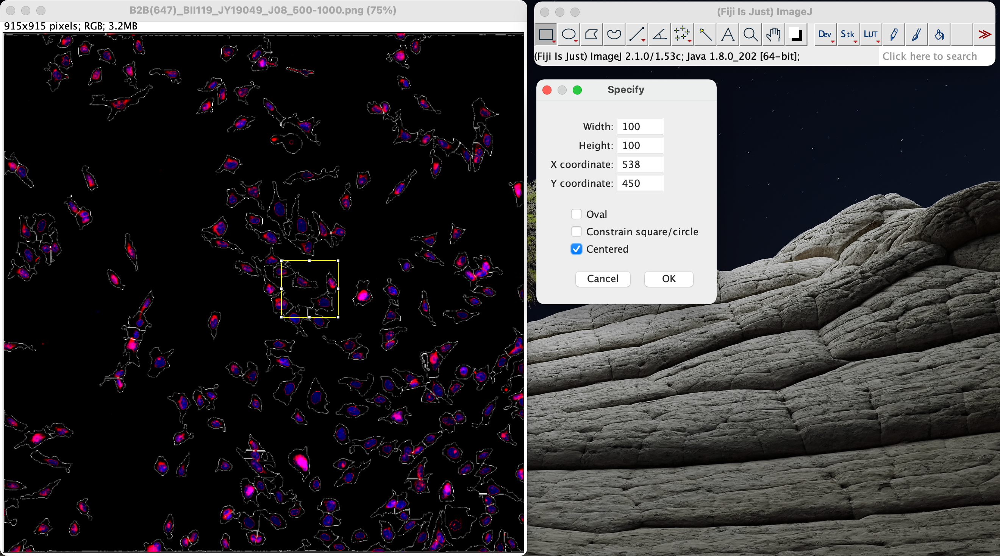
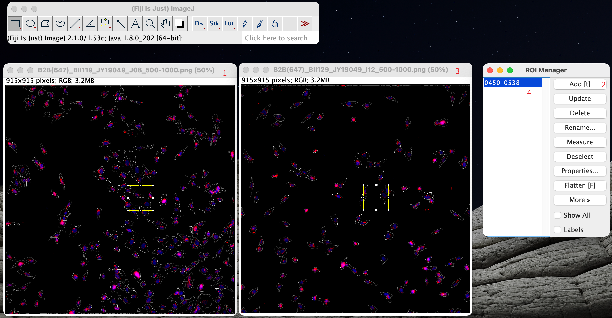
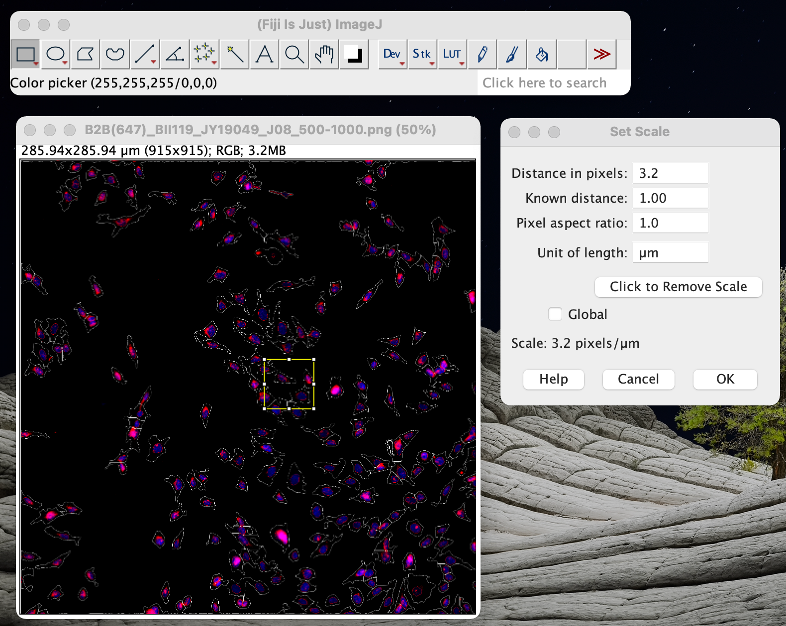
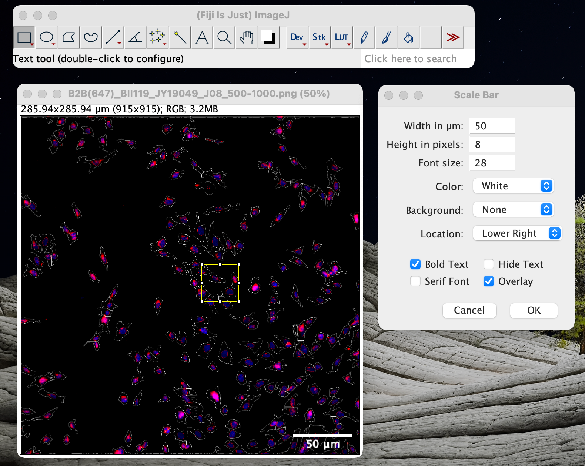

## Crop images to a given physical size

1. Edit -> Selection -> Specify 
2. image -> Crop

## Crop same area from different images

1. Select the area on the first image
2. Analyze -> Tools -> ROI manager -> Add [t]
3. Click the second image, select and click the parameters on the ROI manager

## Set scale and add scale bar

1. Analyze -> Set Scale

   - Nikon: 

     - 0.16 um/pixel (40x object)

     - 6.25 pixel/um (40x object)

     - 12.5 pixel/um (when exported with 200% zoom in using cellXpress)

       

     - 3.2 pixel/um (20x object)

     - 5 um/16 pixel (20x object)

     - 12.8 pixel/um (when exported with 400% zoom in using cellXpress)
     
     - 5uM = 16 pixels, if exported as 4x, then 5uM = 64 pixels)

   - TC microscope:
     - physical length of a pixel: 3.4375 um
     - 10x: 0.34375 um/pixel = 2.91 pixel/um
     - 20x: 0.171875 um/pixel = 5.82 pixel/um

2. Analyze -> Tools -> Scale bar

3. File save as png format.

   

