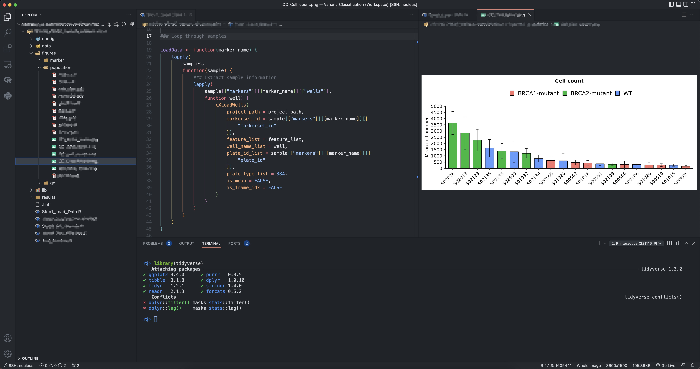

The details refer to: <https://github.com/REditorSupport/vscode-R>



### Install r packages
   
```r
pacman::p_load(
    jsonlite,
    rlang,
    languageserver, 
    httpgd,
    IRkernel,
    rmarkdown
)

```

```bash
### A modern R console from python
pip install -U radian
```

### Intall VSCode extensions

- vscode-R
- R Debugger
- Error lens
- Live Preview
- vscode-pdf
- vscode-icons
- Remote Development
- LiveShare
- Excel Viewer 
- Project Manager
- Quarto
- Path Intellisense
- Codesnap  
- Git Graph

### SSH using Keys
open `Users/zhonggr/.ssh/config`, add the following
```bash
Host nucleus
    HostName 172.20.***.** ## host ip address
    User zhonggr

```
### User Settings

- User `settings.json`:

```json
{ "files.associations": {
        "*.Rmd": "rmd",
        "*.R": "r"
    },
    "security.workspace.trust.untrustedFiles": "open",
    "editor.fontSize": 14,
    "editor.rulers": [80],
    "explorer.confirmDelete": false,
    "r.rterm.mac": "/opt/homebrew/bin/radian",
    // "r.rterm.mac": "/opt/homebrew/Caskroom/miniforge/base/bin/radian",
    "r.rpath.mac": "/usr/local/bin/R",
    // "r.rpath.mac": "/opt/homebrew/Caskroom/miniforge/base/bin/R",
    // "r.rterm.windows": "C:\\Program Files\\R\\R-4.2.1\\bin\\R.exe",
    "r.rterm.windows": "C:\\Users\\zhonggr\\AppData\\Local\\Programs\\Python\\Python310\\Scripts\\radian.exe",
    "r.rpath.windows": "C:\\Program Files\\R\\R-4.2.1\\bin\\R.exe",
    "r.plot.useHttpgd": true,
    "r.rterm.option": [],
    "r.bracketedPaste": true,
    "r.sessionWatcher": true,
    "r.alwaysUseActiveTerminal": true,
    "quarto.render.previewType": "external",
    // "terminal.integrated.fontSize": 15,
    // "terminal.integrated.defaultProfile.windows": "Git Bash",
    "terminal.integrated.defaultProfile.windows": "R Terminal",
    // "terminal.integrated.defaultProfile.osx": "R Terminal",
    "terminal.integrated.defaultProfile.osx": "zsh",
    "workbench.iconTheme": "vscode-icons",
    "r.helpPanel.cacheIndexFiles": "Global",
    "workbench.preferredDarkColorTheme": "Monokai",
    "workbench.preferredHighContrastColorTheme": "GitHub Dark Default",
    "r.rmarkdown.chunkBackgroundColor": "",
    "workbench.colorTheme": "GitHub Dark",
    "liveServer.settings.donotShowInfoMsg": true,
    "workbench.tree.indent": 25,
    "python.analysis.completeFunctionParens": true,
    "editor.minimap.enabled": false,
    "explorer.confirmDragAndDrop": false,
    "window.restoreWindows": "none",
    "remote.SSH.remotePlatform": {
        "nucleus": "linux"
    },
    "editor.guides.bracketPairs": true,
    "workbench.colorCustomizations": {
        "editorBracketHighlight.foreground1": "#5bb3b3",
        "editorBracketHighlight.foreground2": "#fac863",
        "editorBracketHighlight.foreground3": "#f99157",
        "editorBracketHighlight.foreground4": "#ec5f67",
        "editorBracketHighlight.foreground5": "#bb80b3",
        "editorBracketHighlight.foreground6": "#98C379",
    },
    "editor.parameterHints.enabled": false,
    "task.quickOpen.history": 3,
    "terminal.integrated.tabs.enableAnimation": false,
    "terminal.integrated.tabs.enabled": false,
    "terminal.integrated.fontSize": 13,
    "editor.acceptSuggestionOnEnter": "off",
    "editor.tabCompletion": "on",
    "editor.guides.indentation": false,
    "vsicons.dontShowNewVersionMessage": true,
    "files.exclude": {
        "**/.git": true,
        "**/.svn": true,
        "**/.hg": true,
        "**/CVS": true,
        "**/.DS_Store": true,
        "**/Thumbs.db": true

    }
}
```
### Remote Server Settings

[SSH:nucleus] `settings.json`
  
```json
{
    "r.rterm.linux": "/home/zhonggr/.local/bin/radian",
    // "r.rterm.linux": "/bin/R",
    "r.rpath.linux": "/bin/R",
    "r.alwaysUseActiveTerminal": true,
    "r.bracketedPaste": true,
    "r.sessionWatcher": true,
    // "terminal.integrated.defaultProfile.linux": "R Terminal",
    // "terminal.integrated.defaultProfile.linux": "tmux",
    "terminal.integrated.defaultProfile.linux": "bash",
    "r.plot.useHttpgd": true
}
```
### Keyboard Shortcuts
```json
// April 09, 2023 updated
[
    {
        "key": "alt+-",
        "command": "type",
        // "when": "editorLangId == r && editorTextFocus || editorLangId == rmd && editorTextFocus",
        // if you want using quarto, try this
        "when": "editorLangId =~ /r|rmd|qmd/ && editorTextFocus",
        "args": {
            "text": " <- "
        }
    },
    {
        "key": "ctrl+shift+m",
        "command": "type",
        // "when": "editorLangId == r && editorTextFocus || editorLangId == rmd && editorTextFocus",
        "when": "editorLangId =~ /r|rmd|qmd/ && editorTextFocus",
        "args": {
            "text": " |> "
        }
    },
    {
        "key": "ctrl+shift+m",
        "command": "-workbench.actions.view.problems"
    },
    // input indicative of r markdown code chunk
    {
        "key": "ctrl+shift+i",
        "command": "editor.action.insertSnippet",
        "when": "editorTextFocus && editorLangId == 'rmd'",
        "args": {
            "snippet": "```{r}\n${TM_SELECTED_TEXT}$0\n```"
        },
        "label": "input indicative of r markdown code chunk"
    },
    // you can also input indicative of code chunk in `r` file by inserting "# %% ":
    // specifics in `https://github.com/REditorSupport/vscode-R/pull/662`
    {
        "key": "ctrl+shift+i",
        "command": "editor.action.insertSnippet",
        "when": "editorTextFocus && editorLangId == 'r'",
        "args": {
            "snippet": "$LINE_COMMENT %% "
        },
        "label": "input indicative of code chunk"
    },
    // open help panel for selection
    {
        "key": "f1",
        "command": "r.helpPanel.openForSelection",
        "when": "editorTextFocus && editorLangId == 'r' || editorTextFocus && editorLangId == 'rmd'"
    },
    // RStudio keybinding for R Package development
    // {
    //     "key": "ctrl+shift+b",
    //     "command": "r.install",
    //     "when": "resourceLangId == 'r'"
    // },
    // {
    //     "key": "ctrl+shift+e",
    //     "command": "r.check",
    //     "when": "resourceLangId == 'r'"
    // },
    // {
    //     "key": "ctrl+shift+t",
    //     "command": "r.test",
    //     "when": "resourceLangId == 'r'"
    // },
    // {
    //     "key": "ctrl+shift+d",
    //     "command": "r.document",
    //     "when": "resourceLangId == 'r'"
    // },
    // {
    //     "key": "ctrl+shift+l",
    //     "command": "r.loadAll",
    //     "when": "resourceLangId == 'r'"
    // },
    {
        "key": "ctrl+alt+p",
        "command": "r.runCommand",
        "when": "editorTextFocus && editorLangId == 'r'",
        "args": ".vsc.browser(httpgd::hgd_url(), viewer = \"Beside\")"
    },
    // terminal settings
    {
        "key": "alt+-", // or whatever keybinding you want
        "command": "workbench.action.terminal.sendSequence",
        "args": {
            "text": " <- "
        },
        "when": "terminalFocus && !terminalTextSelected"
    },
    {
        "key": "ctrl+shift+m",
        "command": "workbench.action.terminal.sendSequence",
        "when": "terminalFocus && !terminalTextSelected",
        "args": {
            "text": " |> "
        }
    }
]
```
### Toning down code linting

creating a ~/.lintr file in the project folder

```bash
linters: with_defaults(
  line_length_linter = NULL,
  open_curly_linter = NULL, 
  object_usage_linter = NULL,
  commented_code_linter = NULL,
  object_name_linter = NULL,
  object_length_lnter = NULL,
  infix_spaces_linter = NULL,
  commas_linter = NULL,
  function_left_parentheses_linter = NULL,
  trailing_whitespace_linter = NULL)
```

### Reference

- [Quick list of useful R packages](https://support.posit.co/hc/en-us/articles/201057987-Quick-list-of-useful-R-packages)
- [Managing R with .Rprofile, .Renviron, Rprofile.site, Renviron.site, rsession.conf, and repos.conf](https://support.posit.co/hc/en-us/articles/360047157094-Managing-R-with-Rprofile-Renviron-Rprofile-site-Renviron-site-rsession-conf-and-repos-conf)
- [My Fully Remote Research Workflow in VS Code](https://medium.com/@parasu/my-fully-remote-research-workflow-in-vs-code-96bfbdc8d959)