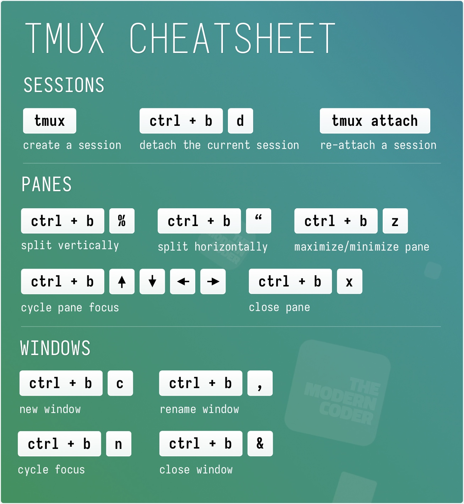
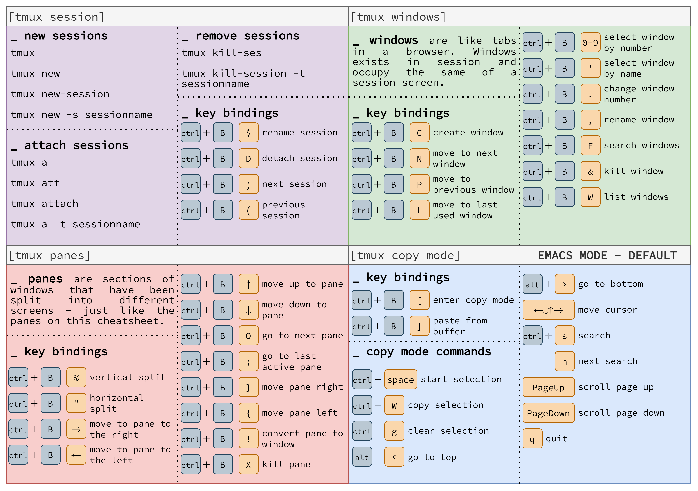

The solution is to set the default terminal provider on the remote settings to be tmux, and have it attach to either an existing session named main, or create a new one if it doesn't exist. 

## Tmux shortcuts

<!--  -->


[Advanced commands & shortcodes](https://quickref.me/tmux)

## Single session

- Add the below snippet to your remote settings in VSCode.

```json
{
  "terminal.integrated.profiles.linux": {
    "tmux": {
      "path": "/usr/bin/tmux",
      "args": [
        "new-session",
        "-A",
        "-s",
        "main"
      ],
    },
  },
  "terminal.integrated.defaultProfile.linux": "tmux",
}

```
## Session Per Workspace

- Use vscode variables to make one tmux-session per project, 

```json
{
  "terminal.integrated.profiles.linux": {
    "tmux": {
      "path": "/usr/bin/tmux",
      "args": [
        "new-session",
        "-A",
        "-s",
        "vscode-${workspaceFolderBasename}"
      ],
    },
  },
  "terminal.integrated.defaultProfile.linux": "tmux",
}

```

## Remote setting

```json
// 2023-04-10 updated
{
    "r.rterm.linux": "/home/zhonggr/.local/bin/radian",
    // "r.rterm.linux": "/bin/R",
    "r.rpath.linux": "/bin/R",
    "r.alwaysUseActiveTerminal": true,
    "r.bracketedPaste": true,
    "r.sessionWatcher": true,
    // "terminal.integrated.defaultProfile.linux": "R Terminal",
    // "terminal.integrated.defaultProfile.linux": "bash",
    "r.plot.useHttpgd": true,
    "editor.tabCompletion": "on",
    "editor.acceptSuggestionOnEnter": "off",
    "terminal.integrated.profiles.linux": {
        "tmux": {
            "path": "/usr/bin/tmux",
            "args": [
                "new-session",
                "-A",
                "-s",
                "main"
            ],
        },
    },
    "terminal.integrated.defaultProfile.linux": "tmux"
}

```
## Reference

- <https://www.zdyn.net/system/hacks/2020/09/19/vscode-term-session.html>
- <https://arcolinux.com/everthing-you-need-to-know-about-tmux-introduction/>