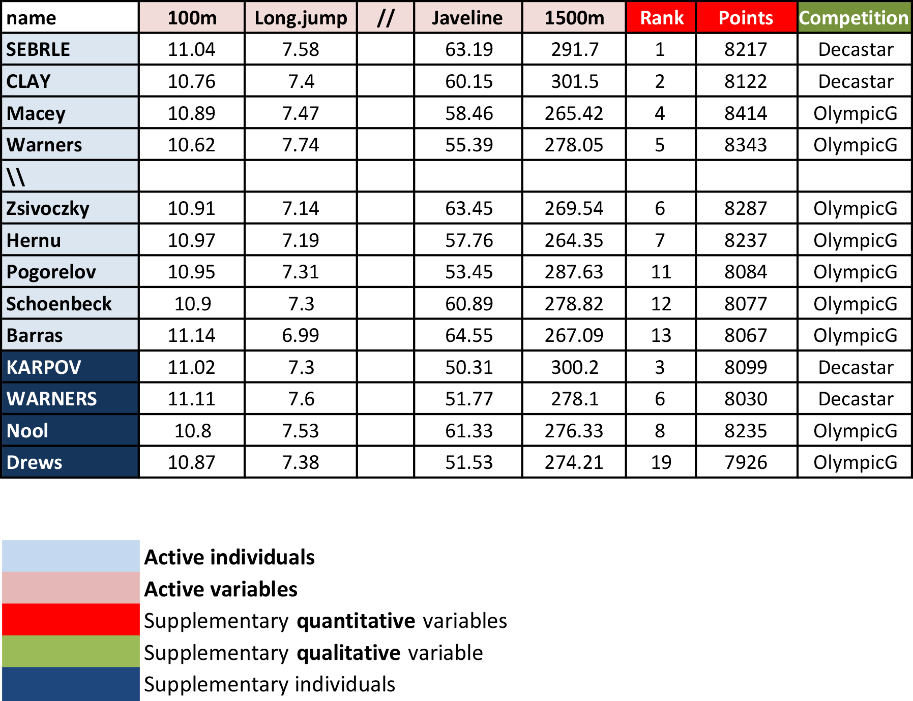

```{r setup, include=FALSE}
knitr::opts_chunk$set(
    # fig.width = 6, 
    # fig.height = 3.8,
    fig.align = "center", 
    # fig.retina = 3,
    # out.width = "85%", 
    collapse = TRUE
)
```

## Load Demon data

```{r}
### Load packages
library(pacman)
p_load(
    tidyverse,  # tidy data
    FactoMineR, # compute principal component methods
    factoextra  # extract, visualize and interpretate the results
)

### Demo data from factoextra
data(decathlon2)
decathlon2

### extract only active individuals and variables
decathlon2_active <- decathlon2[1:23, 1:10]
decathlon2_active
```


## Compute PCA and Visualize

```{r}
res_pca <- prcomp(decathlon2_active, scale = TRUE) # use the singular value decomposition
res_pca

### visualize the eigenvalues
fviz_eig(res_pca)

### Individuals with a similar profile are grouped together
fviz_pca_ind(
    res_pca, 
    col.ind = "cos2", # color by the quality of representation
    gradient.cols = c("#00AFBB", "#E7B800", "#FC4E07"),
    repel = TRUE # avoid text overlapping
)

### graph of variables. positive correlated variables point to the same side of the plot
### negative correlated variables point to opposite of the graph
fviz_pca_var(
    res_pca, 
    col.var = "contrib", # color by contributions to the PC
    gradient.cols = c("#00AFBB", "#E7B800", "#FC4E07"),
    repel = TRUE # avoid text overlapping
)

### biplot of individuals and variables
fviz_pca_biplot(
    res_pca, 
    repel = TRUE,
    col.var = "#2E9FDF", # Variables color
    col.ind = "#696969"  # Individuals color
)
```

## Access to the PCA results

```{r}
### eigenvalues
eig_val <- get_eigenvalue(res_pca)
eig_val

# Results for Variables
res_var <- get_pca_var(res_pca)
res_var$coord          # Coordinates
res_var$contrib        # Contributions to the PCs
res_var$cos2           # Quality of representation 

# Results for individuals
res_ind <- get_pca_ind(res_pca)
res_ind$coord          # Coordinates
res_ind$contrib        # Contributions to the PCs
res_ind$cos2           # Quality of representation
```

## Predict using PCA

```{r}
### Data for the supplementary individuals
ind_sup <- decathlon2[24:27, 1:10]
ind_sup

### Predict the coordinates of new individuals data
ind_sup_coord <- predict(res_pca, newdata = ind_sup)
ind_sup_coord

### Graphs of individuals including the supplementary individuals
p <- fviz_pca_ind(res_pca, repel = TRUE)
# Add supplementary individuals
fviz_add(p, ind_sup_coord, color ="blue")
```

## Qualitative or categorical variables

```{r}
groups <- as.factor(decathlon2$Competition[1:23])
fviz_pca_ind(
    res_pca,
    col.ind = groups, # color by groups
    palette = c("#00AFBB",  "#FC4E07"),
    addEllipses = TRUE, # Concentration ellipses
    ellipse.type = "confidence",
    legend.title = "Groups",
    repel = TRUE
)
```

## Quantitative variables

```{r}
quanti_sup <- decathlon2[1:23, 11:12, drop = FALSE]
head(quanti_sup)

# Predict coordinates and compute cos2
quanti_coord <- cor(quanti_sup, res_pca$x)
quanti_cos2 <- quanti_coord^2
# Graph of variables including supplementary variables
p <- fviz_pca_var(res_pca)
fviz_add(p, quanti_coord, color ="blue", geom="arrow")
```


## Reference

1. [Principal Component Analysis in R: prcomp vs princomp](http://www.sthda.com/english/articles/31-principal-component-methods-in-r-practical-guide/118-principal-component-analysis-in-r-prcomp-vs-princomp)