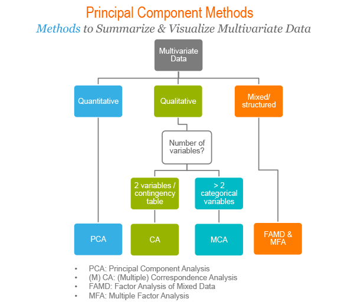
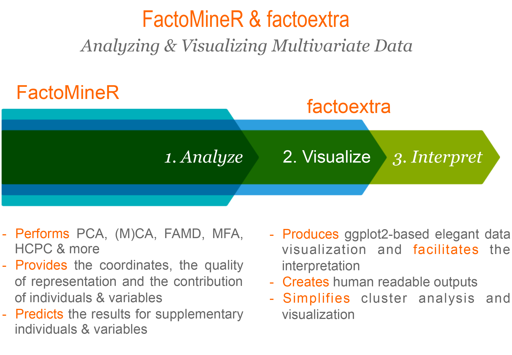

```{r setup, include=FALSE}
knitr::opts_chunk$set(
    # fig.width = 6, 
    # fig.height = 3.8,
    fig.align = "center", 
    # fig.retina = 3,
    # out.width = "85%", 
    collapse = TRUE
)
```
Principle component methods are used to summarize and viusalize the information contained in a large multivariate datasets.

Principle component analysis is used to extract the important information from a multivariate data table and to express this information as a set of few new variables called principle components. These new variables correspond to a linear combination of the originals. The number of principal components is less than or equal to the number of original variables.



## R packages

```{r}
library(tidyverse)
library(FactoMineR) # compute principal component methods
library(factoextra) # extract, visualize and interpretate the results
``` 


## PCA for continuous variables

```{r}
data(decathlon2)
head(decathlon2)
```

```{r}
### subset data
decathlon2_active <- decathlon2[1:23, 1:10]
### standardize data and PCA
res_pca <- PCA(
   decathlon2_active, 
   scale.unit = TRUE,
   graph = FALSE 
)
### extract the eigenvalues/variances of principal components
eig_val <- get_eigenvalue(res_pca)
eig_val

fviz_eig(res_pca, addlabels = TRUE, ylim = c(0, 50))

var <- get_pca_var(res_pca)
# Coordinates
head(var$coord)
# Cos2: quality on the factore map
head(var$cos2)
# Contributions to the principal components
head(var$contrib)

```

### color by groups

```{r}
head(iris, 3)
iris_pca <- PCA(iris[, -5], graph = FALSE)

fviz_pca_ind(
  iris_pca,
  geom.ind = "point", # show points only
  col.ind = iris$Species, # color by groups
  palette = c("#00AFBB", "#E7B800", "#FC4E07"),
  addEllipses = TRUE, # concentratoin ellipse
  legend.title = "Groups"
)

# Add confidence ellipses
fviz_pca_ind(
  iris_pca, 
  geom.ind = "point", 
  col.ind = iris$Species, 
  palette = c("#00AFBB", "#E7B800", "#FC4E07"),
  addEllipses = TRUE, 
  ellipse.type = "confidence",
  legend.title = "Groups"
)

fviz_pca_ind(
  iris_pca,
  label = "none", # hide individual labels
  habillage = iris$Species, # color by groups
  addEllipses = TRUE, # Concentration ellipses
  palette = "jco"
)

# Variables on dimensions 2 and 3
fviz_pca_var(res_pca, axes = c(2, 3))
# Individuals on dimensions 2 and 3
fviz_pca_ind(res_pca, axes = c(2, 3))
```

```{r}
# Show variable points and text labels
fviz_pca_var(res_pca, geom.var = c("point", "text"))

# Show individuals text labels only
fviz_pca_ind(res_pca, geom.ind =  "text")

# Change the size of arrows an labels
fviz_pca_var(
  res_pca, 
  arrowsize = 1, 
  labelsize = 5, 
  repel = TRUE
)

# Change points size, shape and fill color
# Change labelsize
fviz_pca_ind(
  res_pca, 
  pointsize = 3, 
  pointshape = 21, 
  fill = "lightblue",
  labelsize = 5, 
  repel = TRUE
)
```

```{r}
# Add confidence ellipses
fviz_pca_ind(
  iris_pca, 
  geom.ind = "point", 
  col.ind = iris$Species, # color by groups
  palette = c("#00AFBB", "#E7B800", "#FC4E07"),
  addEllipses = TRUE, 
  ellipse.type = "confidence",
  legend.title = "Groups"
)

# Convex hull
fviz_pca_ind(
  iris_pca, 
  geom.ind = "point",
  col.ind = iris$Species, # color by groups
  palette = c("#00AFBB", "#E7B800", "#FC4E07"),
  addEllipses = TRUE, 
  ellipse.type = "convex",
  legend.title = "Groups"
)


```

```{r}
fviz_pca_ind(
  iris_pca,
  geom.ind = "point", # show points only (but not "text")
  group.ind = iris$Species, # color by groups
  legend.title = "Groups",
  mean.point = FALSE
)

```

```{r}
ind.p <- fviz_pca_ind(
  iris_pca, 
  geom = "point", 
  col.ind = iris$Species
)

ggpubr::ggpar(
  ind.p,
  title = "Principal Component Analysis",
  subtitle = "Iris data set",
  caption = "Source: factoextra",
  xlab = "PC1", ylab = "PC2",
  legend.title = "Species", 
  legend.position = "top",
  ggtheme = theme_gray(), palette = "jco"
)
```

```{r}
fviz_pca_biplot(res_pca, repel = TRUE,
                col.var = "#2E9FDF", # Variables color
                col.ind = "#696969"  # Individuals color
                )

fviz_pca_biplot(
  iris_pca, 
  col.ind = iris$Species, 
  palette = "jco", 
  addEllipses = TRUE, 
  label = "var",
  col.var = "black", 
  repel = TRUE,
  legend.title = "Species"
) 
```

```{r}
fviz_pca_biplot(
  iris_pca, 
  # Fill individuals by groups
  geom.ind = "point",
  pointshape = 21,
  pointsize = 2.5,
  fill.ind = iris$Species,
  col.ind = "black",
  # Color variable by groups
  col.var = factor(c("sepal", "sepal", "petal", "petal")),
  
  legend.title = list(fill = "Species", color = "Clusters"),
  repel = TRUE    # Avoid label overplotting
)+
  ggpubr::fill_palette("jco")+      # Indiviual fill color
  ggpubr::color_palette("npg")      # Variable colors
```

```{r}
fviz_pca_biplot(
  iris_pca, 
  # Individuals
  geom.ind = "point",
  fill.ind = iris$Species, 
  col.ind = "black",
  pointshape = 21, 
  pointsize = 2,
  palette = "jco",
  addEllipses = TRUE,
  # Variables
  alpha.var ="contrib", 
  col.var = "contrib",
  gradient.cols = "RdYlBu",
  legend.title = list(
    fill = "Species", 
    color = "Contrib",
    alpha = "Contrib"
    )
)
```

## Reference

1. [Principal Component Methods in R: Practical Guide](http://www.sthda.com/english/articles/31-principal-component-methods-in-r-practical-guide/)
2. [Principal Component Analysis in R: prcomp vs princomp](http://www.sthda.com/english/articles/31-principal-component-methods-in-r-practical-guide/118-principal-component-analysis-in-r-prcomp-vs-princomp/)