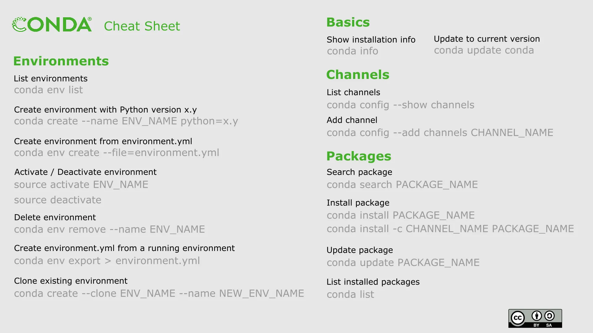
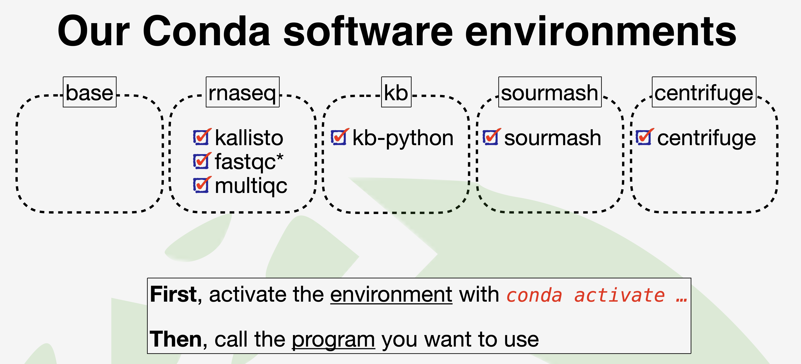

## Install conda

```bash
### Download miniforge
wget https://github.com/conda-forge/miniforge/releases/latest/download/Miniforge3-Linux-x86_64.sh

### chmod 
chmod +x ./Miniforge3-Linux-x86_64.sh

### Install to /home/usr/opt/miniforge3
bash ./Miniforge3-Linux-x86_64.sh

### Not auto activate base environment
conda config --set auto_activate_base false

### Install mamba
conda install -c conda-forge mamba
```


## Configuring conda

```bash
### Make sure conda works
conda info #to view all the details about your conda set-up
conda info --envs #to view all the environments available to you (note, since you just installed miniconda, you'll only have a 'base' environment available)

### Access to various channels where many pre-packaged bioinformatics programs can be downloaded with all their dependencies
conda config --add channels defaults
conda config --add channels bioconda
conda config --add channels conda-forge
conda config --set offline false
```

## Create environment



```bash
### Conda environment makes managing dependencies much less frustrating
conda create --name rnaseq 
conda activate rnaseq 

### Install some commonly used RNA-seq software inside this environment
conda install -c bioconda kallisto
kallisto # test it works
conda install -c bioconda fastqc
conda install -c bioconda multiqc
```

## Useful conda commands

```bash
conda list #shows you everything installed in your current environment
conda list -n [ENV NAME] #shows you everything installed in the specified environment
conda remove --name myenv --all #remove any environment (substitute your env name for 'myenv')
conda search myenv #search your channels for a specific package called 'myenv'
conda update --all #update conda
nano $HOME/.condarc #view your list of channels
```

## Conda tips
We automatically get a 'base' environment after installing conda and we can find it when we open the terminal that you are placed in the base env by default.  
- Avoid installing lots of software in base or, eventually, you will run into conflicts.

## Reference

- [](https://protocols.hostmicrobe.org/conda)
