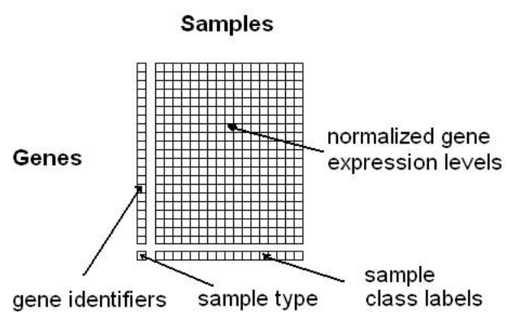

```{r setup, include=FALSE}
knitr::opts_chunk$set(
  # fig.width = 6, fig.height = 3.8, out.width = "85%", 
  fig.align = "center", fig.retina = 3,
  collapse = TRUE
)
```
## What is batch effect?

Batch effects are sub-groubs of measurements that have qualitatively different behaviour
across conditions and unrelated to the biological or scientific variables in a study.
 - Experiments run on different time
 - Different technician
 - Differnt doing the sample preparation
 - Sequencing at a differnt institute
 - Prepare the sample at different timepoint
 - Different lots of reagents, chips or instruments ...

All of these factors are considered to be factors as batches

## Why is batch effect a problem

- Not biological difference
- Just the other factors are taking actions, and are showing differences
- Most of the time, batch effect deviate our finding from the real biological relevant information

Try our best to eliminate batch effect to get a real difference between conditions! 

## Setting up the data

- The data should be a matrix with features in the rows and samples in the columns.
- The data should be standardized before applying for correction.



```{r}
#| warning: false

### Load packages
pacman::p_load(here, tidyverse, sva, bladderbatch, pamr, limma, survival)
### Load data
data(bladderdata)
### Get the expression data matrix
edata <- exprs(bladderEset)
head(edata)

### Get the variable data
pheno <- pData(bladderEset)
head(pheno)

### Create full model matrix, including both the adjustment variables and the variable of interest (cancer status)
mod <- model.matrix(~as.matrix(cancer), data = pheno)

### Create null model matrix, ontains only the adjustment variables.
mod0 <- model.matrix(~1, data = pheno) 
```

## Adjusting for batch effects with a linear model

In this case, we use two models. 
- One with the variable we care about - cancer status
- the other is just the known adjustment variables, in this case, we assume none

```{r}
#| warning: false

mod <- model.matrix(~as.factor(cancer) + as.factor(batch), data = pheno)
fit <- lm.fit(mod, t(edata))
hist(fit$coefficients[2, ], col = 4, breaks = 100)
```
This will only work if the batch effects aren't too highly correlated with the outcome.

```{r}
#| warning: false

table(pheno$cancer, pheno$batch)
```
## Adjust known batches using {Combat}

`ComBat` returns a “cleaned” data matrix after batch effects have been removed. Here we pass a model matrix with any known adjustment variables and a second parameter that is the batch variable.
```{r}
#| warning: false
### Adjust for known batches using an empirical Bayesian framework
### a known batch variable
batch <- pheno$batch
### Model matrix
modcombat <- model.matrix(~1, data = pheno)
modcancer <- model.matrix(~cancer, data = pheno)
### Using parametric empirical Bayesian adjustments.
combat_edata <- ComBat(
    dat = edata,
    batch = batch, 
    mod = modcombat,
    par.prior = TRUE, # performs parametric empirical Bayesian adjustment
    # par.prior = FALSE, # performs non-parametric empirical Bayesian adjustment
    prior.plots = FALSE,
    mean.only = FALSE
)
combat_fit <- lm.fit(modcancer, t(combat_edata))
hist(combat_fit$coefficients[2, ], col = 4, breaks = 100)

### Significance analysis
pvalue_combat <- f.pvalue(combat_edata, mod, mod0)
qvalue_combat <- p.adjust(pvalue_combat, method = "BH")
```

## Comparing {ComBat} and linear adjustment

We can compare the estimated coefficients from Combat and linear adjustment by looking at the right coefficients for each model.

```{r}
#| warning: false
plot(
  fit$coefficients[2, ], combat_fit$coefficients[2, ], col = 4,
  xlab = "Linear Model", ylab = "Combat", xlim = c(-5, 5), ylim = c(-5, 5)
)
abline(c(0, 1), col = 6, lwd = 3)
dev.off()
```
## Estimate batch and other artifacts using {sva}

First we need to estimate the surrogate variables. To do this, we need to build a model with any known adjustment variables and the variable we care about mod and another model with only the adjustment variables. Here we won’t adjust for anything to see if sva can “discover” the batch effect.

```{r}
#| warning: false

### Identify the number of latent factors that need to be estimated
mod <- model.matrix(~cancer, data = pheno)
mod0 <- model.matrix(~1, data = pheno)
### Estimate the surrogate variables
sva1 <- sva(edata, mod, mod0, n.sv = 2)

### See if any of the variables correlate with batch
summary(lm(sva1$sv ~ pheno$batch))

boxplot(sva1$sv[, 2] ~ pheno$batch)
points(sva1$sv[, 2] ~ jitter(as.numeric(pheno$batch)), col = as.numeric(pheno$batch))
dev.off()
### Add the surrogate variables to the model matrix and perform model fit
modsv <- cbind(mod, sva1$sv)
fitsv <- lm.fit(modsv, t(edata))

### Compare the fit from surrogate variable analysis to the other two
par(mfrow = c(1, 2))
plot(
  fitsv$coefficients[2,], combat_fit$coefficients[2, ], 
  col = 2, xlab = "SVA", ylab = "Combat", xlim = c(-5, 5), ylim = c(-5, 5)
)
abline(c(0, 1), col = 1, lwd = 3)
plot(
  fitsv$coefficients[2,], fit$coefficients[2, ], 
  col = 2, xlab = "SVA", ylab = "Linear model", xlim = c(-5, 5), ylim = c(-5, 5)
)
abline(c(0, 1), col = 1, lwd = 3)
``` 

## Adjusting the surrogate variables using {limma}

```{r}
#| warning: false

### Fit the linear model with surrogate variables
fit <- lmFit(edata, modsv)

### Compute the contrasts between pairs of cancer/normal terms
contrast_matrix <- cbind(
  "C1" = c(-1, 1, 0, rep(0, sva1$n.sv)),
  "C2" = c(0, -1, 1, rep(0, sva1$n.sv))
)
fitcontrasts <- contrasts.fit(fit, contrast_matrix)

### Calculate the test statistics
eb <- eBayes(fitcontrasts)
topTableF(eb, adjust = "BH")
```


## Reference
- [Batch effects and confounders](http://jtleek.com/genstats/inst/doc/02_13_batch-effects.html)
- [The SVA package for removing batch effects and other unwanted variation in high-throughput experiments](https://www.bioconductor.org/packages/release/bioc/vignettes/sva/inst/doc/sva.pdf)
