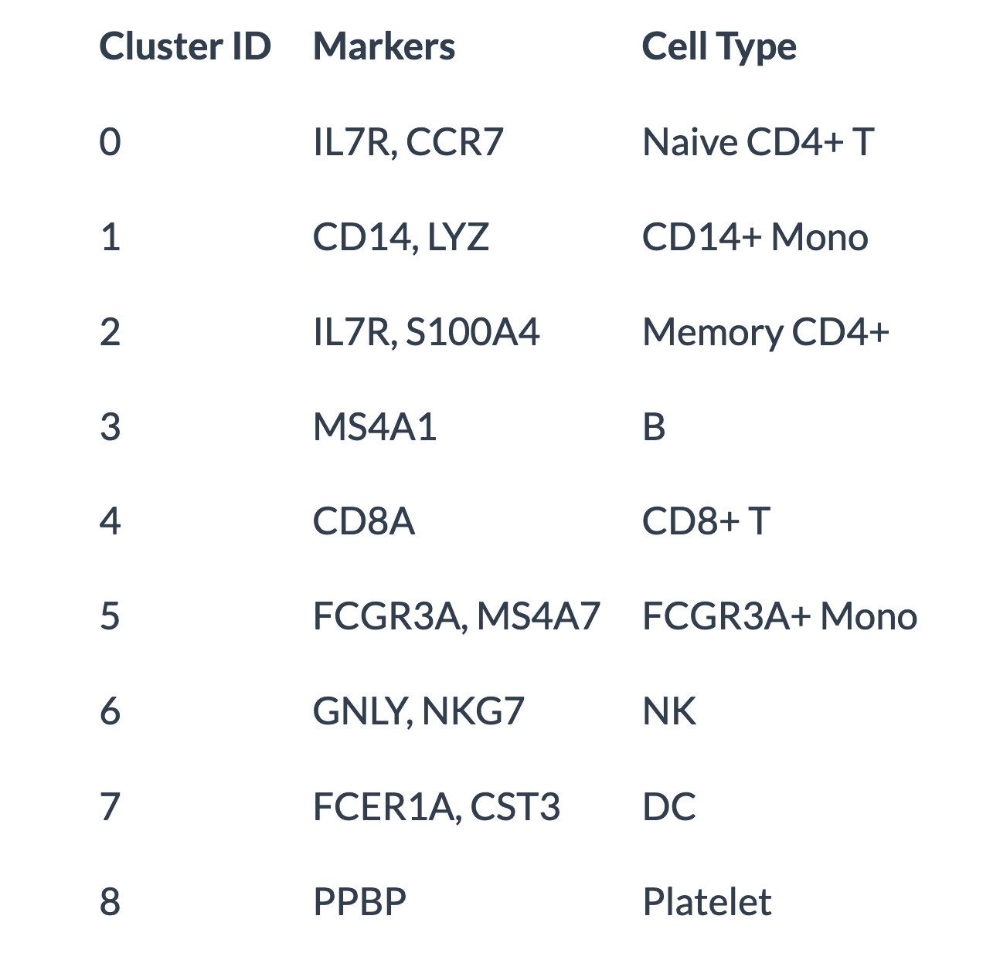

```{r setup, include=FALSE}
knitr::opts_chunk$set(
  # fig.width = 6, fig.height = 3.8, out.width = "85%", 
  fig.align = "center", fig.retina = 3,
  collapse = TRUE
)
```

```{r}
pacman::p_load(
    Seurat,
    scCustomize,
    tidyverse,
    patchwork,
    here
)
```

## Single cell RNA sequencing
Single cell RNA sequencing measures the RNA molecules within each cell of a give sample. This information provides a snapshot of the transcriptone when the cells are harvested. it can:
- reveal complex and rare cell populations
- uncover regulatory relations between genes
- track the trajectories of distict cell lineages in development

Commonly platform

- 10x genomics
- BD Rhapsody

## Read single cell data

This data is from [PBMC 3K guided tutorial](https://satijalab.org/seurat/articles/pbmc3k_tutorial).

- barcodes.tsv - cell information
- genes.tsv - gene information
- matrix.mtx - expression information

Option1: read data one by one (samll size data)
```{r}
pacman::p_load(data.table, Matrix)
### Read the data
gene <- fread("./pbmc3k/genes.tsv", data.table = FALSE, header = FALSE)
head(gene)
barcode <- fread("./pbmc3k/barcodes.tsv", data.table = FALSE, header = FALSE)
head(barcode)
mat <- as.data.frame(readMM("./pbmc3k/matrix.mtx"))

### Combine the three data
colnames(mat) <- barcode$V1 # cell barcode
mat$gene_id <- gene$V2 # gene name
mat <- mat[!duplicated(mat$gene_id), ] # remove duplicate genes
mat <- mat |> 
    select(gene_id, head(colnames(mat),-1)) # relocate gene id to first column
head(as_tibble(mat))
```

Option2: Setup the `Seurat` object

```{r}
pacman::p_load(Seurat)
### Load PBMC dataset
pbmc_data <- Read10X(data.dir = "./pbmc3k/")
### Init the seurat object with the raw (non-normalized data)
pbmc <- CreateSeuratObject(
    counts = pbmc_data,
    project = "pbmc3k",
    min.cells = 3, 
    min.features = 200
)
pbmc
```

What does data in a count matix look like?

```{r}
pbmc_data[c("CD3D", "TCL1A", "MS4A1"), 1:30]
```
The `.` values in the matrix represent 0s (no molecules detected). Since most values in an scRNA-seq matrix are 0, Seurat uses a sparse-matrix representation whenever possible. This results in significant memory and speed savings for Drop-seq/inDrop/10x data.

```{r}
#| warning: false
### SeuratData
# devtools::install_github('satijalab/seurat-data')
library(SeuratData)
# AvailableData()

# InstallData("pbmc3k")
data("pbmc3k")
pbmc3k
```

## Pre-processing data

The standard pre-processing workflow for scRNA-seq data including:

- Selection and filteration of cells based on QC matrics
- Data normalization and scaling 
- Detection of highly variable features

### QC and selecting cells for further analysis

- The number of unique genes detected in each cell
  * Low quality cells or empty droplets will often have few gens
  * Cell doublets or multiplets exhibit an aberrantly high gene count
- Similarly, the total number of molecules detected within a cell
- The percentage of reads that map to the mitochondrial genome
  * Low quality /dying cells often exhibit entensive mitochondrial contamination
  * Calculate mitochondrial QC matrics with `PercentageFeatureSet()` function, which calculate the percentage of counts originating from a set of features
  * Mitochondrial genes are start with `MT-`

```{r}
pbmc3k[["percent.mt"]] <- PercentageFeatureSet(pbmc3k, pattern = "^MT-")
### Show QC metrics for the first 5 cells
head(pbmc3k@meta.data, 5)
```
Visualize QC metrics and filter cells
- Filter cells that have unique feture over 2500 or less than 200
- Filter cells have 5% mitochondrial counts

```{r}
### Visualize QC metrics as a violin plot
VlnPlot(
  pbmc3k,
  features = c("nFeature_RNA", "nCount_RNA", "percent.mt"),
  ncol = 3
)

### Visualize feature-feature relationships
p1 <- FeatureScatter(
  pbmc3k, 
  feature1 = "nCount_RNA", 
  feature2 = "percent.mt"
  )

p2 <- FeatureScatter(
  pbmc3k, 
  feature1 = "nCount_RNA", 
  feature2 = "nFeature_RNA")

p1 + p2

pbmc <- subset(
  pbmc3k, 
  subset = nFeature_RNA > 200 & nFeature_RNA < 2500 & percent.mt < 5
)
```
### Normalizaing the data

After removing unwanted cells from the dataset, the next stop is to normalize the data. The {Seurat} employ a global-scaling normalization method that normalizes the feature expression measurements for each cell by the total expression, multiplies this by a scale factor and log-transforms the result. Normalized values are stored in `pbmc[["RNA"]]@data`.
```{r}
pbmc <- NormalizeData(
  pbmc, 
  normalization.method = "LogNormalize",
  scale.factor = 10000
)
```
### Identification of highly variable features

The next is to calculate a subset of features that exhibit high cell-to-cell variation in the dataset.
- i.e, they are highly expressed in some cells, and lowly expressed in other cells.
- Focus on these genes in downstream analysis helps to highlight biological signal in single-cell datasets

```{r}
pbmc <- FindVariableFeatures(pbmc, selection.method = "vst", nfeatures = 2000)
### Identify the 10 most highly variable genes
top10 <- head(VariableFeatures(pbmc), 10)
### Plot variable features with or without labels
p1 <- VariableFeaturePlot(pbmc)
p2 <- LabelPoints(plot = p1, points = top10, repel = TRUE)

p1 + p2
```
### Scaling the data

Next, apply a linear transformation ("scaling") that is a standard pre-processing step prior to dimensional reduction technique like PCA.
- Shift the expresion of each gene, so that the mean expression across cells is 0
- Scale the expression of each gene, so that the variance across cells is 1.
  * This step gives equal weight in downstream analysis, so that highly-expressed genes do not dominate
- The results of this are stored in `pbmc[["RNA"]]@scale.data`

```{r}
all.genes <- rownames(pbmc)
pbmc <- ScaleData(pbmc, features = all.genes)
```

## Perform linear dimensional reduction

```{r}
pbmc <- RunPCA(pbmc, features = VariableFeatures(object = pbmc))

### Examine and visualize PCA results in a few different ways
print(pbmc[["pca"]], dim = 1:5, nfeatures = 5)
VizDimLoadings(pbmc, dims = 1:2, reduction = "pca")

DimPlot(pbmc, reduction = "pca")

DimHeatmap(pbmc, dims = 1, cells = 500, balanced = TRUE)

DimHeatmap(pbmc, dims = 1:15, cells = 500, balanced = TRUE)
```
## Determine the dimensionality of the dataset

To overcome the extensive technical noise in any single feature for scRNA-seq data, `Seurat` clusters cells based on their PCA scores, with each PC essentially representing a ‘metafeature’ that combines information across a correlated feature set. The top principal components therefore represent a robust compression of the dataset. However, how many components should we choose to include? 10? 20? 100?

```{r}
pbmc <- JackStraw(pbmc, num.replicate = 100)
pbmc <- ScoreJackStraw(pbmc, dims = 1:20)
JackStrawPlot(pbmc, dims = 1:15)
ElbowPlot(pbmc)
```
## Cluster the cells

```{r}
pbmc <- FindNeighbors(pbmc, dims = 1:10)
pbmc <- FindClusters(pbmc, resolution = 0.5)
### Look at cluster IDs of the first 5 cells
head(Idents(pbmc), 5)
```

## Non-linear dimensional reduction (UMAP/tSNE)

In order to place similar cells together in low-dimensional space, `Seurat` offers several non-linear dimensional reduction techniques, such as tSNE and UMAP, to visualize and explore these datasets.

```{r}
pbmc <- RunUMAP(pbmc, dims = 1:10)
DimPlot(pbmc, reduction = "umap")
```
## Finding differntially expressed features (cluster biomakers)

```{r}
### Find all markers of cluster 2
cluster2_markers <- FindMarkers(pbmc, ident.1 = 2, min.pct = 0.25)
head(cluster2_markers, n = 5)

### Find all markers distinguishing cluster 5 from clusters 0 and 3
cluster5_markers <- FindMarkers(
  pbmc, ident.1 = 5, 
  ident.2 = c(0, 3), 
  min.pct = 0.25)
head(cluster5_markers, n = 5)

### Find markers for every cluster compared to all remaining cells, 
### report only the positive ones
pbmc_markers <- FindAllMarkers(
  pbmc, only.pos = TRUE, 
  min.pct = 0.25, 
  logfc.threshold = 0.25)
pbmc_markers %>%
    group_by(cluster) %>%
    slice_max(n = 2, order_by = avg_log2FC)

cluster0_markers <- FindMarkers(
  pbmc, ident.1 = 0, 
  logfc.threshold = 0.25, 
  test.use = "roc", 
  only.pos = TRUE)

VlnPlot(pbmc, features = c("MS4A1", "CD79A"))

### Plot raw counts as well
VlnPlot(pbmc, features = c("NKG7", "PF4"), slot = "counts", log = TRUE)

FeaturePlot(
  pbmc, 
  features = c(
    "MS4A1", "GNLY", "CD3E", "CD14", "FCER1A", "FCGR3A", "LYZ", "PPBP","CD8A"
    )
)
```

## Assigning cell type identity to clusters


## Reference

- [SEURAT: R toolkit for single cell genomics](https://satijalab.org/seurat/)
- [Seurat for Single Cell RNA-Seq Data](https://rpubs.com/Ronlee/SeuratPractice)
- [Batch Effect in Single-Cell RNA-Seq: Frequently Asked Questions and Answers](https://blog.bioturing.com/2022/03/24/batch-effect-in-single-cell-rna-seq-frequently-asked-questions-and-answers/)
## Session Info

```{r}
sessionInfo()
```

