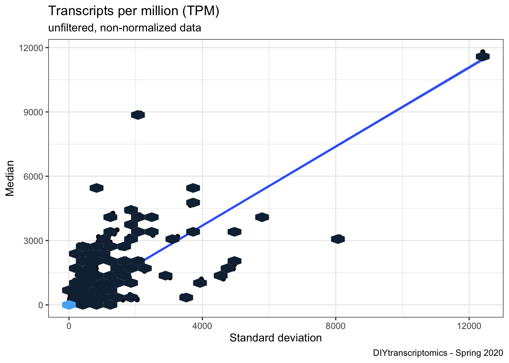
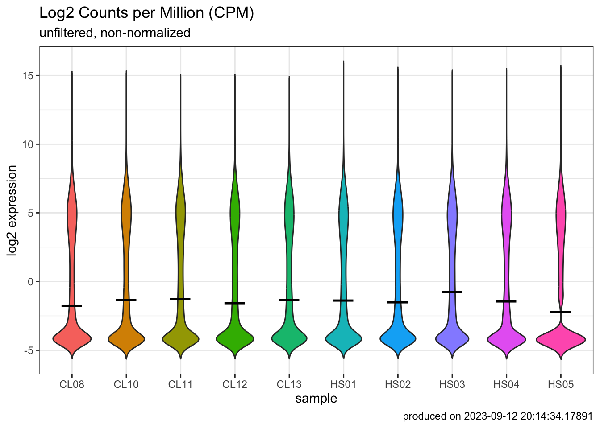
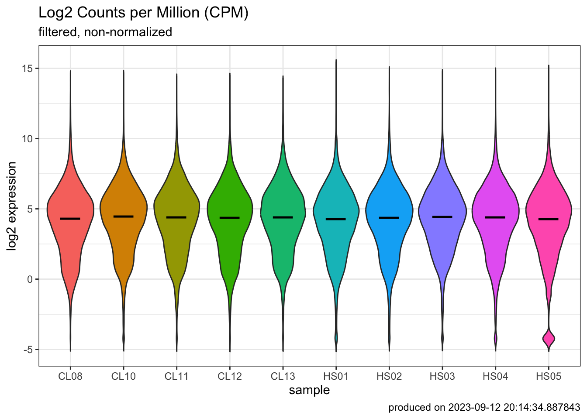
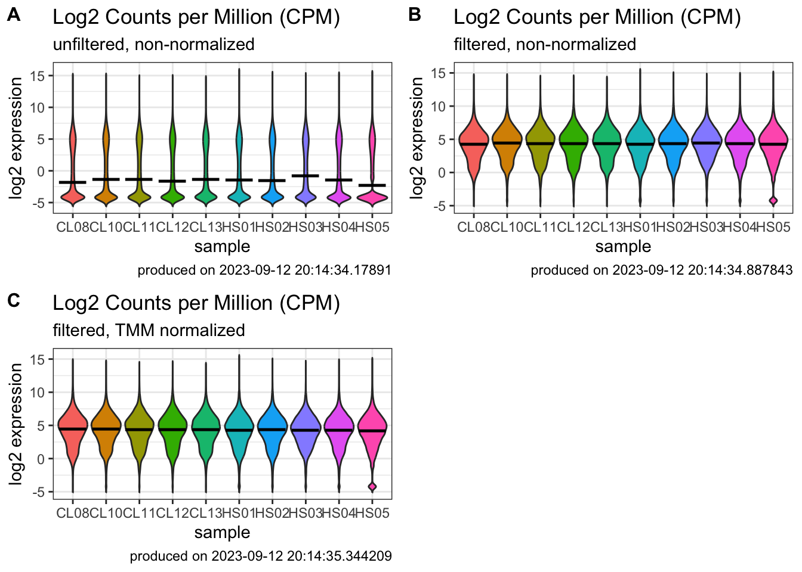

## Step1: Check the quality of raw reads

```bash
### go to row reads folder
cd ~/onedrive/analysis/230907_DIY_Transcriptomics/data/fastq
### activate env
conda active rnaseq
### use fastqc to check the quality of fastq files
fastqc *.gz -t 4
```

## Step2: Mapping reads with Kallisto pseudoaligment

- Download reference transciptome files from [here](https://asia.ensembl.org/info/data/ftp/index.html)

- Build an index from reference fasta file

```bash
kallisto index -i Homo_sapiens.GRCh38.cdna.all.index Homo_sapiens.GRCh38.cdna.all.fa.gz
```
- Map reads to the indexed reference host transcriptome


- Summarize output with Multiqc  in a single summary html

```bash
multiqc -d .
```

```bash
### first the healthy subjects (HS)
kallisto quant -i Homo_sapiens.GRCh38.cdna.all.index -o HS01 -t 4 --single -l 250 -s 30 SRR8668755.fastq.gz &> HS01.log
kallisto quant -i Homo_sapiens.GRCh38.cdna.all.index -o HS02 -t 4 --single -l 250 -s 30 SRR8668756.fastq.gz &> HS02.log
kallisto quant -i Homo_sapiens.GRCh38.cdna.all.index -o HS03 -t 4 --single -l 250 -s 30 SRR8668757.fastq.gz &> HS03.log
kallisto quant -i Homo_sapiens.GRCh38.cdna.all.index -o HS04 -t 4 --single -l 250 -s 30 SRR8668758.fastq.gz &> HS04.log
kallisto quant -i Homo_sapiens.GRCh38.cdna.all.index -o HS05 -t 4 --single -l 250 -s 30 SRR8668759.fastq.gz &> HS05.log

### then the cutaneous leishmaniasis (CL) patients
kallisto quant -i Homo_sapiens.GRCh38.cdna.all.index -o CL08 -t 4 --single -l 250 -s 30 SRR8668769.fastq.gz &> CL08.log
kallisto quant -i Homo_sapiens.GRCh38.cdna.all.index -o CL10 -t 4 --single -l 250 -s 30 SRR8668771.fastq.gz &> CL10.log
kallisto quant -i Homo_sapiens.GRCh38.cdna.all.index -o CL11 -t 4 --single -l 250 -s 30 SRR8668772.fastq.gz &> CL11.log
kallisto quant -i Homo_sapiens.GRCh38.cdna.all.index -o CL12 -t 4 --single -l 250 -s 30 SRR8668773.fastq.gz &> CL12.log
kallisto quant -i Homo_sapiens.GRCh38.cdna.all.index -o CL13 -t 4 --single -l 250 -s 30 SRR8668774.fastq.gz &> CL13.log

### Summarize outputs
multiqc -d .
```


## Step3: Import data into R

### Load packages

::: {.cell layout-align="center"}

```{.r .cell-code}
### load packages
library(rhdf5) # provides functions for handling hdf5 file formats (kallisto outputs bootstraps in this format)
library(tidyverse) # Hadley Wickham's collection of R packages for data science, which we will use throughout the course
library(tximport) # package for getting Kallisto results into R
library(ensembldb) # helps deal with ensembl
library(EnsDb.Hsapiens.v86) # replace with your organism-specific database package
library(here) # file path
library(datapasta) # paste data into R from clipboard
library(edgeR) # well known package for differential expression analysis, but we only use for the DGEList object and for normalization methods
library(matrixStats) # easily calculate stats on rows or columns of a data matrix
library(cowplot) # allows you to combine multiple plots in one figure
library(DT) # for making interactive tables
library(plotly) # for making interactive plots
library(gt) # A layered 'grammar of tables' - think ggplot, but for tables
library(limma) # venerable package for differential gene expression using linear modeling
library(edgeR)
library(RColorBrewer) # need colors to make heatmaps
# library(gameofthrones) #because...why not.  Install using 'devtools::install_github("aljrico/gameofthrones")'
library(heatmaply) #for making interactive heatmaps using plotly
library(gplots)
# library(d3heatmap) # for making interactive heatmaps using D3
library(GSEABase) # functions and methods for Gene Set Enrichment Analysis
library(Biobase) # base functions for bioconductor; required by GSEABase
library(GSVA) # Gene Set Variation Analysis, a non-parametric and unsupervised method for estimating variation of gene set enrichment across samples.
library(gprofiler2) # tools for accessing the GO enrichment results using g:Profiler web resources
library(clusterProfiler) # provides a suite of tools for functional enrichment analysis
library(msigdbr) # access to msigdb collections directly within R
library(enrichplot) # great for making the standard GSEA enrichment plots
```
:::

### Import study design files

::: {.cell layout-align="center"}

```{.r .cell-code}
### load study design
targets <- read_tsv(
    here("learn", "230907_DIY_Transcriptomics", "studydesign.txt")
)
targets
## # A tibble: 10 × 3
##    sample sra_accession group  
##    <chr>  <chr>         <chr>  
##  1 HS01   SRR8668755    healthy
##  2 HS02   SRR8668756    healthy
##  3 HS03   SRR8668757    healthy
##  4 HS04   SRR8668758    healthy
##  5 HS05   SRR8668759    healthy
##  6 CL08   SRR8668769    disease
##  7 CL10   SRR8668771    disease
##  8 CL11   SRR8668772    disease
##  9 CL12   SRR8668773    disease
## 10 CL13   SRR8668774    disease

### create file paths for the abundance files
path <- file.path(
    "learn", "230907_DIY_Transcriptomics", targets$sample, "abundance.tsv"
)
path
##  [1] "learn/230907_DIY_Transcriptomics/HS01/abundance.tsv"
##  [2] "learn/230907_DIY_Transcriptomics/HS02/abundance.tsv"
##  [3] "learn/230907_DIY_Transcriptomics/HS03/abundance.tsv"
##  [4] "learn/230907_DIY_Transcriptomics/HS04/abundance.tsv"
##  [5] "learn/230907_DIY_Transcriptomics/HS05/abundance.tsv"
##  [6] "learn/230907_DIY_Transcriptomics/CL08/abundance.tsv"
##  [7] "learn/230907_DIY_Transcriptomics/CL10/abundance.tsv"
##  [8] "learn/230907_DIY_Transcriptomics/CL11/abundance.tsv"
##  [9] "learn/230907_DIY_Transcriptomics/CL12/abundance.tsv"
## [10] "learn/230907_DIY_Transcriptomics/CL13/abundance.tsv"

### make sure path is correct
all(file.exists(path))
## [1] TRUE
```
:::

### Get organsim specific annotations


::: {.cell layout-align="center"}

```{.r .cell-code}
tx <- transcripts(
    EnsDb.Hsapiens.v86, columns = c("tx_id", "gene_name")
) |>
    as_tibble() |> 
    ### need to change first column name to 'target_id'
    rename(target_id = tx_id)
tx
## # A tibble: 216,741 × 7
##    seqnames start   end width strand target_id       gene_name
##    <fct>    <int> <int> <int> <fct>  <chr>           <chr>    
##  1 1        11869 14409  2541 +      ENST00000456328 DDX11L1  
##  2 1        12010 13670  1661 +      ENST00000450305 DDX11L1  
##  3 1        14404 29570 15167 -      ENST00000488147 WASH7P   
##  4 1        17369 17436    68 -      ENST00000619216 MIR6859-1
##  5 1        29554 31097  1544 +      ENST00000473358 MIR1302-2
##  6 1        30267 31109   843 +      ENST00000469289 MIR1302-2
##  7 1        30366 30503   138 +      ENST00000607096 MIR1302-2
##  8 1        34554 36081  1528 -      ENST00000417324 FAM138A  
##  9 1        35245 36073   829 -      ENST00000461467 FAM138A  
## 10 1        52473 53312   840 +      ENST00000606857 OR4G4P   
## # ℹ 216,731 more rows

### move transcrip ID the first column in the dataframe
tx <- select(tx, "target_id", "gene_name")
```
:::


### Load transcript counts


::: {.cell layout-align="center"}

```{.r .cell-code}
txi_gene <- tximport(
    path,
    type = "kallisto",
    tx2gene = tx,
    txOut = FALSE, # How does the result change if this =FALSE vs =TRUE?
    countsFromAbundance = "lengthScaledTPM",
    ignoreTxVersion = TRUE
)

### take a look at the type of object
class(txi_gene)
## [1] "list"
names(txi_gene)
## [1] "abundance"           "counts"              "length"             
## [4] "countsFromAbundance"
```
:::


## Step4: Wrangling gene expression


::: {.cell layout-align="center"}

```{.r .cell-code}
### examine the data
tpm <- txi_gene$abundance
counts <- txi_gene$counts

### generate summary stats
tpm_stats <- transform(
    tpm,
    SD = rowSds(tpm),
    AVG = rowMeans(tpm),
    MED = rowMedians(tpm)
)

### look at the summary data
head(tpm_stats)
##                  X1          X2         X3           X4         X5          X6
## 5S_rRNA   0.0000000   0.0000000   0.000000   0.00000000   0.000000   0.0000000
## A1BG      6.3823340   6.7399420   3.842043   6.70710000   8.591181  14.6144150
## A1CF      0.0757872   0.0616752   0.214226   0.00859446   0.000000   0.0265036
## A2M     162.5622990 341.8312630 295.814803 261.47230600 169.453100 345.6983730
## A2ML1   109.6624900  80.6018680  90.356840  64.11152700  67.035650  52.5762220
## A2MP1     0.2237170   0.3143760   0.390022   0.15622800   0.122260   0.2700100
##                 X7          X8           X9         X10           SD
## 5S_rRNA   0.000000   0.0000000   0.00000000   0.0000000   0.00000000
## A1BG     18.182700  12.8662800  12.05296100   9.8268802   4.41172300
## A1CF      0.072777   0.1359934   0.03722713   0.0581254   0.06414927
## A2M     643.554440 341.8972850 324.80208900 415.9663840 135.78415021
## A2ML1     4.401309   5.1981760   1.75721000  15.1189910  39.78108982
## A2MP1     1.087410   0.7737610   0.68834900   0.6378640   0.31619850
##                  AVG         MED
## 5S_rRNA   0.00000000   0.0000000
## A1BG      9.98058361   9.2090306
## A1CF      0.06909094   0.0599003
## A2M     330.30523424 333.3166760
## A2ML1    49.08202830  58.3438745
## A2MP1     0.46639970   0.3521990

### visualize it using scatter plot
ggplot(tpm_stats, aes(x = SD, y = MED)) +
    geom_point(shape = 18, size = 2) +
    geom_smooth(method = lm) +
    geom_hex(show.legend = FALSE) +
    labs(
        y = "Median", x = "Standard deviation",
        title = "Transcripts per million (TPM)",
        subtitle = "unfiltered, non-normalized data",
        caption = "DIYtranscriptomics - Spring 2020"
    ) +
    theme_classic() +
    theme_dark() +
    theme_bw()
```

::: {.cell-output-display}
{fig-align='center' width=100%}
:::
:::

::: {.cell layout-align="center"}

```{.r .cell-code}
### capture sample labels from study design
sampleLabels <- targets$sample

### make DGElist from the counts
DGEList <- DGEList(txi_gene$counts)
DGEList
## An object of class "DGEList"
## $counts
##             Sample1     Sample2     Sample3     Sample4  Sample5     Sample6
## 5S_rRNA     0.00000     0.00000     0.00000    0.000000   0.0000     0.00000
## A1BG      184.19070   245.13169   101.73418   79.204797  13.3335   682.72256
## A1CF       22.94477    23.53171    59.50815    1.064719   0.0000    12.98875
## A2M     11901.13136 31538.08430 19870.31859 7832.900974 667.1460 40967.58721
## A2ML1   15162.86062 14045.04908 11463.06052 3627.335147 498.4618 11767.57706
##            Sample7     Sample8     Sample9    Sample10
## 5S_rRNA     0.0000     0.00000     0.00000     0.00000
## A1BG      391.5812   326.10430   397.97768   499.96534
## A1CF       16.4421    36.15938    12.89508    31.02343
## A2M     35158.3894 21982.61779 27205.95758 53686.20520
## A2ML1     454.1300   631.23251   277.98636  3685.37686
## 35366 more rows ...
## 
## $samples
##          group lib.size norm.factors
## Sample1      1 42300696            1
## Sample2      1 51775632            1
## Sample3      1 40485664            1
## Sample4      1 16661634            1
## Sample5      1  2191577            1
## Sample6      1 55389922            1
## Sample7      1 28800520            1
## Sample8      1 31632164            1
## Sample9      1 39464569            1
## Sample10     1 67827185            1

### get counts per million
cpm <- cpm(DGEList)
colSums(cpm)
##  Sample1  Sample2  Sample3  Sample4  Sample5  Sample6  Sample7  Sample8 
##    1e+06    1e+06    1e+06    1e+06    1e+06    1e+06    1e+06    1e+06 
##  Sample9 Sample10 
##    1e+06    1e+06

log2_cpm <- cpm(DGEList, log=TRUE)
### connvert data matrix to dataframe
log2_cpm_df <- as_tibble(log2_cpm, rownames = "geneID")
### add sample names
colnames(log2_cpm_df) <- c("geneID", sampleLabels)

### pivot from wide to long 
log2_cpm_df_pivot <- pivot_longer(
  log2_cpm_df, 
  cols = HS01:CL13, 
  names_to = "samples", 
  values_to = "expression" 
) 

p1 <- ggplot(
    log2_cpm_df_pivot,
    aes(x = samples, y = expression, fill = samples)
) +
    geom_violin(trim = FALSE, show.legend = FALSE) +
    stat_summary(fun = "median",
        geom = "point",
        shape = 95,
        size = 10,
        color = "black",
        show.legend = FALSE
    ) +
    labs(
        y = "log2 expression", x = "sample",
        title = "Log2 Counts per Million (CPM)",
        subtitle = "unfiltered, non-normalized",
        caption = paste0("produced on ", Sys.time())
    ) +
    theme_bw()
p1
```

::: {.cell-output-display}
{fig-align='center' width=100%}
:::
:::

- How many genes or transcripts have no read counts at all?


::: {.cell layout-align="center"}

```{.r .cell-code}
### filter data
table(rowSums(DGEList$counts==0)==10)
## 
## FALSE  TRUE 
## 29373  5998

### how many genes had more than 1 CPM (TRUE) in at least 3 samples

### set cutoff
keepers <- rowSums(cpm>1) >= 5 # user defined
DGEList_filtered <- DGEList[keepers, ]

log2_cpm_filtered <- cpm(DGEList_filtered, log=TRUE)
log2_cpm_filtered_df <- as_tibble(log2_cpm_filtered, rownames = "geneID")
colnames(log2_cpm_filtered_df) <- c("geneID", sampleLabels)
log2_cpm_filtered_df_pivot <- pivot_longer(
    log2_cpm_filtered_df,
    cols = HS01:CL13,
    names_to = "samples",
    values_to = "expression"
)

p2 <- ggplot(
    log2_cpm_filtered_df_pivot,
    aes(x = samples, y = expression, fill = samples)
) +
    geom_violin(trim = FALSE, show.legend = FALSE) +
    stat_summary(
        fun = "median",
        geom = "point",
        shape = 95,
        size = 10,
        color = "black",
        show.legend = FALSE
    ) +
    labs(y = "log2 expression", x = "sample",
        title = "Log2 Counts per Million (CPM)",
        subtitle = "filtered, non-normalized",
        caption = paste0("produced on ", Sys.time())) +
    theme_bw()

p2
```

::: {.cell-output-display}
{fig-align='center' width=100%}
:::
:::

::: {.cell layout-align="center"}

```{.r .cell-code}
### normalize data
DGEList_filtered_norm <- calcNormFactors(
    DGEList_filtered, method = "TMM"
)
log2_cpm_filtered_norm <- cpm(
    DGEList_filtered_norm, log = TRUE
)
log2_cpm_filtered_norm_df <- as_tibble(
    log2_cpm_filtered_norm, rownames = "geneID"
)
colnames(log2_cpm_filtered_norm_df) <- c("geneID", sampleLabels)

log2_cpm_filtered_norm_df_pivot <- pivot_longer(
    log2_cpm_filtered_norm_df,
    cols = HS01:CL13,
    names_to = "samples",
    values_to = "expression"
)

p3 <- ggplot(
    log2_cpm_filtered_norm_df_pivot,
    aes(x = samples, y = expression, fill = samples)
) +
    geom_violin(trim = FALSE, show.legend = FALSE) +
    stat_summary(
        fun = "median",
        geom = "point",
        shape = 95,
        size = 10,
        color = "black",
        show.legend = FALSE
    ) +
    labs(
        y = "log2 expression", x = "sample",
        title = "Log2 Counts per Million (CPM)",
        subtitle = "filtered, TMM normalized",
        caption = paste0("produced on ", Sys.time())
    ) +
    theme_bw()

### combine plots
plot_grid(
  p1, p2, p3, 
  labels = c('A', 'B', 'C'), 
  label_size = 12
)
```

::: {.cell-output-display}
{fig-align='center' width=100%}
:::
:::

## Step5: Data exploration with multivariate analysis


::: {.cell layout-align="center"}

```{.r .cell-code}
### Identify variables of interest in study design file
group <- targets$group
group <- factor(group)
group
##  [1] healthy healthy healthy healthy healthy disease disease disease disease
## [10] disease
## Levels: disease healthy
```
:::


### Hierarchical clustering


::: {.cell layout-align="center"}

```{.r .cell-code}
### calculate distance  methods (e.g. switch from 'maximum' to 'euclidean')
distance <- dist(
    t(log2_cpm_filtered_norm), method = "maximum"
)
### other distance methods are "euclidean", maximum", "manhattan", "canberra", "binary" or "minkowski"

clusters <- hclust(distance, method = "average") 
### other agglomeration methods are "ward.D", "ward.D2", "single", "complete", "average", "mcquitty", "median", or "centroid"
plot(clusters, labels=sampleLabels)
```

::: {.cell-output-display}
{fig-align='center' width=100%}
:::
:::


### Principal compoent analysis


::: {.cell layout-align="center"}

```{.r .cell-code}
pca_res <- prcomp(
    t(log2_cpm_filtered_norm),
    scale. = FALSE, retx = TRUE
)


### prints variance summary for all principal components.
summary(pca_res)
## Importance of components:
##                             PC1     PC2      PC3      PC4      PC5      PC6
## Standard deviation     113.9821 49.8074 33.42376 27.08082 26.40296 22.23750
## Proportion of Variance   0.6656  0.1271  0.05723  0.03757  0.03571  0.02533
## Cumulative Proportion    0.6656  0.7927  0.84993  0.88750  0.92322  0.94855
##                             PC7      PC8      PC9      PC10
## Standard deviation     20.50645 17.71945 16.42366 1.816e-13
## Proportion of Variance  0.02154  0.01609  0.01382 0.000e+00
## Cumulative Proportion   0.97010  0.98618  1.00000 1.000e+00

### look at the PCA result (pca.res)
ls(pca_res)
## [1] "center"   "rotation" "scale"    "sdev"     "x"

### $rotation shows you how much each gene influenced each PC (called 'scores')
head(pca_res$rotation) 
##                 PC1          PC2           PC3          PC4           PC5
## A1BG    0.006058601 -0.005265865  0.0030322868  0.008759217  0.0021903806
## A2M     0.004897345  0.002459393 -0.0029437295  0.010128989  0.0010754828
## A2ML1  -0.015426376  0.002131922  0.0236833694  0.012776801  0.0151330784
## A2MP1   0.008361769  0.005416383 -0.0080073403 -0.004989098  0.0019137300
## A4GALT -0.004861196 -0.010071400 -0.0040747825  0.004365382 -0.0073287027
## AAAS    0.002247684 -0.005546829 -0.0003891962  0.005401109 -0.0008667994
##                 PC6           PC7         PC8          PC9        PC10
## A1BG    0.002600255  1.165903e-02 0.002109927  0.006017461 -0.62642253
## A2M    -0.003082754 -2.988929e-03 0.007583352 -0.002958490 -0.07649096
## A2ML1  -0.013272183 -1.389944e-02 0.008501332  0.020687796  0.29435235
## A2MP1  -0.002415560  1.626299e-03 0.011281299 -0.005577339 -0.50451276
## A4GALT -0.009698589  6.199904e-05 0.012467687  0.004110126 -0.31572438
## AAAS    0.006991981  3.783003e-03 0.004628266  0.003568768 -0.14061416

### 'x' shows you how much each sample influenced each PC (called 'loadings')
pca_res$x 
##                 PC1          PC2        PC3        PC4         PC5        PC6
## Sample1  -116.29139   38.2334807  21.154790 -31.204512  24.3342557  -5.032445
## Sample2   -98.08443   28.5182187   6.488451  20.455248 -24.7150117  -5.625522
## Sample3   -98.57599   46.3377421 -21.880766 -22.638077  26.9619112   8.312240
## Sample4  -102.83232   27.1997919 -10.521681  36.884584 -34.6489813  11.837625
## Sample5  -119.48548 -130.0448432  -8.771308  -8.078419   0.7747427  -2.609032
## Sample6    76.83934  -13.0282654  65.541177  34.668976  32.4966464   9.756467
## Sample7   114.80802    0.9427947 -66.411954  27.226075  30.8708143  -6.756527
## Sample8   122.14072   -0.8992447  -2.600281 -31.000051 -26.0328136  19.278692
## Sample9   129.23356   -4.8764679   3.983424 -16.285254 -13.4446636  25.667565
## Sample10   92.24799    7.6167930  13.018146 -10.028570 -16.5969001 -54.829063
##                 PC7         PC8         PC9          PC10
## Sample1   37.289161  -8.2755495   9.2338103  6.432316e-13
## Sample2    9.263960  37.6085903 -14.4523481  7.064106e-14
## Sample3  -40.584484   0.6580365  -8.3486393  3.455381e-13
## Sample4   -3.089166 -28.1333136  11.4331050 -5.619926e-14
## Sample5   -2.014396  -0.2124505  -0.6860841 -1.205842e-13
## Sample6  -10.563273   2.1965073   5.3204553 -6.485607e-14
## Sample7   15.193876   4.0838551   4.1812220 -2.588419e-13
## Sample8   -5.936520  15.6564254  28.6671255 -1.908206e-13
## Sample9   11.836127 -13.5624080 -32.5109827 -3.271781e-13
## Sample10 -11.395285 -10.0196929  -2.8376640  1.788202e-13

### A screeplot is a standard way to view eigenvalues for each PCA
screeplot(pca_res) 
```

::: {.cell-output-display}
{fig-align='center' width=100%}
:::

```{.r .cell-code}

### sdev^2 captures these eigenvalues from the PCA result
pc_var <- pca_res$sdev^2 

### use these eigenvalues to calculate the percentage variance explained by each PC
pc_per <- round(pc_var/sum(pc_var)*100, 1) 
pc_per
##  [1] 66.6 12.7  5.7  3.8  3.6  2.5  2.2  1.6  1.4  0.0
```
:::

- Can we figure out the identify of outlier?


::: {.cell layout-align="center"}

```{.r .cell-code}
### visualize PCA result 
pca_res_df <- as_tibble(pca_res$x) |> 
  bind_cols(targets) |> 
  mutate(group = factor(group))
pca_plot1 <- pca_res_df |>
    ggplot(
        aes(x = PC1, y = PC2, label = sample, color = group)
    ) +
    geom_point(size = 4) +
    stat_ellipse() +
    xlab(paste0("PC1 (", pc_per[1], "%", ")")) +
    ylab(paste0("PC2 (", pc_per[2], "%", ")")) +
    labs(title = "PCA plot",
        caption = paste0("produced on ", Sys.time())) +
    coord_fixed() +
    theme_bw()

pca_plot1
```

::: {.cell-output-display}
{fig-align='center' width=100%}
:::
:::

- Another way to view PCA laodings to understand impact of each sample on each pricipal component


::: {.cell layout-align="center"}

```{.r .cell-code}
pca_res_df <- pca_res$x[, 1:4] |>
    as_tibble() |>
    add_column(
        sample = sampleLabels,
        group = group
    )
### dataframe to be pivoted  
pca_pivot <- pivot_longer(
  pca_res_df, 
  cols = PC1:PC4, 
  names_to = "PC", 
  values_to = "loadings"
) 
### plot
pca_plot2 <- ggplot(pca_pivot) +
    aes(x = sample, y = loadings, fill = group) +
    geom_bar(stat = "identity") +
    facet_wrap(~PC) +
    labs(
        title = "PCA 'small multiples' plot",
        caption = paste0("produced on ", Sys.time())
    ) +
    theme_bw() +
    coord_flip()
pca_plot2
```

::: {.cell-output-display}
{fig-align='center' width=100%}
:::

```{.r .cell-code}
### combine plot
# plot_grid(pca_plot1, pca_plot2)
```
:::

::: {.cell layout-align="center"}

```{.r .cell-code}
# make columns comparing each of the averages above that you're interested in
mydata_df <- mutate(
  log2_cpm_filtered_norm_df,
  healthy.AVG = (HS01 + HS02 + HS03 + HS04 + HS05)/5, 
  disease.AVG = (CL08 + CL10 + CL11 + CL12 + CL13)/5,
  LogFC = (disease.AVG - healthy.AVG)
  ) |> 
  mutate_if(is.numeric, round, 2)

### sort data
mydata_sort <- mydata_df |>
  arrange(desc(LogFC)) |> 
  select(geneID, LogFC)
mydata_sort
## # A tibble: 15,765 × 2
##    geneID    LogFC
##    <chr>     <dbl>
##  1 IGLC3     10.6 
##  2 MMP1      10.4 
##  3 IGKV1-5   10.2 
##  4 IGLV3-1    9.96
##  5 IGLV3-19   9.9 
##  6 IGLC1      9.88
##  7 IGKV1D-39  9.87
##  8 IGLL5      9.85
##  9 IGKV1D-33  9.83
## 10 IGLV2-8    9.65
## # ℹ 15,755 more rows

### filter data
mydata_filter <- mydata_df |>
    filter(
        geneID == "MMP1" | geneID == "GZMB" | geneID == "IL1B" | geneID == "GNLY" | geneID == "IFNG"
        | geneID == "CCL4" | geneID == "PRF1" | geneID == "APOBEC3A" | geneID == "UNC13A"
    ) |>
    select(geneID, healthy.AVG, disease.AVG, LogFC) |>
    arrange(desc(LogFC))
mydata_filter
## # A tibble: 9 × 4
##   geneID   healthy.AVG disease.AVG LogFC
##   <chr>          <dbl>       <dbl> <dbl>
## 1 MMP1            1.44       11.9  10.4 
## 2 IFNG           -3.65        4.42  8.07
## 3 CCL4           -1.75        6.14  7.89
## 4 GZMB           -0.58        6.47  7.05
## 5 GNLY            0.98        7.17  6.19
## 6 IL1B            0.63        6.48  5.85
## 7 PRF1            1.03        6.64  5.61
## 8 APOBEC3A        0.27        5.6   5.33
## 9 UNC13A         -0.78        1.95  2.73
```
:::

::: {.cell layout-align="center"}

```{.r .cell-code}
### Produce publication-quality tables using `gt` package
mydata_filter |>
    gt() |>
    fmt_number(columns = 2:4, decimals = 1) |>
    tab_header(
        title = md("**Regulators of skin pathogenesis**"),
        subtitle = md("*during cutaneous leishmaniasis*")
    ) |>
    tab_footnote(
        footnote = "Deletion or blockaid ameliorates disease in mice",
        locations = cells_body(columns = geneID, rows = c(6, 7))
    ) |>
    tab_footnote(
        footnote = "Associated with treatment failure in multiple studies",
        locations = cells_body(columns = geneID, rows = c(2:9))
    ) |>
    tab_footnote(
        footnote = "Implicated in parasite control",
        locations = cells_body(columns = geneID, rows = c(2))
    ) |>
    tab_source_note(
        source_note = md("Reference: Amorim *et al*., (2019). DOI: 10.1126/scitranslmed.aar3619")
    )
```

::: {.cell-output-display}
```{=html}
<div id="xsofkktcyz" style="padding-left:0px;padding-right:0px;padding-top:10px;padding-bottom:10px;overflow-x:auto;overflow-y:auto;width:auto;height:auto;">
<style>#xsofkktcyz table {
  font-family: system-ui, 'Segoe UI', Roboto, Helvetica, Arial, sans-serif, 'Apple Color Emoji', 'Segoe UI Emoji', 'Segoe UI Symbol', 'Noto Color Emoji';
  -webkit-font-smoothing: antialiased;
  -moz-osx-font-smoothing: grayscale;
}

#xsofkktcyz thead, #xsofkktcyz tbody, #xsofkktcyz tfoot, #xsofkktcyz tr, #xsofkktcyz td, #xsofkktcyz th {
  border-style: none;
}

#xsofkktcyz p {
  margin: 0;
  padding: 0;
}

#xsofkktcyz .gt_table {
  display: table;
  border-collapse: collapse;
  line-height: normal;
  margin-left: auto;
  margin-right: auto;
  color: #333333;
  font-size: 16px;
  font-weight: normal;
  font-style: normal;
  background-color: #FFFFFF;
  width: auto;
  border-top-style: solid;
  border-top-width: 2px;
  border-top-color: #A8A8A8;
  border-right-style: none;
  border-right-width: 2px;
  border-right-color: #D3D3D3;
  border-bottom-style: solid;
  border-bottom-width: 2px;
  border-bottom-color: #A8A8A8;
  border-left-style: none;
  border-left-width: 2px;
  border-left-color: #D3D3D3;
}

#xsofkktcyz .gt_caption {
  padding-top: 4px;
  padding-bottom: 4px;
}

#xsofkktcyz .gt_title {
  color: #333333;
  font-size: 125%;
  font-weight: initial;
  padding-top: 4px;
  padding-bottom: 4px;
  padding-left: 5px;
  padding-right: 5px;
  border-bottom-color: #FFFFFF;
  border-bottom-width: 0;
}

#xsofkktcyz .gt_subtitle {
  color: #333333;
  font-size: 85%;
  font-weight: initial;
  padding-top: 3px;
  padding-bottom: 5px;
  padding-left: 5px;
  padding-right: 5px;
  border-top-color: #FFFFFF;
  border-top-width: 0;
}

#xsofkktcyz .gt_heading {
  background-color: #FFFFFF;
  text-align: center;
  border-bottom-color: #FFFFFF;
  border-left-style: none;
  border-left-width: 1px;
  border-left-color: #D3D3D3;
  border-right-style: none;
  border-right-width: 1px;
  border-right-color: #D3D3D3;
}

#xsofkktcyz .gt_bottom_border {
  border-bottom-style: solid;
  border-bottom-width: 2px;
  border-bottom-color: #D3D3D3;
}

#xsofkktcyz .gt_col_headings {
  border-top-style: solid;
  border-top-width: 2px;
  border-top-color: #D3D3D3;
  border-bottom-style: solid;
  border-bottom-width: 2px;
  border-bottom-color: #D3D3D3;
  border-left-style: none;
  border-left-width: 1px;
  border-left-color: #D3D3D3;
  border-right-style: none;
  border-right-width: 1px;
  border-right-color: #D3D3D3;
}

#xsofkktcyz .gt_col_heading {
  color: #333333;
  background-color: #FFFFFF;
  font-size: 100%;
  font-weight: normal;
  text-transform: inherit;
  border-left-style: none;
  border-left-width: 1px;
  border-left-color: #D3D3D3;
  border-right-style: none;
  border-right-width: 1px;
  border-right-color: #D3D3D3;
  vertical-align: bottom;
  padding-top: 5px;
  padding-bottom: 6px;
  padding-left: 5px;
  padding-right: 5px;
  overflow-x: hidden;
}

#xsofkktcyz .gt_column_spanner_outer {
  color: #333333;
  background-color: #FFFFFF;
  font-size: 100%;
  font-weight: normal;
  text-transform: inherit;
  padding-top: 0;
  padding-bottom: 0;
  padding-left: 4px;
  padding-right: 4px;
}

#xsofkktcyz .gt_column_spanner_outer:first-child {
  padding-left: 0;
}

#xsofkktcyz .gt_column_spanner_outer:last-child {
  padding-right: 0;
}

#xsofkktcyz .gt_column_spanner {
  border-bottom-style: solid;
  border-bottom-width: 2px;
  border-bottom-color: #D3D3D3;
  vertical-align: bottom;
  padding-top: 5px;
  padding-bottom: 5px;
  overflow-x: hidden;
  display: inline-block;
  width: 100%;
}

#xsofkktcyz .gt_spanner_row {
  border-bottom-style: hidden;
}

#xsofkktcyz .gt_group_heading {
  padding-top: 8px;
  padding-bottom: 8px;
  padding-left: 5px;
  padding-right: 5px;
  color: #333333;
  background-color: #FFFFFF;
  font-size: 100%;
  font-weight: initial;
  text-transform: inherit;
  border-top-style: solid;
  border-top-width: 2px;
  border-top-color: #D3D3D3;
  border-bottom-style: solid;
  border-bottom-width: 2px;
  border-bottom-color: #D3D3D3;
  border-left-style: none;
  border-left-width: 1px;
  border-left-color: #D3D3D3;
  border-right-style: none;
  border-right-width: 1px;
  border-right-color: #D3D3D3;
  vertical-align: middle;
  text-align: left;
}

#xsofkktcyz .gt_empty_group_heading {
  padding: 0.5px;
  color: #333333;
  background-color: #FFFFFF;
  font-size: 100%;
  font-weight: initial;
  border-top-style: solid;
  border-top-width: 2px;
  border-top-color: #D3D3D3;
  border-bottom-style: solid;
  border-bottom-width: 2px;
  border-bottom-color: #D3D3D3;
  vertical-align: middle;
}

#xsofkktcyz .gt_from_md > :first-child {
  margin-top: 0;
}

#xsofkktcyz .gt_from_md > :last-child {
  margin-bottom: 0;
}

#xsofkktcyz .gt_row {
  padding-top: 8px;
  padding-bottom: 8px;
  padding-left: 5px;
  padding-right: 5px;
  margin: 10px;
  border-top-style: solid;
  border-top-width: 1px;
  border-top-color: #D3D3D3;
  border-left-style: none;
  border-left-width: 1px;
  border-left-color: #D3D3D3;
  border-right-style: none;
  border-right-width: 1px;
  border-right-color: #D3D3D3;
  vertical-align: middle;
  overflow-x: hidden;
}

#xsofkktcyz .gt_stub {
  color: #333333;
  background-color: #FFFFFF;
  font-size: 100%;
  font-weight: initial;
  text-transform: inherit;
  border-right-style: solid;
  border-right-width: 2px;
  border-right-color: #D3D3D3;
  padding-left: 5px;
  padding-right: 5px;
}

#xsofkktcyz .gt_stub_row_group {
  color: #333333;
  background-color: #FFFFFF;
  font-size: 100%;
  font-weight: initial;
  text-transform: inherit;
  border-right-style: solid;
  border-right-width: 2px;
  border-right-color: #D3D3D3;
  padding-left: 5px;
  padding-right: 5px;
  vertical-align: top;
}

#xsofkktcyz .gt_row_group_first td {
  border-top-width: 2px;
}

#xsofkktcyz .gt_row_group_first th {
  border-top-width: 2px;
}

#xsofkktcyz .gt_summary_row {
  color: #333333;
  background-color: #FFFFFF;
  text-transform: inherit;
  padding-top: 8px;
  padding-bottom: 8px;
  padding-left: 5px;
  padding-right: 5px;
}

#xsofkktcyz .gt_first_summary_row {
  border-top-style: solid;
  border-top-color: #D3D3D3;
}

#xsofkktcyz .gt_first_summary_row.thick {
  border-top-width: 2px;
}

#xsofkktcyz .gt_last_summary_row {
  padding-top: 8px;
  padding-bottom: 8px;
  padding-left: 5px;
  padding-right: 5px;
  border-bottom-style: solid;
  border-bottom-width: 2px;
  border-bottom-color: #D3D3D3;
}

#xsofkktcyz .gt_grand_summary_row {
  color: #333333;
  background-color: #FFFFFF;
  text-transform: inherit;
  padding-top: 8px;
  padding-bottom: 8px;
  padding-left: 5px;
  padding-right: 5px;
}

#xsofkktcyz .gt_first_grand_summary_row {
  padding-top: 8px;
  padding-bottom: 8px;
  padding-left: 5px;
  padding-right: 5px;
  border-top-style: double;
  border-top-width: 6px;
  border-top-color: #D3D3D3;
}

#xsofkktcyz .gt_last_grand_summary_row_top {
  padding-top: 8px;
  padding-bottom: 8px;
  padding-left: 5px;
  padding-right: 5px;
  border-bottom-style: double;
  border-bottom-width: 6px;
  border-bottom-color: #D3D3D3;
}

#xsofkktcyz .gt_striped {
  background-color: rgba(128, 128, 128, 0.05);
}

#xsofkktcyz .gt_table_body {
  border-top-style: solid;
  border-top-width: 2px;
  border-top-color: #D3D3D3;
  border-bottom-style: solid;
  border-bottom-width: 2px;
  border-bottom-color: #D3D3D3;
}

#xsofkktcyz .gt_footnotes {
  color: #333333;
  background-color: #FFFFFF;
  border-bottom-style: none;
  border-bottom-width: 2px;
  border-bottom-color: #D3D3D3;
  border-left-style: none;
  border-left-width: 2px;
  border-left-color: #D3D3D3;
  border-right-style: none;
  border-right-width: 2px;
  border-right-color: #D3D3D3;
}

#xsofkktcyz .gt_footnote {
  margin: 0px;
  font-size: 90%;
  padding-top: 4px;
  padding-bottom: 4px;
  padding-left: 5px;
  padding-right: 5px;
}

#xsofkktcyz .gt_sourcenotes {
  color: #333333;
  background-color: #FFFFFF;
  border-bottom-style: none;
  border-bottom-width: 2px;
  border-bottom-color: #D3D3D3;
  border-left-style: none;
  border-left-width: 2px;
  border-left-color: #D3D3D3;
  border-right-style: none;
  border-right-width: 2px;
  border-right-color: #D3D3D3;
}

#xsofkktcyz .gt_sourcenote {
  font-size: 90%;
  padding-top: 4px;
  padding-bottom: 4px;
  padding-left: 5px;
  padding-right: 5px;
}

#xsofkktcyz .gt_left {
  text-align: left;
}

#xsofkktcyz .gt_center {
  text-align: center;
}

#xsofkktcyz .gt_right {
  text-align: right;
  font-variant-numeric: tabular-nums;
}

#xsofkktcyz .gt_font_normal {
  font-weight: normal;
}

#xsofkktcyz .gt_font_bold {
  font-weight: bold;
}

#xsofkktcyz .gt_font_italic {
  font-style: italic;
}

#xsofkktcyz .gt_super {
  font-size: 65%;
}

#xsofkktcyz .gt_footnote_marks {
  font-size: 75%;
  vertical-align: 0.4em;
  position: initial;
}

#xsofkktcyz .gt_asterisk {
  font-size: 100%;
  vertical-align: 0;
}

#xsofkktcyz .gt_indent_1 {
  text-indent: 5px;
}

#xsofkktcyz .gt_indent_2 {
  text-indent: 10px;
}

#xsofkktcyz .gt_indent_3 {
  text-indent: 15px;
}

#xsofkktcyz .gt_indent_4 {
  text-indent: 20px;
}

#xsofkktcyz .gt_indent_5 {
  text-indent: 25px;
}
</style>
<table class="gt_table" data-quarto-disable-processing="false" data-quarto-bootstrap="false">
  <thead>
    <tr class="gt_heading">
      <td colspan="4" class="gt_heading gt_title gt_font_normal" style><strong>Regulators of skin pathogenesis</strong></td>
    </tr>
    <tr class="gt_heading">
      <td colspan="4" class="gt_heading gt_subtitle gt_font_normal gt_bottom_border" style><em>during cutaneous leishmaniasis</em></td>
    </tr>
    <tr class="gt_col_headings">
      <th class="gt_col_heading gt_columns_bottom_border gt_left" rowspan="1" colspan="1" scope="col" id="geneID">geneID</th>
      <th class="gt_col_heading gt_columns_bottom_border gt_right" rowspan="1" colspan="1" scope="col" id="healthy.AVG">healthy.AVG</th>
      <th class="gt_col_heading gt_columns_bottom_border gt_right" rowspan="1" colspan="1" scope="col" id="disease.AVG">disease.AVG</th>
      <th class="gt_col_heading gt_columns_bottom_border gt_right" rowspan="1" colspan="1" scope="col" id="LogFC">LogFC</th>
    </tr>
  </thead>
  <tbody class="gt_table_body">
    <tr><td headers="geneID" class="gt_row gt_left">MMP1</td>
<td headers="healthy.AVG" class="gt_row gt_right">1.4</td>
<td headers="disease.AVG" class="gt_row gt_right">11.9</td>
<td headers="LogFC" class="gt_row gt_right">10.4</td></tr>
    <tr><td headers="geneID" class="gt_row gt_left">IFNG<span class="gt_footnote_marks" style="white-space:nowrap;font-style:italic;font-weight:normal;"><sup>1,2</sup></span></td>
<td headers="healthy.AVG" class="gt_row gt_right">−3.6</td>
<td headers="disease.AVG" class="gt_row gt_right">4.4</td>
<td headers="LogFC" class="gt_row gt_right">8.1</td></tr>
    <tr><td headers="geneID" class="gt_row gt_left">CCL4<span class="gt_footnote_marks" style="white-space:nowrap;font-style:italic;font-weight:normal;"><sup>1</sup></span></td>
<td headers="healthy.AVG" class="gt_row gt_right">−1.8</td>
<td headers="disease.AVG" class="gt_row gt_right">6.1</td>
<td headers="LogFC" class="gt_row gt_right">7.9</td></tr>
    <tr><td headers="geneID" class="gt_row gt_left">GZMB<span class="gt_footnote_marks" style="white-space:nowrap;font-style:italic;font-weight:normal;"><sup>1</sup></span></td>
<td headers="healthy.AVG" class="gt_row gt_right">−0.6</td>
<td headers="disease.AVG" class="gt_row gt_right">6.5</td>
<td headers="LogFC" class="gt_row gt_right">7.0</td></tr>
    <tr><td headers="geneID" class="gt_row gt_left">GNLY<span class="gt_footnote_marks" style="white-space:nowrap;font-style:italic;font-weight:normal;"><sup>1</sup></span></td>
<td headers="healthy.AVG" class="gt_row gt_right">1.0</td>
<td headers="disease.AVG" class="gt_row gt_right">7.2</td>
<td headers="LogFC" class="gt_row gt_right">6.2</td></tr>
    <tr><td headers="geneID" class="gt_row gt_left">IL1B<span class="gt_footnote_marks" style="white-space:nowrap;font-style:italic;font-weight:normal;"><sup>3,1</sup></span></td>
<td headers="healthy.AVG" class="gt_row gt_right">0.6</td>
<td headers="disease.AVG" class="gt_row gt_right">6.5</td>
<td headers="LogFC" class="gt_row gt_right">5.8</td></tr>
    <tr><td headers="geneID" class="gt_row gt_left">PRF1<span class="gt_footnote_marks" style="white-space:nowrap;font-style:italic;font-weight:normal;"><sup>3,1</sup></span></td>
<td headers="healthy.AVG" class="gt_row gt_right">1.0</td>
<td headers="disease.AVG" class="gt_row gt_right">6.6</td>
<td headers="LogFC" class="gt_row gt_right">5.6</td></tr>
    <tr><td headers="geneID" class="gt_row gt_left">APOBEC3A<span class="gt_footnote_marks" style="white-space:nowrap;font-style:italic;font-weight:normal;"><sup>1</sup></span></td>
<td headers="healthy.AVG" class="gt_row gt_right">0.3</td>
<td headers="disease.AVG" class="gt_row gt_right">5.6</td>
<td headers="LogFC" class="gt_row gt_right">5.3</td></tr>
    <tr><td headers="geneID" class="gt_row gt_left">UNC13A<span class="gt_footnote_marks" style="white-space:nowrap;font-style:italic;font-weight:normal;"><sup>1</sup></span></td>
<td headers="healthy.AVG" class="gt_row gt_right">−0.8</td>
<td headers="disease.AVG" class="gt_row gt_right">1.9</td>
<td headers="LogFC" class="gt_row gt_right">2.7</td></tr>
  </tbody>
  <tfoot class="gt_sourcenotes">
    <tr>
      <td class="gt_sourcenote" colspan="4">Reference: Amorim <em>et al</em>., (2019). DOI: 10.1126/scitranslmed.aar3619</td>
    </tr>
  </tfoot>
  <tfoot class="gt_footnotes">
    <tr>
      <td class="gt_footnote" colspan="4"><span class="gt_footnote_marks" style="white-space:nowrap;font-style:italic;font-weight:normal;"><sup>1</sup></span> Associated with treatment failure in multiple studies</td>
    </tr>
    <tr>
      <td class="gt_footnote" colspan="4"><span class="gt_footnote_marks" style="white-space:nowrap;font-style:italic;font-weight:normal;"><sup>2</sup></span> Implicated in parasite control</td>
    </tr>
    <tr>
      <td class="gt_footnote" colspan="4"><span class="gt_footnote_marks" style="white-space:nowrap;font-style:italic;font-weight:normal;"><sup>3</sup></span> Deletion or blockaid ameliorates disease in mice</td>
    </tr>
  </tfoot>
</table>
</div>
```
:::
:::


- Make an interactive table using the `DT` package


::: {.cell layout-align="center"}

```{.r .cell-code}
# datatable(
#     mydata_df[, c(1, 12:14)],
#     extensions = c('KeyTable', "FixedHeader"),
#     filter = 'top',
#     options = list(keys = TRUE,
#         searchHighlight = TRUE,
#         pageLength = 10,
#         # dom = "Blfrtip",
#         # buttons = c("copy", "csv", "excel"),
#         lengthMenu = c("10", "25", "50", "100"))
# )
```
:::


- Make an interactive scatter plot with `plotly`


::: {.cell layout-align="center"}

```{.r .cell-code}
myplot <- ggplot(mydata_df) +
  aes(x=healthy.AVG, y=disease.AVG, 
      text = paste("Symbol:", geneID)) +
  geom_point(shape=16, size=1) +
  ggtitle("disease vs. healthy") +
  theme_bw()

myplot
```

::: {.cell-output-display}
{fig-align='center' width=100%}
:::

```{.r .cell-code}
# ggplotly(myplot)
```
:::


## Step6: Differential gene expression

### Set up design matrix


::: {.cell layout-align="center"}

```{.r .cell-code}
group <- factor(targets$group)
design <- model.matrix(~0 + group)
colnames(design) <- levels(group)

# NOTE: if you need a paired analysis (a.k.a.'blocking' design) or have a batch effect, the following design is useful
# design <- model.matrix(~block + treatment)
# this is just an example. 'block' and 'treatment' would need to be objects in your environment
```
:::


### Model mean-variance trend and fit linear model to data


::: {.cell layout-align="center"}

```{.r .cell-code}
### Use VOOM function from Limma package to model the mean-variance relationship
head(DGEList_filtered_norm)
## An object of class "DGEList"
## $counts
##            Sample1     Sample2     Sample3    Sample4     Sample5     Sample6
## A1BG     184.19070   245.13169   101.73418   79.20480  13.3334957   682.72256
## A2M    11901.13136 31538.08430 19870.31859 7832.90097 667.1460374 40967.58721
## A2ML1  15162.86062 14045.04908 11463.06052 3627.33515 498.4617540 11767.57706
## A2MP1     29.31478    51.91491    46.89141    8.37674   0.8615391    57.27197
## A4GALT   128.32345   355.39448   131.42493   75.43359  30.6454026   112.79123
## AAAS     269.07806   457.62142   257.49394  147.56154  27.9749726   636.62246
##            Sample7     Sample8    Sample9   Sample10
## A1BG     391.58119   326.10430   397.9777   499.9653
## A2M    35158.38935 21982.61779 27205.9576 53686.2052
## A2ML1    454.12997   631.23251   277.9864  3685.3769
## A2MP1    106.33010    89.04506   103.1984   147.3506
## A4GALT    87.64872    88.03357    62.6173   230.0622
## AAAS     382.02897   412.70476   446.8081   509.4904
## 
## $samples
##          group lib.size norm.factors
## Sample1      1 42300696    0.9838341
## Sample2      1 51775632    1.0056785
## Sample3      1 40485664    1.1055948
## Sample4      1 16661634    1.0332639
## Sample5      1  2191577    1.0154852
## Sample6      1 55389922    0.8810033
## Sample7      1 28800520    1.0117840
## Sample8      1 31632164    1.0093077
## Sample9      1 39464569    0.9639270
## Sample10     1 67827185    1.0046274
v_DEGList_filtered_norm <- voom(DGEList_filtered_norm, design, plot = TRUE)
```

::: {.cell-output-display}
{fig-align='center' width=100%}
:::

```{.r .cell-code}

# fit a linear model to your data
fit <- lmFit(v_DEGList_filtered_norm, design)

### contrast matrix
contrast_matrix <- makeContrasts(infection = disease - healthy,
                                 levels=design)
### extract the linear model fit
fits <- contrasts.fit(fit, contrast_matrix)

### get bayesian stats for the linear model fit
ebFit <- eBayes(fits)

#write.fit(ebFit, file="lmfit_results.txt")

### top table to view DEGs
TopHits <- topTable(ebFit, adjust ="BH", coef=1, number=40000, sort.by="logFC")

### convert to a tibble
TopHits_df <- TopHits |>
  as_tibble(rownames = "geneID")

TopHits_df
## # A tibble: 15,765 × 7
##    geneID    logFC AveExpr     t      P.Value  adj.P.Val     B
##    <chr>     <dbl>   <dbl> <dbl>        <dbl>      <dbl> <dbl>
##  1 MMP1      10.8    6.65  13.4  0.0000000182 0.00000123 10.0 
##  2 IGLC3     10.3    3.49   7.50 0.00000815   0.0000778   4.06
##  3 IGKV1D-33 10.2    1.12   9.29 0.000000913  0.0000160   6.11
##  4 IGKV2D-28 10.1    0.898  9.50 0.000000723  0.0000137   6.32
##  5 IGLV3-25  10.0    0.242  6.89 0.0000186    0.000147    3.27
##  6 IGLV3-1   10.0    1.75  11.8  0.0000000715 0.00000281  8.36
##  7 IGKV1-5    9.93   3.36  13.8  0.0000000124 0.00000101 10.0 
##  8 IGHV1-3    9.89   0.447  6.24 0.0000468    0.000302    2.37
##  9 IGLV3-19   9.84   2.18   6.93 0.0000175    0.000140    3.33
## 10 IGHV3-21   9.80   1.42   9.00 0.00000128   0.0000200   5.80
## # ℹ 15,755 more rows
```
:::


::: {.callout-note}
## Limma outputs
- TopTable (from Limma) outputs a few different stats:
- logFC, AveExpr, and P.Value should be self-explanatory
- adj.P.Val is your adjusted P value, also known as an FDR (if BH method was used for multiple testing correction)
- B statistic is the log-odds that that gene is differentially expressed. If B = 1.5, then log odds is e^1.5, where e is euler's constant (approx. 2.718).  So, the odds of differential expression os about 4.8 to 1
- t statistic is ratio of the logFC to the standard error (where the error has been moderated across all genes...because of Bayesian approach)
:::


::: {.cell layout-align="center"}

```{.r .cell-code}
### volcano plot
vplot <- TopHits_df |>
    ggplot(
        aes(y = -log10(adj.P.Val), x = logFC, text = paste("Symbol:", geneID))
    ) +
    geom_point(size = 2) +
    geom_hline(yintercept = -log10(0.01), linetype = "longdash", colour = "grey", linewidth = 1) +
    geom_vline(xintercept = 1, linetype = "longdash", colour = "#BE684D", linewidth = 1) +
    geom_vline(xintercept = -1, linetype = "longdash", colour = "#2C467A", linewidth = 1) +
    # annotate("rect", xmin = 1, xmax = 12, ymin = -log10(0.01), ymax = 7.5, alpha=.2, fill="#BE684D") +
    # annotate("rect", xmin = -1, xmax = -12, ymin = -log10(0.01), ymax = 7.5, alpha=.2, fill="#2C467A") +
    labs(title = "Volcano plot",
        subtitle = "Cutaneous leishmaniasis",
        caption = paste0("produced on ", Sys.time())) +
    theme_bw()

vplot
```

::: {.cell-output-display}
{fig-align='center' width=100%}
:::
:::

::: {.cell layout-align="center"}

```{.r .cell-code}
### pull out DEGs and make venn diagram
results <- decideTests(
    ebFit, method = "global", adjust.method = "BH", p.value = 0.01, lfc = 2
)
head(results)
## TestResults matrix
##         Contrasts
##          infection
##   A1BG           0
##   A2M            0
##   A2ML1         -1
##   A2MP1          0
##   A4GALT         0
##   AAAS           0
summary(results)
##        infection
## Down        1012
## NotSig     13446
## Up          1307
vennDiagram(results, include="up")
```

::: {.cell-output-display}
{fig-align='center' width=100%}
:::
:::

::: {.cell layout-align="center"}

```{.r .cell-code}
### retrieve expression data for DEGs
head(v_DEGList_filtered_norm$E)
##           Sample1     Sample2    Sample3    Sample4    Sample5   Sample6
## A1BG    2.1498709 2.237982296 1.19157184  2.2109278  2.6359548 3.8074408
## A2M     8.1597752 9.242459704 8.79420169  8.8297563  8.2288005 9.7134419
## A2ML1   8.5092054 8.075454826 8.00060559  7.7192264  7.8086463 7.9138199
## A2MP1  -0.4811408 0.009534871 0.08239155 -0.9556369 -0.7089007 0.2435267
## A4GALT  1.6301549 2.772935178 1.55941146  2.1409994  3.8068082 1.2151214
## AAAS    2.6954627 3.137215647 2.52703139  3.1043863  3.6774835 3.7066558
##          Sample7  Sample8   Sample9 Sample10
## A1BG    3.750084 3.354713 3.3888732 2.876674
## A2M    10.236678 9.427422 9.4821796 9.621825
## A2ML1   3.963625 4.306483 2.8719810 5.757340
## A2MP1   1.874250 1.487855 1.4467684 1.117544
## A4GALT  1.596943 1.471466 0.7304817 1.758560
## AAAS    3.714501 3.694027 3.5556433 2.903874
colnames(v_DEGList_filtered_norm$E) <- sampleLabels

diffGenes <- v_DEGList_filtered_norm$E[results[,1] !=0,]
head(diffGenes)
##             HS01     HS02     HS03     HS04     HS05     CL08       CL10
## A2ML1   8.509205 8.075455 8.000606 7.719226 7.808646 7.913820  3.9636246
## AADAC   3.783598 3.145125 3.421001 3.846583 4.124090 2.241617 -3.5057299
## AADACL2 6.884775 7.025967 6.096531 6.700546 6.104662 5.215819 -5.8649243
## AARD    2.817882 1.719728 2.562007 2.090062 2.784928 1.028134  0.2785801
## ABCA10  4.429922 4.330043 6.261231 3.871370 2.785400 2.261820  2.9336235
## ABCA12  8.609129 7.810834 7.884251 7.603805 7.963791 7.338358  3.3247149
##              CL11       CL12       CL13
## A2ML1   4.3064835  2.8719810  5.7573398
## AADAC   0.1777154 -0.9997370 -0.5843452
## AADACL2 2.9288016  2.0251967  3.5424241
## AARD    0.2142361 -0.4255113  0.1288021
## ABCA10  2.4838643  2.4430992  0.6882190
## ABCA12  5.2844659  4.7055495  6.6999992
dim(diffGenes)
## [1] 2319   10

#convert DEGs to a dataframe using as_tibble
diffGenes_df <- as_tibble(diffGenes, rownames = "geneID")

### create interactive tables to display DEGs
# datatable(diffGenes_df,
#           extensions = c('KeyTable', "FixedHeader"),
#           caption = 'Table 1: DEGs in cutaneous leishmaniasis',
#           options = list(keys = TRUE, searchHighlight = TRUE, pageLength = 10, lengthMenu = c("10", "25", "50", "100"))) |>
#   formatRound(columns=c(2:11), digits=2)

### write DEGs to a file
# write_tsv(diffGenes_df, "DiffGenes.txt") 
#NOTE: this .txt file can be directly used for input into other clustering or network analysis tools (e.g., String, Clust (https://github.com/BaselAbujamous/clust, etc.)
```
:::


## Step7: Module identification


::: {.cell layout-align="center"}

```{.r .cell-code}
heatcolors <- rev(brewer.pal(name="RdBu", n=11))

#cluster rows by pearson correlation
clustRows <- hclust(
  as.dist(1-cor(t(diffGenes), method="pearson")), 
  method="complete"
)
#cluster columns by pearson correlation
clustColumns <- hclust(
  as.dist(1-cor(diffGenes, method="spearman")), 
  method="complete"
  )

module_assign <- cutree(clustRows, k=2)

module_color <- rainbow(length(unique(module_assign)), start=0.1, end=0.9) 

module_color <- module_color[as.vector(module_assign)] 

heatmap.2(
    diffGenes,
    Rowv = as.dendrogram(clustRows),
    Colv = as.dendrogram(clustColumns),
    RowSideColors = module_color,
    col = heatcolors, scale = 'row', labRow = NA,
    density.info = "none", trace = "none",
    cexRow = 1, cexCol = 1, margins = c(8, 20)
)
```

::: {.cell-output-display}
{fig-align='center' width=100%}
:::

```{.r .cell-code}

modulePick <- 2 
Module_up <- diffGenes[names(module_assign[module_assign %in% modulePick]),] 
hrsub_up <- hclust(
    as.dist(1 - cor(t(Module_up), method = "pearson")),
    method = "complete"
)

heatmap.2(
    Module_up, 
    Rowv=as.dendrogram(hrsub_up), 
    Colv=NA, 
    labRow = NA,
    col=heatcolors, scale="row", 
    density.info="none", trace="none", 
    RowSideColors=module_color[module_assign%in%modulePick], margins=c(8,20)
)
```

::: {.cell-output-display}
{fig-align='center' width=100%}
:::

```{.r .cell-code}

modulePick <- 1 
Module_down <- diffGenes[names(module_assign[module_assign %in% modulePick]),] 
hrsub_down <- hclust(
    as.dist(1 - cor(t(Module_down), method = "pearson")),
    method = "complete"
)

heatmap.2(Module_down, 
          Rowv=as.dendrogram(hrsub_down), 
          Colv=NA, 
          labRow = NA,
          col=heatcolors, scale="row", 
          density.info="none", trace="none", 
          RowSideColors=module_color[module_assign%in%modulePick], margins=c(8,20))
```

::: {.cell-output-display}
{fig-align='center' width=100%}
:::
:::


## Step8: Functional enrichment analysis

### Go enrichment analysis


::: {.cell layout-align="center"}

```{.r .cell-code}
### carry out GO enrichment using gProfiler2
#### use topTable result to pick the top genes for carrying out a Gene Ontology (GO) enrichment analysis
myTopHits <- topTable(
    ebFit,
    adjust = "BH",
    coef = 1,
    number = 50,
    sort.by = "logFC"
)

### use the 'gost' function from the gprofiler2 package to run GO enrichment analysis
gost_res <- gost(
    rownames(myTopHits),
    organism = "hsapiens",
    correction_method = "fdr"
)

### produce an interactive manhattan plot of enriched GO terms
gostplot(gost_res, interactive = TRUE, capped = T) 
```

::: {.cell-output-display}
```{=html}
<div class="plotly html-widget html-fill-item-overflow-hidden html-fill-item" id="htmlwidget-8c3bfd06b79f84837d8b" style="width:100%;height:480px;"></div>
<script type="application/json" data-for="htmlwidget-8c3bfd06b79f84837d8b">{"x":{"data":[{"x":[155.31927977489644,151.91524195481168,155.3171388706071],"y":[2.6262762222965401,2.6262762222965401,2.4046201641637848],"text":["CORUM:6821 (2) <br> TTR-RBP complex <br> 2.364e-03","CORUM:1703 (1) <br> IGHM-VPREB1-IGLL1 complex <br> 2.364e-03","CORUM:6820 (5) <br> APOL1 complex B (APOL1, APOA1, HPR, FN1, IGHM) <br> 3.939e-03"],"key":["CORUM:6821","CORUM:1703","CORUM:6820"],"type":"scatter","mode":"markers","marker":{"autocolorscale":false,"color":"rgba(102,170,0,1)","opacity":0.80000000000000004,"size":[8.9679083027707129,3.7795275590551185,11.685516855496353],"symbol":"circle","line":{"width":1.8897637795275593,"color":"rgba(102,170,0,1)"}},"hoveron":"points","set":"SharedDatad960d28f","name":"CORUM","legendgroup":"CORUM","showlegend":true,"xaxis":"x","yaxis":"y","hoverinfo":"text","_isNestedKey":false,"frame":null},{"x":[40.705042417465691,44.625976580097401,40.970433157731165,68.973436751548391,68.892107331144473,52.495668128130561],"y":[17,17,17,11.718899065595979,2.5354130387224485,1.599332363568277],"text":["GO:0002250 (718) <br> adaptive immune response <br> 2.046e-43","GO:0006955 (1951) <br> immune response <br> 1.928e-33","GO:0002376 (2730) <br> immune system process <br> 8.766e-30","GO:0050896 (8955) <br> response to stimulus <br> 1.910e-12","GO:0050853 (70) <br> B cell receptor signaling pathway <br> 2.915e-03","GO:0019730 (127) <br> antimicrobial humoral response <br> 2.516e-02"],"key":["GO:0002250","GO:0006955","GO:0002376","GO:0050896","GO:0050853","GO:0019730"],"type":"scatter","mode":"markers","marker":{"autocolorscale":false,"color":"rgba(255,153,0,1)","opacity":0.80000000000000004,"size":[19.760953100387198,20.932598402907679,21.308796689486559,22.578712678924681,16.624603506234173,17.495593428699955],"symbol":"circle","line":{"width":1.8897637795275593,"color":"rgba(255,153,0,1)"}},"hoveron":"points","set":"SharedDatad960d28f","name":"GO:BP","legendgroup":"GO:BP","showlegend":true,"xaxis":"x","yaxis":"y","hoverinfo":"text","_isNestedKey":false,"frame":null},{"x":[29.936074977920477,28.608841973088278,34.221753164491531,34.176798498198835,29.092639810333562,28.68162571851456,29.589281837948192,35.024515062575531,29.604266726712428,29.730567932010974,33.371895901719952,33.329081933822138,32.222340863663682,31.059941635238062,36.075597974466831,34.129703133511242,34.091170562403207,34.136125228695917,34.131843831906124,32.027537309728629,34.112577546352114,30.820183415010312,34.138265927090799,34.097592657587882,34.106155451167439,34.118999641536789,34.125421736721449,34.11471824474701,34.121140339931671],"y":[17,17,17,17,17,17,17,13.524418818442603,12.108036873239982,10.096786498495034,7.4580961601000864,7.4580961601000864,7.4580961601000864,7.4580961601000864,7.4580961601000864,6.8159446966590576,6.4449386478270601,4.2945557783861537,4.2945557783861537,3.6407037117615433,3.6407037117615433,3.4525663106858997,2.1618761887207678,2.1618761887207678,1.8789978799541966,1.5958466894761949,1.5467838723111729,1.5467838723111729,1.5467838723111729],"text":["GO:0019814 (149) <br> immunoglobulin complex <br> 1.009e-70","GO:0005576 (4206) <br> extracellular region <br> 6.987e-31","GO:0072562 (136) <br> blood microparticle <br> 1.710e-21","GO:0071944 (6202) <br> cell periphery <br> 6.350e-20","GO:0005886 (5717) <br> plasma membrane <br> 2.115e-18","GO:0005615 (3284) <br> extracellular space <br> 8.161e-18","GO:0009897 (427) <br> external side of plasma membrane <br> 2.701e-17","GO:0098552 (656) <br> side of membrane <br> 2.989e-14","GO:0009986 (955) <br> cell surface <br> 7.798e-13","GO:0016020 (9853) <br> membrane <br> 8.002e-11","GO:0070062 (2109) <br> extracellular exosome <br> 3.483e-08","GO:0065010 (2134) <br> extracellular membrane-bounded organelle <br> 3.483e-08","GO:0043230 (2134) <br> extracellular organelle <br> 3.483e-08","GO:0032991 (8527) <br> protein-containing complex <br> 3.483e-08","GO:1903561 (2133) <br> extracellular vesicle <br> 3.483e-08","GO:0071753 (4) <br> IgM immunoglobulin complex <br> 1.528e-07","GO:0071735 (5) <br> IgG immunoglobulin complex <br> 3.590e-07","GO:0071756 (3) <br> pentameric IgM immunoglobulin complex <br> 5.075e-05","GO:0071754 (3) <br> IgM immunoglobulin complex, circulating <br> 5.075e-05","GO:0042571 (6) <br> immunoglobulin complex, circulating <br> 2.287e-04","GO:0071745 (6) <br> IgA immunoglobulin complex <br> 2.287e-04","GO:0031982 (3976) <br> vesicle <br> 3.527e-04","GO:0071757 (1) <br> hexameric IgM immunoglobulin complex <br> 6.888e-03","GO:0071738 (1) <br> IgD immunoglobulin complex <br> 6.888e-03","GO:0071742 (2) <br> IgE immunoglobulin complex <br> 1.321e-02","GO:0071748 (4) <br> monomeric IgA immunoglobulin complex <br> 2.536e-02","GO:0071751 (5) <br> secretory IgA immunoglobulin complex <br> 2.839e-02","GO:0071746 (5) <br> IgA immunoglobulin complex, circulating <br> 2.839e-02","GO:0071749 (5) <br> polymeric IgA immunoglobulin complex <br> 2.839e-02"],"key":["GO:0019814","GO:0005576","GO:0072562","GO:0071944","GO:0005886","GO:0005615","GO:0009897","GO:0098552","GO:0009986","GO:0016020","GO:0070062","GO:0065010","GO:0043230","GO:0032991","GO:1903561","GO:0071753","GO:0071735","GO:0071756","GO:0071754","GO:0042571","GO:0071745","GO:0031982","GO:0071757","GO:0071738","GO:0071742","GO:0071748","GO:0071751","GO:0071746","GO:0071749"],"type":"scatter","mode":"markers","marker":{"autocolorscale":false,"color":"rgba(16,150,24,1)","opacity":0.80000000000000004,"size":[17.719933765215238,21.781214866745234,17.59218484123225,22.195368953169552,22.109308347681086,21.512285374899808,19.116518170560521,19.650844469559107,20.103856236279107,22.677165354330711,21.020527996395611,21.033795239590564,21.033795239590564,22.528057466073552,21.033267735673274,11.117005973573116,11.685516855496353,10.311454741100846,10.311454741100846,12.121311987659505,12.121311987659505,21.720451562965863,3.7795275590551185,3.7795275590551185,8.9679083027707129,11.117005973573116,11.685516855496353,11.685516855496353,11.685516855496353],"symbol":"circle","line":{"width":1.8897637795275593,"color":"rgba(16,150,24,1)"}},"hoveron":"points","set":"SharedDatad960d28f","name":"GO:CC","legendgroup":"GO:CC","showlegend":true,"xaxis":"x","yaxis":"y","hoverinfo":"text","_isNestedKey":false,"frame":null},{"x":[2.7833720675371505,17.650318464020884,13.320368484163904,15.099008342424485,5.253348477203466],"y":[17,3.0124337423067518,2.4506641412764192,2.1341913567288198,1.3409707333403511],"text":["GO:0003823 (115) <br> antigen binding <br> 1.567e-44","GO:0048248 (5) <br> CXCR3 chemokine receptor binding <br> 9.718e-04","GO:0034987 (11) <br> immunoglobulin receptor binding <br> 3.543e-03","GO:0045236 (18) <br> CXCR chemokine receptor binding <br> 7.342e-03","GO:0008009 (50) <br> chemokine activity <br> 4.561e-02"],"key":["GO:0003823","GO:0048248","GO:0034987","GO:0045236","GO:0008009"],"type":"scatter","mode":"markers","marker":{"autocolorscale":false,"color":"rgba(220,57,18,1)","opacity":0.80000000000000004,"size":[17.354348527787963,11.685516855496353,13.429680893642971,14.374405574627291,16.105460718562572],"symbol":"circle","line":{"width":1.8897637795275593,"color":"rgba(220,57,18,1)"}},"hoveron":"points","set":"SharedDatad960d28f","name":"GO:MF","legendgroup":"GO:MF","showlegend":true,"xaxis":"x","yaxis":"y","hoverinfo":"text","_isNestedKey":false,"frame":null},{"x":[100.73341931506239,100.9070815720401,100.88564178722804,100.73556329354361,100.73770727202481,101.15578307586],"y":[2.3683916268072629,2.2613324725606234,2.2613324725606234,2.2613324725606234,1.8222592992503441,1.7342700263050239],"text":["KEGG:04060 (293) <br> Cytokine-cytokine receptor interaction <br> 4.282e-03","KEGG:04657 (91) <br> IL-17 signaling pathway <br> 5.479e-03","KEGG:04620 (102) <br> Toll-like receptor signaling pathway <br> 5.479e-03","KEGG:04061 (98) <br> Viral protein interaction with cytokine and cytokine receptor <br> 5.479e-03","KEGG:04062 (190) <br> Chemokine signaling pathway <br> 1.506e-02","KEGG:05171 (231) <br> Coronavirus disease - COVID-19 <br> 1.844e-02"],"key":["KEGG:04060","KEGG:04657","KEGG:04620","KEGG:04061","KEGG:04062","KEGG:05171"],"type":"scatter","mode":"markers","marker":{"autocolorscale":false,"color":"rgba(221,68,119,1)","opacity":0.80000000000000004,"size":[18.632038292976183,17.015283753483406,17.181653674821646,17.123564576575358,18.054511771768507,18.317875012744647],"symbol":"circle","line":{"width":1.8897637795275593,"color":"rgba(221,68,119,1)"}},"hoveron":"points","set":"SharedDatad960d28f","name":"KEGG","legendgroup":"KEGG","showlegend":true,"xaxis":"x","yaxis":"y","hoverinfo":"text","_isNestedKey":false,"frame":null},{"x":[104.31755628925704,105.37734357291312,104.39463172806838,104.09489391046867,106.0046520054611,107.83519367723072,105.37948455732456,107.58683948550525,103.8615266096232,107.99362652367628,107.83305269281931,104.347530071017,105.38162554173599,106.24016029071799,107.04731141382578,107.66819689313945,105.37306160409028,105.37092061967886,103.85724464080033,106.23801930630657,105.46726491819305,104.00711354960019,107.18861638497994,104.22977592838855,108.29550532568742,105.37520258850171,107.04945239823721,106.23587832189516,105.94256345752973,105.46512393378161,107.84161663046501,105.83123226813555,105.96825527046683,108.95706950881819,103.79087412404611,108.95278753999533,106.0132159431068,105.075464770902,105.94042247311829,107.80307891105932,104.2661726633828],"y":[17,17,17,17,17,17,17,17,17,17,17,17,17,17,17,17,17,17,17,17,17,17,17,17,17,17,17,17,17,17,17,17,17,17,17,17,17,17,17,2.2207478758153774,1.6034774000123493],"text":["REAC:R-HSA-173623 (61) <br> Classical antibody-mediated complement activation <br> 2.077e-53","REAC:R-HSA-2029481 (67) <br> FCGR activation <br> 2.297e-52","REAC:R-HSA-166786 (68) <br> Creation of C4 and C2 activators <br> 2.477e-52","REAC:R-HSA-5690714 (60) <br> CD22 mediated BCR regulation <br> 2.982e-51","REAC:R-HSA-166663 (76) <br> Initial triggering of complement <br> 5.195e-51","REAC:R-HSA-2029485 (81) <br> Role of phospholipids in phagocytosis <br> 3.178e-50","REAC:R-HSA-9664323 (93) <br> FCGR3A-mediated IL10 synthesis <br> 1.878e-48","REAC:R-HSA-977606 (101) <br> Regulation of Complement cascade <br> 1.959e-47","REAC:R-HSA-983695 (84) <br> Antigen activates B Cell Receptor (BCR) leading to generation of second messengers <br> 3.866e-47","REAC:R-HSA-2168880 (69) <br> Scavenging of heme from plasma <br> 5.721e-47","REAC:R-HSA-2730905 (69) <br> Role of LAT2/NTAL/LAB on calcium mobilization <br> 5.721e-47","REAC:R-HSA-166658 (111) <br> Complement cascade <br> 2.137e-46","REAC:R-HSA-9664422 (113) <br> FCGR3A-mediated phagocytosis <br> 2.889e-46","REAC:R-HSA-9664417 (113) <br> Leishmania phagocytosis <br> 2.889e-46","REAC:R-HSA-9664407 (113) <br> Parasite infection <br> 2.889e-46","REAC:R-HSA-2029482 (116) <br> Regulation of actin dynamics for phagocytic cup formation <br> 5.832e-46","REAC:R-HSA-2871796 (83) <br> FCERI mediated MAPK activation <br> 6.875e-45","REAC:R-HSA-2871809 (83) <br> FCERI mediated Ca+2 mobilization <br> 6.875e-45","REAC:R-HSA-9662851 (132) <br> Anti-inflammatory response favouring Leishmania parasite infection <br> 1.973e-44","REAC:R-HSA-9664433 (132) <br> Leishmania parasite growth and survival <br> 1.973e-44","REAC:R-HSA-2029480 (140) <br> Fcgamma receptor (FCGR) dependent phagocytosis <br> 1.014e-43","REAC:R-HSA-2173782 (97) <br> Binding and Uptake of Ligands by Scavenger Receptors <br> 4.207e-43","REAC:R-HSA-9679191 (150) <br> Potential therapeutics for SARS <br> 1.832e-40","REAC:R-HSA-202733 (190) <br> Cell surface interactions at the vascular wall <br> 4.785e-40","REAC:R-HSA-983705 (163) <br> Signaling by the B Cell Receptor (BCR) <br> 1.594e-39","REAC:R-HSA-2871837 (136) <br> FCERI mediated NF-kB activation <br> 2.971e-39","REAC:R-HSA-9824443 (215) <br> Parasitic Infection Pathways <br> 1.248e-38","REAC:R-HSA-9658195 (215) <br> Leishmania infection <br> 1.248e-38","REAC:R-HSA-198933 (181) <br> Immunoregulatory interactions between a Lymphoid and a non-Lymphoid cell <br> 4.296e-36","REAC:R-HSA-2454202 (182) <br> Fc epsilon receptor (FCERI) signaling <br> 4.780e-36","REAC:R-HSA-9679506 (459) <br> SARS-CoV Infections <br> 6.450e-28","REAC:R-HSA-109582 (672) <br> Hemostasis <br> 1.775e-25","REAC:R-HSA-5663205 (999) <br> Infectious disease <br> 1.245e-22","REAC:R-HSA-9824446 (809) <br> Viral Infection Pathways <br> 8.361e-22","REAC:R-HSA-1280218 (809) <br> Adaptive Immune System <br> 8.361e-22","REAC:R-HSA-5653656 (718) <br> Vesicle-mediated transport <br> 1.707e-21","REAC:R-HSA-168249 (1100) <br> Innate Immune System <br> 5.114e-20","REAC:R-HSA-1643685 (1768) <br> Disease <br> 1.594e-17","REAC:R-HSA-168256 (2051) <br> Immune System <br> 3.458e-17","REAC:R-HSA-6809583 (1) <br> Retinoid metabolism disease events <br> 6.015e-03","REAC:R-HSA-380108 (57) <br> Chemokine receptors bind chemokines <br> 2.492e-02"],"key":["REAC:R-HSA-173623","REAC:R-HSA-2029481","REAC:R-HSA-166786","REAC:R-HSA-5690714","REAC:R-HSA-166663","REAC:R-HSA-2029485","REAC:R-HSA-9664323","REAC:R-HSA-977606","REAC:R-HSA-983695","REAC:R-HSA-2168880","REAC:R-HSA-2730905","REAC:R-HSA-166658","REAC:R-HSA-9664422","REAC:R-HSA-9664417","REAC:R-HSA-9664407","REAC:R-HSA-2029482","REAC:R-HSA-2871796","REAC:R-HSA-2871809","REAC:R-HSA-9662851","REAC:R-HSA-9664433","REAC:R-HSA-2029480","REAC:R-HSA-2173782","REAC:R-HSA-9679191","REAC:R-HSA-202733","REAC:R-HSA-983705","REAC:R-HSA-2871837","REAC:R-HSA-9824443","REAC:R-HSA-9658195","REAC:R-HSA-198933","REAC:R-HSA-2454202","REAC:R-HSA-9679506","REAC:R-HSA-109582","REAC:R-HSA-5663205","REAC:R-HSA-9824446","REAC:R-HSA-1280218","REAC:R-HSA-5653656","REAC:R-HSA-168249","REAC:R-HSA-1643685","REAC:R-HSA-168256","REAC:R-HSA-6809583","REAC:R-HSA-380108"],"type":"scatter","mode":"markers","marker":{"autocolorscale":false,"color":"rgba(51,102,204,1)","opacity":0.80000000000000004,"size":[16.414845775301554,16.558214613980976,16.580707444250166,16.389417683497474,16.748328670165268,16.843381923146577,17.047140132513317,17.167371200103453,16.897327557022052,16.602833306375246,16.602833306375246,17.30361286285148,17.32922894620004,17.32922894620004,17.32922894620004,17.366727849814772,16.879587308642606,16.879587308642606,17.550152874418341,17.550152874418341,17.632876281676548,17.108631019856755,17.729248020920775,18.054511771768507,17.844469050608055,17.59218484123225,18.221684151271067,18.221684151271067,17.98834742391934,17.995875078024451,19.207743110577862,19.680299899162929,20.157348803880588,19.905291932643788,19.905291932643788,19.760953100387198,20.271143076507045,20.820734342661488,20.98909146093353,3.7795275590551185,16.310181392258002],"symbol":"circle","line":{"width":1.8897637795275593,"color":"rgba(51,102,204,1)"}},"hoveron":"points","set":"SharedDatad960d28f","name":"REAC","legendgroup":"REAC","showlegend":true,"xaxis":"x","yaxis":"y","hoverinfo":"text","_isNestedKey":false,"frame":null},{"x":[198.55152814351155,198.9393579468462,199.12148796498681,198.95649959561237,199.48146258907641,199.17719832347686,199.35718563552166,198.99935371752781,198.65652074220438,198.24512117181624,199.07863384307134,198.87079135178152,199.99142663987004,198.82793722986608,198.49796049111728,198.73794357384369,199.04220783944325,199.44503658544832,199.24362221244579,199.13005878936985,198.8343653481534,199.45146470373558,199.89500486556034,198.63509368124664,199.62288119139734,199.75144355714363,199.80072579734636,199.86072156802797,198.56866979227775,198.27083364496551],"y":[2.8078885861687253,2.5200441180456949,2.5200441180456949,2.1399595865885841,1.8953620494176195,1.8953620494176195,1.8953620494176195,1.6511579661900624,1.5147783179892784,1.5147783179892784,1.4465097057229968,1.4465097057229968,1.4465097057229968,1.4465097057229968,1.4459489421984575,1.4347264106025992,1.4347264106025992,1.4347264106025992,1.4347264106025992,1.4347264106025992,1.3772381076819589,1.3696142275167016,1.3503035023717875,1.3298331939424508,1.3298331939424508,1.3298331939424508,1.3298331939424508,1.3298331939424508,1.3298331939424508,1.3298331939424508],"text":["WP:WP5095 (127) <br> Overview of proinflammatory and profibrotic mediators <br> 1.556e-03","WP:WP619 (37) <br> Type II interferon signaling <br> 3.020e-03","WP:WP5088 (33) <br> Prostaglandin signaling <br> 3.020e-03","WP:WP5039 (66) <br> SARS-CoV-2 innate immunity evasion and cell-specific immune response <br> 7.245e-03","WP:WP2431 (116) <br> Spinal cord injury <br> 1.272e-02","WP:WP75 (103) <br> Toll-like receptor signaling pathway <br> 1.272e-02","WP:WP5322 (116) <br> CKAP4 signaling pathway map <br> 1.272e-02","WP:WP3929 (165) <br> Chemokine signaling pathway <br> 2.233e-02","WP:WP3934 (10) <br> Leptin and adiponectin <br> 3.056e-02","WP:WP5115 (217) <br> Network map of SARS-CoV-2 signaling pathway <br> 3.056e-02","WP:WP2435 (16) <br> Quercetin and Nf-kB / AP-1 induced apoptosis <br> 3.577e-02","WP:WP5400 (14) <br> 6q16 copy number variation <br> 3.577e-02","WP:WP4891 (15) <br> COVID-19 adverse outcome pathway <br> 3.577e-02","WP:WP3935 (17) <br> Leptin-insulin signaling overlap <br> 3.577e-02","WP:WP5413 (290) <br> IL-24 Signaling pathway <br> 3.581e-02","WP:WP4483 (25) <br> Relationship between inflammation, COX-2 and EGFR <br> 3.675e-02","WP:WP3599 (22) <br> Transcription factor regulation in adipogenesis <br> 3.675e-02","WP:WP5284 (25) <br> Cell interactions of the pancreatic cancer microenvironment <br> 3.675e-02","WP:WP2895 (25) <br> Differentiation of white and brown adipocyte <br> 3.675e-02","WP:WP4537 (22) <br> Hippo-YAP signaling <br> 3.675e-02","WP:WP129 (30) <br> Matrix metalloproteinases <br> 4.195e-02","WP:WP5113 (32) <br> Antiviral and anti-inflammatory effects of Nrf2 on SARS-CoV-2 pathway <br> 4.270e-02","WP:WP3617 (35) <br> Photodynamic therapy-induced NF-kB survival signaling <br> 4.464e-02","WP:WP5283 (46) <br> Chronic hyperglycemia impairment of neuron function <br> 4.679e-02","WP:WP5347 (45) <br> IL-26 signaling pathways <br> 4.679e-02","WP:WP4559 (48) <br> Interactions between immune cells and microRNAs in tumor microenvironment <br> 4.679e-02","WP:WP716 (42) <br> Vitamin A and carotenoid metabolism <br> 4.679e-02","WP:WP4136 (43) <br> Fibrin complement receptor 3 signaling pathway <br> 4.679e-02","WP:WP2828 (40) <br> Bladder cancer <br> 4.679e-02","WP:WP1971 (48) <br> Integrated cancer pathway <br> 4.679e-02"],"key":["WP:WP5095","WP:WP619","WP:WP5088","WP:WP5039","WP:WP2431","WP:WP75","WP:WP5322","WP:WP3929","WP:WP3934","WP:WP5115","WP:WP2435","WP:WP5400","WP:WP4891","WP:WP3935","WP:WP5413","WP:WP4483","WP:WP3599","WP:WP5284","WP:WP2895","WP:WP4537","WP:WP129","WP:WP5113","WP:WP3617","WP:WP5283","WP:WP5347","WP:WP4559","WP:WP716","WP:WP4136","WP:WP2828","WP:WP1971"],"type":"scatter","mode":"markers","marker":{"autocolorscale":false,"color":"rgba(0,153,198,1)","opacity":0.80000000000000004,"size":[17.495593428699955,15.621605526743602,15.432489933172905,16.5353429714215,17.366727849814772,17.195781823273968,17.366727849814772,17.861295873015131,13.235951909580116,18.234128393371993,14.156289046486304,13.903326714182342,14.034806173846196,14.269123212349129,18.6185768464894,14.960284846058837,14.736021255617715,14.960284846058837,14.960284846058837,14.736021255617715,15.2725704202277,15.381099595154099,15.530131005135631,15.973394555191513,15.938343791671642,16.040981456476214,15.827655299285238,15.865520289428702,15.748761075898194,16.040981456476214],"symbol":"circle","line":{"width":1.8897637795275593,"color":"rgba(0,153,198,1)"}},"hoveron":"points","set":"SharedDatad960d28f","name":"WP","legendgroup":"WP","showlegend":true,"xaxis":"x","yaxis":"y","hoverinfo":"text","_isNestedKey":false,"frame":null},{"x":[2,26.046954040382204],"y":[-1,-1],"text":"","type":"scatter","mode":"lines","line":{"width":11.338582677165356,"color":"rgba(220,57,18,1)","dash":"solid"},"hoveron":"points","showlegend":false,"xaxis":"x","yaxis":"y","hoverinfo":"text","frame":null},{"x":[28.187124389294823,36.863374983786585],"y":[-1,-1],"text":"","type":"scatter","mode":"lines","line":{"width":11.338582677165356,"color":"rgba(16,150,24,1)","dash":"solid"},"hoveron":"points","showlegend":false,"xaxis":"x","yaxis":"y","hoverinfo":"text","frame":null},{"x":[39.003545332699204,98.063686281291879],"y":[-1,-1],"text":"","type":"scatter","mode":"lines","line":{"width":11.338582677165356,"color":"rgba(255,153,0,1)","dash":"solid"},"hoveron":"points","showlegend":false,"xaxis":"x","yaxis":"y","hoverinfo":"text","frame":null},{"x":[100.2038566302045,101.4087725366423],"y":[-1,-1],"text":"","type":"scatter","mode":"lines","line":{"width":11.338582677165356,"color":"rgba(221,68,119,1)","dash":"solid"},"hoveron":"points","showlegend":false,"xaxis":"x","yaxis":"y","hoverinfo":"text","frame":null},{"x":[103.54894288555494,109.17759090319512],"y":[-1,-1],"text":"","type":"scatter","mode":"lines","line":{"width":11.338582677165356,"color":"rgba(51,102,204,1)","dash":"solid"},"hoveron":"points","showlegend":false,"xaxis":"x","yaxis":"y","hoverinfo":"text","frame":null},{"x":[111.31776125210774,136.24432530589303],"y":[-1,-1],"text":"","type":"scatter","mode":"lines","line":{"width":11.338582677165356,"color":"rgba(85,116,166,1)","dash":"solid"},"hoveron":"points","showlegend":false,"xaxis":"x","yaxis":"y","hoverinfo":"text","frame":null},{"x":[138.38449565480565,144.07734878291322],"y":[-1,-1],"text":"","type":"scatter","mode":"lines","line":{"width":11.338582677165356,"color":"rgba(34,170,153,1)","dash":"solid"},"hoveron":"points","showlegend":false,"xaxis":"x","yaxis":"y","hoverinfo":"text","frame":null},{"x":[146.21751913182584,148.05592546154176],"y":[-1,-1],"text":"","type":"scatter","mode":"lines","line":{"width":11.338582677165356,"color":"rgba(102,51,204,1)","dash":"solid"},"hoveron":"points","showlegend":false,"xaxis":"x","yaxis":"y","hoverinfo":"text","frame":null},{"x":[150.19609581045438,156.43897271823249],"y":[-1,-1],"text":"","type":"scatter","mode":"lines","line":{"width":11.338582677165356,"color":"rgba(102,170,0,1)","dash":"solid"},"hoveron":"points","showlegend":false,"xaxis":"x","yaxis":"y","hoverinfo":"text","frame":null},{"x":[158.57914306714511,196.05352587660511],"y":[-1,-1],"text":"","type":"scatter","mode":"lines","line":{"width":11.338582677165356,"color":"rgba(153,0,153,1)","dash":"solid"},"hoveron":"points","showlegend":false,"xaxis":"x","yaxis":"y","hoverinfo":"text","frame":null},{"x":[198.19369622551773,200.00214017034889],"y":[-1,-1],"text":"","type":"scatter","mode":"lines","line":{"width":11.338582677165356,"color":"rgba(0,153,198,1)","dash":"solid"},"hoveron":"points","showlegend":false,"xaxis":"x","yaxis":"y","hoverinfo":"text","frame":null},{"x":[180],"y":[16.199999999999999],"text":"values above this threshold are capped","hovertext":"","textfont":{"size":7.559055118110237,"color":"rgba(190,190,190,1)"},"type":"scatter","mode":"text","hoveron":"points","showlegend":false,"xaxis":"x","yaxis":"y","hoverinfo":"text","frame":null},{"x":[0,210],"y":[16,16],"text":"","type":"scatter","mode":"lines","line":{"width":0.75590551181102372,"color":"rgba(190,190,190,1)","dash":"dash"},"hoveron":"points","showlegend":false,"xaxis":"x","yaxis":"y","hoverinfo":"text","frame":null}],"layout":{"margin":{"t":29.283520132835207,"r":6.6417600664176026,"b":55.878166138820198,"l":61.037775010377771},"plot_bgcolor":"rgba(255,255,255,1)","paper_bgcolor":"rgba(255,255,255,1)","font":{"color":"rgba(0,0,0,1)","family":"","size":14.611872146118724},"xaxis":{"domain":[0,1],"automargin":true,"type":"linear","autorange":false,"range":[0,210],"tickmode":"array","ticktext":["GO:MF","GO:CC","GO:BP","KEGG","REAC","TF","MIRNA","HPA","CORUM","HP","WP"],"tickvals":[14.023477020191102,32.525249686540704,68.533615806995542,100.8063145834234,106.36326689437503,123.78104327900039,141.23092221885943,147.13672229668379,153.31753426434344,177.31633447187511,199.09791819793332],"categoryorder":"array","categoryarray":["GO:MF","GO:CC","GO:BP","KEGG","REAC","TF","MIRNA","HPA","CORUM","HP","WP"],"nticks":null,"ticks":"","tickcolor":null,"ticklen":3.6529680365296811,"tickwidth":0,"showticklabels":true,"tickfont":{"color":"rgba(77,77,77,1)","family":"","size":10.62681610626816},"tickangle":-45,"showline":true,"linecolor":"rgba(190,190,190,1)","linewidth":0.13283520132835203,"showgrid":false,"gridcolor":null,"gridwidth":0,"zeroline":false,"anchor":"y","title":"","hoverformat":".2f"},"yaxis":{"domain":[0,1],"automargin":true,"type":"linear","autorange":false,"range":[-1,18.5],"tickmode":"array","ticktext":["0","2","4","6","8","10","12","14",">16"],"tickvals":[0,2,4,6,8,10,12,14,16],"categoryorder":"array","categoryarray":["0","2","4","6","8","10","12","14",">16"],"nticks":null,"ticks":"outside","tickcolor":"rgba(190,190,190,1)","ticklen":3.6529680365296811,"tickwidth":0.66417600664176002,"showticklabels":true,"tickfont":{"color":"rgba(77,77,77,1)","family":"","size":11.68949771689498},"tickangle":-0,"showline":true,"linecolor":"rgba(190,190,190,1)","linewidth":0.66417600664176002,"showgrid":false,"gridcolor":null,"gridwidth":0,"zeroline":false,"anchor":"x","title":"","hoverformat":".2f"},"annotations":[{"text":"-log10(p-adj)","x":0,"y":0.5,"showarrow":false,"ax":0,"ay":0,"font":{"color":"rgba(0,0,0,1)","family":"","size":13.283520132835205},"xref":"paper","yref":"paper","textangle":-90,"xanchor":"right","yanchor":"center","annotationType":"axis","xshift":-37.393109173931101},{"text":"query_1","x":0.5,"y":1,"showarrow":false,"ax":0,"ay":0,"font":{"color":"rgba(169,169,169,1)","family":"","size":13.283520132835205},"xref":"paper","yref":"paper","textangle":-0,"xanchor":"center","yanchor":"bottom"}],"shapes":[{"type":"rect","fillcolor":null,"line":{"color":null,"width":0,"linetype":[]},"yref":"paper","xref":"paper","x0":0,"x1":1,"y0":0,"y1":1},{"type":"rect","fillcolor":null,"line":{"color":null,"width":0,"linetype":[]},"yref":"paper","xref":"paper","x0":0,"x1":1,"y0":0,"y1":24.973017849730184,"yanchor":1,"ysizemode":"pixel"}],"showlegend":false,"legend":{"bgcolor":"rgba(255,255,255,1)","bordercolor":"transparent","borderwidth":1.8897637795275593,"font":{"color":"rgba(0,0,0,1)","family":"","size":11.68949771689498}},"hovermode":"closest","barmode":"relative","dragmode":"zoom"},"config":{"doubleClick":"reset","modeBarButtonsToAdd":["hoverclosest","hovercompare"],"showSendToCloud":false},"source":"A","attrs":{"2dad6a65b517":{"x":{},"y":{},"text":{},"colour":{},"size":{},"alpha":{},"type":"scatter"},"2dad3b542f93":{"x":{},"xend":{},"y":{},"yend":{}},"2dad13ff7a53":{"x":{},"xend":{},"y":{},"yend":{}},"2dad69b7e966":{"x":{},"xend":{},"y":{},"yend":{}},"2dad293c5dc3":{"x":{},"xend":{},"y":{},"yend":{}},"2dad3a2fc25b":{"x":{},"xend":{},"y":{},"yend":{}},"2dad15810235":{"x":{},"xend":{},"y":{},"yend":{}},"2dad48b7f09a":{"x":{},"xend":{},"y":{},"yend":{}},"2dad241533c2":{"x":{},"xend":{},"y":{},"yend":{}},"2dad6bf9180f":{"x":{},"xend":{},"y":{},"yend":{}},"2dad2e9ab82a":{"x":{},"xend":{},"y":{},"yend":{}},"2dad2fb0e54d":{"x":{},"xend":{},"y":{},"yend":{}},"2dad69e3ab1":{"x":{},"y":{}},"2dad7e1f3ddb":{"yintercept":{}}},"cur_data":"2dad6a65b517","visdat":{"2dad6a65b517":["function (y) ","x"],"2dad3b542f93":["function (y) ","x"],"2dad13ff7a53":["function (y) ","x"],"2dad69b7e966":["function (y) ","x"],"2dad293c5dc3":["function (y) ","x"],"2dad3a2fc25b":["function (y) ","x"],"2dad15810235":["function (y) ","x"],"2dad48b7f09a":["function (y) ","x"],"2dad241533c2":["function (y) ","x"],"2dad6bf9180f":["function (y) ","x"],"2dad2e9ab82a":["function (y) ","x"],"2dad2fb0e54d":["function (y) ","x"],"2dad69e3ab1":["function (y) ","x"],"2dad7e1f3ddb":["function (y) ","x"]},"highlight":{"on":"plotly_click","off":"plotly_doubleclick","persistent":false,"dynamic":false,"color":null,"selectize":false,"defaultValues":null,"opacityDim":0.20000000000000001,"selected":{"opacity":1},"debounce":0,"ctGroups":["SharedDatad960d28f"]},"shinyEvents":["plotly_hover","plotly_click","plotly_selected","plotly_relayout","plotly_brushed","plotly_brushing","plotly_clickannotation","plotly_doubleclick","plotly_deselect","plotly_afterplot","plotly_sunburstclick"],"base_url":"https://plot.ly"},"evals":[],"jsHooks":[]}</script>
```
:::

```{.r .cell-code}

### produce a publication quality static manhattan plot with specific GO terms highlighted
mygostplot <- gostplot(
  gost_res, 
  interactive = FALSE, 
  capped = TRUE #set interactive=FALSE to get plot for publications
) 

### rerun the above gostplot function with 'interactive=F' and save to an object 'mygostplot'
publish_gostplot(
  mygostplot, #your static gostplot from above
  highlight_terms = c("GO:0034987"),
  filename = NULL,
  width = NA,
  height = NA)
```

::: {.cell-output-display}
{fig-align='center' width=100%}
:::

::: {.cell-output-display}
{fig-align='center' width=100%}
:::

```{.r .cell-code}

### generate a table of  gost results
publish_gosttable(
  gost_res,
  highlight_terms = NULL,
  use_colors = TRUE,
  show_columns = c("source", "term_name", "term_size", "intersection_size"),
  filename = NULL,
  ggplot=TRUE)
```

::: {.cell-output-display}
{fig-align='center' width=100%}
:::

```{.r .cell-code}
# now repeat the above steps using only genes from a single module from the step 6 script, by using `rownames(myModule)`
# what is value in breaking up DEGs into modules for functional enrichment analysis?
```
:::

### Perform GSEA using clusterProfiler

There are a few ways to get msigDB collections into R:

- Option1: download directly from msigdb and load from your computer. can use the 'read.gmt' function from clusterProfiler package to create a dataframe. alternatively, you can read in using 'getGmt' function from GSEABase package if you need a GeneSetCollection object

```R
c2cp <- read.gmt("/Users/.../MSigDB/c2.cp.v7.1.symbols.gmt")
```
- Option2: use the msigdb package to access up-to-date collections. this option has the additional advantage of providing access to species-specific collections are also retrieved as tibbles


::: {.cell layout-align="center"}

```{.r .cell-code}
msigdbr_species()
## # A tibble: 20 × 2
##    species_name                    species_common_name                          
##    <chr>                           <chr>                                        
##  1 Anolis carolinensis             Carolina anole, green anole                  
##  2 Bos taurus                      bovine, cattle, cow, dairy cow, domestic cat…
##  3 Caenorhabditis elegans          <NA>                                         
##  4 Canis lupus familiaris          dog, dogs                                    
##  5 Danio rerio                     leopard danio, zebra danio, zebra fish, zebr…
##  6 Drosophila melanogaster         fruit fly                                    
##  7 Equus caballus                  domestic horse, equine, horse                
##  8 Felis catus                     cat, cats, domestic cat                      
##  9 Gallus gallus                   bantam, chicken, chickens, Gallus domesticus 
## 10 Homo sapiens                    human                                        
## 11 Macaca mulatta                  rhesus macaque, rhesus macaques, Rhesus monk…
## 12 Monodelphis domestica           gray short-tailed opossum                    
## 13 Mus musculus                    house mouse, mouse                           
## 14 Ornithorhynchus anatinus        duck-billed platypus, duckbill platypus, pla…
## 15 Pan troglodytes                 chimpanzee                                   
## 16 Rattus norvegicus               brown rat, Norway rat, rat, rats             
## 17 Saccharomyces cerevisiae        baker's yeast, brewer's yeast, S. cerevisiae 
## 18 Schizosaccharomyces pombe 972h- <NA>                                         
## 19 Sus scrofa                      pig, pigs, swine, wild boar                  
## 20 Xenopus tropicalis              tropical clawed frog, western clawed frog
### Gets all collections/signatures with human gene IDs
hs_gsea <- msigdbr(species = "Homo sapiens") 

### Take a look at the categories and subcategories of signatures available to you
hs_gsea |> 
  distinct(gs_cat, gs_subcat) |> 
  arrange(gs_cat, gs_subcat)
## # A tibble: 23 × 2
##    gs_cat gs_subcat        
##    <chr>  <chr>            
##  1 C1     ""               
##  2 C2     "CGP"            
##  3 C2     "CP"             
##  4 C2     "CP:BIOCARTA"    
##  5 C2     "CP:KEGG"        
##  6 C2     "CP:PID"         
##  7 C2     "CP:REACTOME"    
##  8 C2     "CP:WIKIPATHWAYS"
##  9 C3     "MIR:MIRDB"      
## 10 C3     "MIR:MIR_Legacy" 
## # ℹ 13 more rows

### Choose a specific msigdb collection/subcollection
hs_gsea_c2 <- msigdbr(
  ### change depending on species your data came from
  species = "Homo sapiens", 
  category = "C2"
  ) |> 
  ###just get the columns corresponding to signature name and gene symbols of genes in each signature 
  select(gs_name, gene_symbol) 

### Pull out just the columns corresponding to gene symbols and LogFC for at least one pairwise comparison for the enrichment analysis
mydata_df_sub <- select(mydata_df, geneID, LogFC)

### Construct a named vector
mydata_gsea <- mydata_df_sub$LogFC
names(mydata_gsea) <- as.character(mydata_df_sub$geneID)
mydata_gsea <- sort(mydata_gsea, decreasing = TRUE)

### Run GSEA using the 'GSEA' function from clusterProfiler
myGSEA_res <- GSEA(mydata_gsea, TERM2GENE=hs_gsea_c2, verbose=FALSE)
myGSEA_df <- as_tibble(myGSEA_res@result)

### View results as an interactive table
# datatable(
#     myGSEA_df,
#     extensions = c('KeyTable', "FixedHeader"),
#     caption = 'Signatures enriched in leishmaniasis',
#     options = list(
#         keys = TRUE,
#         searchHighlight = TRUE,
#         pageLength = 10,
#         lengthMenu = c("10", "25", "50", "100")
#     )
# ) |>
#     formatRound(columns = c(2:10), digits = 2)

### Create enrichment plots using the enrichplot package
gseaplot2(
    myGSEA_res,
    ### can choose multiple signatures to overlay in this plot
    geneSetID = c(6, 47, 262), 
    ### can set this to FALSE for a cleaner plot
    pvalue_table = FALSE, 
    ### can also turn off this title
    title = myGSEA_res$Description[47]
) 
```

::: {.cell-output-display}
{fig-align='center' width=100%}
:::

```{.r .cell-code}

### Add a variable to this result that matches enrichment direction with phenotype
myGSEA_df <- myGSEA_df |>
    mutate(
        phenotype = case_when(
            NES > 0 ~ "disease",
            NES < 0 ~ "healthy"
        )
    )

### Create 'bubble plot' to summarize y signatures across x phenotypes
ggplot(myGSEA_df[1:20,], aes(x=phenotype, y=ID)) + 
  geom_point(aes(size=setSize, color = NES, alpha=-log10(p.adjust))) +
  scale_color_gradient(low="blue", high="red") +
  theme_bw()
```

::: {.cell-output-display}
{fig-align='center' width=100%}
:::
:::


### Competitive GSEA using CAMERA

For competitive tests the null hypothesis is that genes in the set are, at most, as often differentially expressed as genes outside the set.


::: {.cell layout-align="center"}

```{.r .cell-code}
### Create a few signatures to test in our enrichment analysis
### if your own data is from mice, wrap this in 'toupper()' to make gene symbols all caps
mySig <- rownames(myTopHits) 

mySig2 <- sample(
  (rownames(v_DEGList_filtered_norm$E)), 
  size = 50, replace = FALSE
  )

collection <- list(real = mySig, fake = mySig2)

###Test for enrichment using CAMERA
camera_res <- camera(v_DEGList_filtered_norm$E, collection, design, contrast_matrix[,1]) 
camera_df <- as_tibble(camera_res, rownames = "setName")
camera_df
## # A tibble: 2 × 5
##   setName NGenes Direction   PValue      FDR
##   <chr>    <dbl> <chr>        <dbl>    <dbl>
## 1 real        50 Up        5.85e-20 1.17e-19
## 2 fake        50 Down      6.15e- 1 6.15e- 1
```
:::

### Self-contained GSEA using ROAST

For self-contained the null hypothesis is that no genes in the set are differentially expressed.


