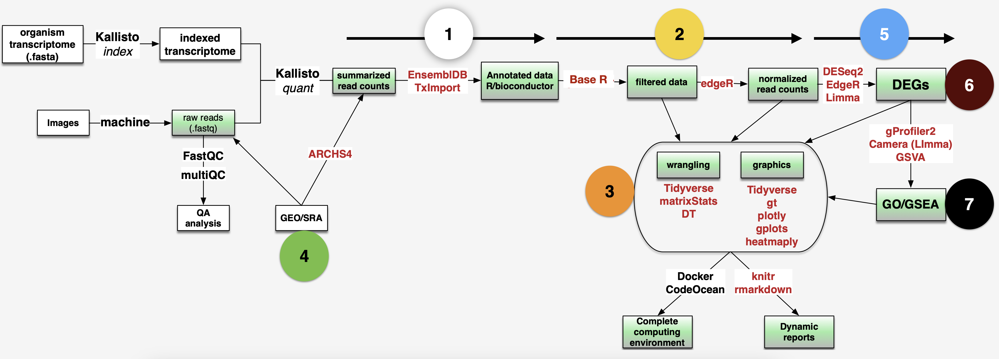
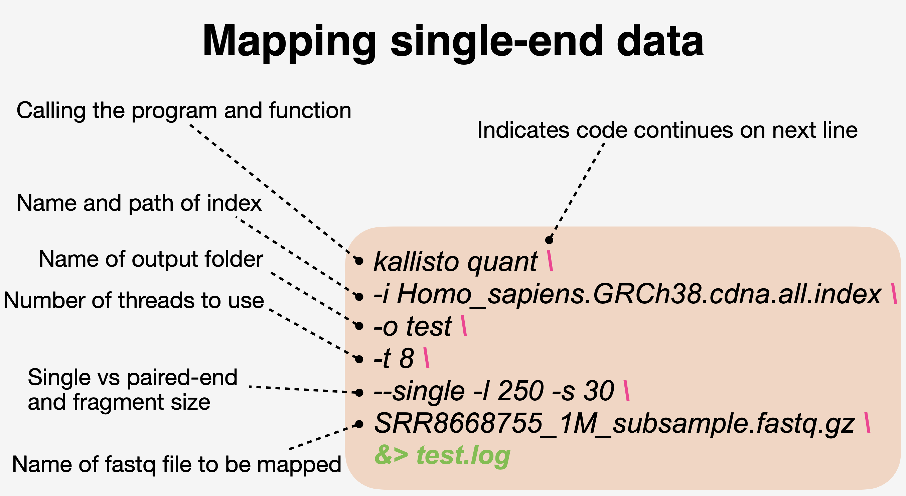
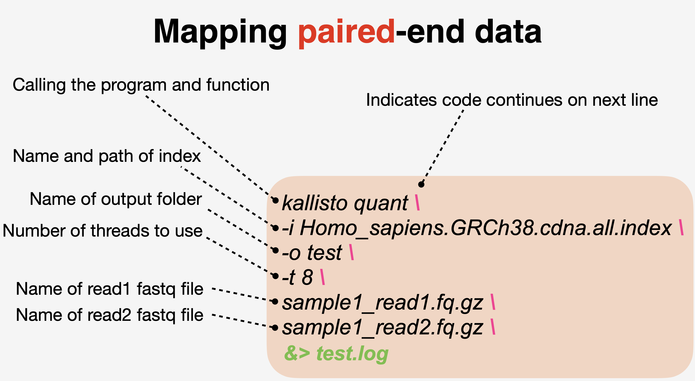

```{r setup, include=FALSE}
knitr::opts_chunk$set(
    # fig.width = 6, 
    # fig.height = 3.8,
    fig.align = "center", 
    # fig.retina = 3,
    out.width = "100%", 
    collapse = TRUE
)
```


## Step1: Check the quality of raw reads

```bash
### go to row reads folder
cd ~/onedrive/analysis/230907_DIY_Transcriptomics/data/fastq
### activate env
conda active rnaseq
### use fastqc to check the quality of fastq files
fastqc *.gz -t 4
```

## Step2: Mapping reads with Kallisto pseudoaligment

- Download reference transciptome files from [here](https://asia.ensembl.org/info/data/ftp/index.html)

- Build an index from reference fasta file

```bash
kallisto index -i Homo_sapiens.GRCh38.cdna.all.index Homo_sapiens.GRCh38.cdna.all.fa.gz
```
- Map reads to the indexed reference host transcriptome





```bash
### first the healthy subjects (HS)
kallisto quant -i Homo_sapiens.GRCh38.cdna.all.index -o HS01 -t 4 --single -l 250 -s 30 SRR8668755.fastq.gz &> HS01.log
kallisto quant -i Homo_sapiens.GRCh38.cdna.all.index -o HS02 -t 4 --single -l 250 -s 30 SRR8668756.fastq.gz &> HS02.log
kallisto quant -i Homo_sapiens.GRCh38.cdna.all.index -o HS03 -t 4 --single -l 250 -s 30 SRR8668757.fastq.gz &> HS03.log
kallisto quant -i Homo_sapiens.GRCh38.cdna.all.index -o HS04 -t 4 --single -l 250 -s 30 SRR8668758.fastq.gz &> HS04.log
kallisto quant -i Homo_sapiens.GRCh38.cdna.all.index -o HS05 -t 4 --single -l 250 -s 30 SRR8668759.fastq.gz &> HS05.log

### then the cutaneous leishmaniasis (CL) patients
kallisto quant -i Homo_sapiens.GRCh38.cdna.all.index -o CL08 -t 4 --single -l 250 -s 30 SRR8668769.fastq.gz &> CL08.log
kallisto quant -i Homo_sapiens.GRCh38.cdna.all.index -o CL10 -t 4 --single -l 250 -s 30 SRR8668771.fastq.gz &> CL10.log
kallisto quant -i Homo_sapiens.GRCh38.cdna.all.index -o CL11 -t 4 --single -l 250 -s 30 SRR8668772.fastq.gz &> CL11.log
kallisto quant -i Homo_sapiens.GRCh38.cdna.all.index -o CL12 -t 4 --single -l 250 -s 30 SRR8668773.fastq.gz &> CL12.log
kallisto quant -i Homo_sapiens.GRCh38.cdna.all.index -o CL13 -t 4 --single -l 250 -s 30 SRR8668774.fastq.gz &> CL13.log
```
- Summarize fastqc and kallisto mapping results in a single summary html using MultiQC

```bash
multiqc -d .
```


## Step3: Import data into R

### Load packages
```{r}
#| warning: false
#| message: false

### load packages
library(rhdf5) #provides functions for handling hdf5 file formats (kallisto outputs bootstraps in this format)
library(tidyverse) # provides access to Hadley Wickham's collection of R packages for data science, which we will use throughout the course
library(tximport) # package for getting Kallisto results into R
library(ensembldb) #helps deal with ensembl
library(EnsDb.Hsapiens.v86) #replace with your organism-specific database package
library(beepr) #just for fun
library(here) # file path
library(datapasta) # paste data into R from clipboard
library(edgeR) # well known package for differential expression analysis, but we only use for the DGEList object and for normalization methods
library(matrixStats) # let's us easily calculate stats on rows or columns of a data matrix
library(cowplot) # allows you to combine multiple plots in one figure
library(DT) # for making interactive tables
library(plotly) # for making interactive plots
library(gt) # A layered 'grammar of tables' - think ggplot, but for tables
library(limma) # venerable package for differential gene expression using linear modeling
library(edgeR)
library(RColorBrewer) #need colors to make heatmaps
# library(gameofthrones) #because...why not.  Install using 'devtools::install_github("aljrico/gameofthrones")'
library(heatmaply) #for making interactive heatmaps using plotly
library(gplots)
# library(d3heatmap) #for making interactive heatmaps using D3
library(GSEABase) #functions and methods for Gene Set Enrichment Analysis
library(Biobase) #base functions for bioconductor; required by GSEABase
library(GSVA) #Gene Set Variation Analysis, a non-parametric and unsupervised method for estimating variation of gene set enrichment across samples.
library(gprofiler2) #tools for accessing the GO enrichment results using g:Profiler web resources
library(clusterProfiler) # provides a suite of tools for functional enrichment analysis
library(msigdbr) # access to msigdb collections directly within R
library(enrichplot) # great for making the standard GSEA enrichment plots
```
### Study design files
```{r}
### load study design
targets <- read_tsv(here("data", 
    "230907_DIY_Transcriptomics",
    "studydesign.txt"))
targets

### create file paths for the abundance files
path <- file.path("data", "230907_DIY_Transcriptomics", targets$sample, "abundance.tsv")
path

### make sure path is correct
all(file.exists(path))
```
### Get organsim specific annotations

```{r}
tx <- transcripts(EnsDb.Hsapiens.v86, columns=c("tx_id", "gene_name"))
tx <- as_tibble(tx)
head(tx)
### need to change first column name to 'target_id'
tx <- dplyr::rename(tx, target_id = tx_id)
### transcrip ID needs to be the first column in the dataframe
tx <- dplyr::select(tx, "target_id", "gene_name")
```
### Load transcript counts

```{r}
txi_gene <- tximport(path, 
                     type = "kallisto", 
                     tx2gene = tx, 
                     txOut = FALSE, #How does the result change if this =FALSE vs =TRUE?
                     countsFromAbundance = "lengthScaledTPM",
                     ignoreTxVersion = TRUE)
### take a look at the type of object
class(txi_gene)
names(txi_gene)
```

## Step4: Wrangling gene expression

```{r}
### examine the data
tpm <- txi_gene$abundance
counts <- txi_gene$counts

### generate summary stats
tpm_stats <- transform(tpm, 
                         SD=rowSds(tpm), 
                         AVG=rowMeans(tpm),
                         MED=rowMedians(tpm))

### look at what you created
head(tpm_stats)

### scatter plot
ggplot(tpm_stats) + 
  aes(x = SD, y = MED) +
  geom_point(shape=16, size=2) +
  geom_smooth(method=lm) +
  geom_hex(show.legend = FALSE) +
  labs(y="Median", x = "Standard deviation",
       title="Transcripts per million (TPM)",
       subtitle="unfiltered, non-normalized data",
       caption="DIYtranscriptomics - Spring 2020") +
  theme_classic() +
  theme_dark() + 
  theme_bw()
```

```{r}
### capture sample labels from study design
sampleLabels <- targets$sample
### make DGElist from the counts
DGEList <- DGEList(txi_gene$counts)
DGEList

### get counts per million
cpm <- cpm(DGEList)
colSums(cpm)

log2_cpm <- cpm(DGEList, log=TRUE)
### connvert data matrix to dataframe
log2_cpm_df <- as_tibble(log2_cpm, rownames = "geneID")
### add sample names
colnames(log2_cpm_df) <- c("geneID", sampleLabels)

### pivot from wide to long 
log2_cpm_df_pivot <- pivot_longer(
  log2_cpm_df, # dataframe to be pivoted
  cols = HS01:CL13, # column names to be stored as a SINGLE variable
  names_to = "samples", # name of that new variable (column)
  values_to = "expression") # name of new variable (column) storing all the values (data)

p1 <- ggplot(log2_cpm_df_pivot) +
  aes(x=samples, y=expression, fill=samples) +
  geom_violin(trim = FALSE, show.legend = FALSE) +
  stat_summary(fun = "median", 
               geom = "point", 
               shape = 95, 
               size = 10, 
               color = "black", 
               show.legend = FALSE) +
  labs(y="log2 expression", x = "sample",
       title="Log2 Counts per Million (CPM)",
       subtitle="unfiltered, non-normalized",
       caption=paste0("produced on ", Sys.time())) +
  theme_bw()
p1
```
- How many genes or transcripts have no read counts at all?

```{r}
### filter data
table(rowSums(DGEList$counts==0)==10)
### how many genes had more than 1 CPM (TRUE) in at least 3 samples
### set cutoff
keepers <- rowSums(cpm>1)>=5 #user defined
DGEList_filtered <- DGEList[keepers,]

log2_cpm_filtered <- cpm(DGEList_filtered, log=TRUE)
log2_cpm_filtered_df <- as_tibble(log2_cpm_filtered, rownames = "geneID")
colnames(log2_cpm_filtered_df) <- c("geneID", sampleLabels)
log2_cpm_filtered_df_pivot <- pivot_longer(log2_cpm_filtered_df, # dataframe to be pivoted
      cols = HS01:CL13, # column names to be stored as a SINGLE variable
      names_to = "samples", # name of that new variable (column)
      values_to = "expression") # name of new variable (column) storing all the values (data)

p2 <- ggplot(log2_cpm_filtered_df_pivot) +
  aes(x=samples, y=expression, fill=samples) +
  geom_violin(trim = FALSE, show.legend = FALSE) +
  stat_summary(fun = "median", 
               geom = "point", 
               shape = 95, 
               size = 10, 
               color = "black", 
               show.legend = FALSE) +
  labs(y="log2 expression", x = "sample",
       title="Log2 Counts per Million (CPM)",
       subtitle="filtered, non-normalized",
       caption=paste0("produced on ", Sys.time())) +
  theme_bw()

p2
```

```{r}
### normalize data
DGEList_filtered_norm <- calcNormFactors(DGEList_filtered, method = "TMM")
log2_cpm_filtered_norm <- cpm(DGEList_filtered_norm, log=TRUE)
log2_cpm_filtered_norm_df <- as_tibble(log2_cpm_filtered_norm, rownames = "geneID")
colnames(log2_cpm_filtered_norm_df) <- c("geneID", sampleLabels)

log2_cpm_filtered_norm_df_pivot <- pivot_longer(log2_cpm_filtered_norm_df, # dataframe to be pivoted
    cols = HS01:CL13, # column names to be stored as a SINGLE variable
    names_to = "samples", # name of that new variable (column)
    values_to = "expression") # name of new variable (column) storing all the values (data)

p3 <- ggplot(log2_cpm_filtered_norm_df_pivot) +
  aes(x=samples, y=expression, fill=samples) +
  geom_violin(trim = FALSE, show.legend = FALSE) +
  stat_summary(fun = "median", 
               geom = "point", 
               shape = 95, 
               size = 10, 
               color = "black", 
               show.legend = FALSE) +
  labs(y="log2 expression", x = "sample",
       title="Log2 Counts per Million (CPM)",
       subtitle="filtered, TMM normalized",
       caption=paste0("produced on ", Sys.time())) +
  theme_bw()

plot_grid(p1, p2, p3, labels = c('A', 'B', 'C'), label_size = 12)

```
## Step5: Data exploration with multivariate analysis


```{r}
### Identify variables of interest in study design file
group <- targets$group
group <- factor(group)
group
```

### Hierarchical clustering

```{r}
### calculate distance  methods (e.g. switch from 'maximum' to 'euclidean')
distance <- dist(t(log2_cpm_filtered_norm), method = "maximum") 
### other distance methods are "euclidean", maximum", "manhattan", "canberra", "binary" or "minkowski"

clusters <- hclust(distance, method = "average") 
### other agglomeration methods are "ward.D", "ward.D2", "single", "complete", "average", "mcquitty", "median", or "centroid"
plot(clusters, labels=sampleLabels)
```

### Principal compoent analysis

```{r}
pca_res <- prcomp(t(log2_cpm_filtered_norm), scale. = FALSE, retx = TRUE)
### look at the PCA result (pca.res)
ls(pca_res)
### Prints variance summary for all principal components.
summary(pca_res)
### $rotation shows you how much each gene influenced each PC (called 'scores')
head(pca_res$rotation) 
### 'x' shows you how much each sample influenced each PC (called 'loadings')
pca_res$x 
### A screeplot is a standard way to view eigenvalues for each PCA
screeplot(pca_res) 
### sdev^2 captures these eigenvalues from the PCA result
pc_var <- pca_res$sdev^2 
### use these eigenvalues to calculate the percentage variance explained by each PC
pc_per <- round(pc_var/sum(pc_var)*100, 1) 
pc_per

```
- Can we figure out the identify of outlier?

```{r}
### Visualize PCA result 
pca_res_df <- as_tibble(pca_res$x)
pca_plot <- ggplot(pca_res_df) +
  aes(x=PC1, y=PC2, label=sampleLabels, color = group) +
  geom_point(size=4) +
  stat_ellipse() +
  xlab(paste0("PC1 (",pc_per[1],"%",")")) + 
  ylab(paste0("PC2 (",pc_per[2],"%",")")) +
  labs(title="PCA plot",
       caption=paste0("produced on ", Sys.time())) +
  coord_fixed() +
  theme_bw()

pca_plot
# ggplotly(pca_plot)
```
- Another way to view PCA laodings to understand impact of each sample on each pricipal component

```{r}
pca_res_df <- pca_res$x[,1:4] %>% 
  as_tibble() %>%
  add_column(sample = sampleLabels,
             group = group)
### dataframe to be pivoted  
pca_pivot <- pivot_longer(pca_res_df, 
                          cols = PC1:PC4, # column names to be stored as a SINGLE variable
                          names_to = "PC", # name of that new variable (column)
                          values_to = "loadings") # name of new variable (column) storing all the values (data)

ggplot(pca_pivot) +
  aes(x=sample, y=loadings, fill=group) + # you could iteratively 'paint' different covariates onto this plot using the 'fill' aes
  geom_bar(stat="identity") +
  facet_wrap(~PC) +
  labs(title="PCA 'small multiples' plot",
       caption=paste0("produced on ", Sys.time())) +
  theme_bw() +
  coord_flip()
```

```{r}
mydata_df <- mutate(log2_cpm_filtered_norm_df,
                    healthy.AVG = (HS01 + HS02 + HS03 + HS04 + HS05)/5, 
                    disease.AVG = (CL08 + CL10 + CL11 + CL12 + CL13)/5,
                    #now make columns comparing each of the averages above that you're interested in
                    LogFC = (disease.AVG - healthy.AVG)) %>% 
  mutate_if(is.numeric, round, 2)

### sort data
mydata_sort <- mydata_df %>%
  dplyr::arrange(desc(LogFC)) %>% 
  dplyr::select(geneID, LogFC)
mydata_sort

### filter data
mydata_filter <- mydata_df %>%
  dplyr::filter(geneID=="MMP1" | geneID=="GZMB" | geneID=="IL1B" | geneID=="GNLY" | geneID=="IFNG"
                | geneID=="CCL4" | geneID=="PRF1" | geneID=="APOBEC3A" | geneID=="UNC13A" ) %>%
  dplyr::select(geneID, healthy.AVG, disease.AVG, LogFC) %>%
  dplyr::arrange(desc(LogFC))
mydata_filter
```

- Produce publication-quality tables using `gt` package

```{r}
gt(mydata_filter)

mydata_filter %>%
  gt() %>%
  fmt_number(columns=2:4, decimals = 1) %>%
  tab_header(title = md("**Regulators of skin pathogenesis**"),
             subtitle = md("*during cutaneous leishmaniasis*")) %>%
  tab_footnote(
    footnote = "Deletion or blockaid ameliorates disease in mice",
    locations = cells_body(
      columns = geneID,
      rows = c(6, 7))) %>% 
  tab_footnote(
    footnote = "Associated with treatment failure in multiple studies",
    locations = cells_body(
      columns = geneID,
      rows = c(2:9))) %>%
  tab_footnote(
    footnote = "Implicated in parasite control",
    locations = cells_body(
      columns = geneID,
      rows = c(2))) %>%
  tab_source_note(
    source_note = md("Reference: Amorim *et al*., (2019). DOI: 10.1126/scitranslmed.aar3619"))
```

- Make an interactive table using the `DT` package

```{r}
#| eval: false
datatable(mydata_df[,c(1,12:14)], 
          extensions = c('KeyTable', "FixedHeader"), 
          filter = 'top',
          options = list(keys = TRUE, 
                         searchHighlight = TRUE, 
                         pageLength = 10, 
                         #dom = "Blfrtip", 
                         #buttons = c("copy", "csv", "excel"),
                         lengthMenu = c("10", "25", "50", "100")))
```

- Make an interactive scatter plot with `plotly`

```{r}
myplot <- ggplot(mydata_df) +
  aes(x=healthy.AVG, y=disease.AVG, 
      text = paste("Symbol:", geneID)) +
  geom_point(shape=16, size=1) +
  ggtitle("disease vs. healthy") +
  theme_bw()

myplot
# ggplotly(myplot)
```

## Step6: Differential gene expression

### Set up design matrix

```{r}
group <- factor(targets$group)
design <- model.matrix(~0 + group)
colnames(design) <- levels(group)

# NOTE: if you need a paired analysis (a.k.a.'blocking' design) or have a batch effect, the following design is useful
# design <- model.matrix(~block + treatment)
# this is just an example. 'block' and 'treatment' would need to be objects in your environment
```

### Model mean-variance trend and fit linear model to data

```{r}
head(DGEList_filtered_norm)
### Use VOOM function from Limma package to model the mean-variance relationship
v_DEGList_filtered_norm <- voom(DGEList_filtered_norm, design, plot = TRUE)
# fit a linear model to your data
fit <- lmFit(v_DEGList_filtered_norm, design)
### contrast matrix
contrast_matrix <- makeContrasts(infection = disease - healthy,
                                 levels=design)
### extract the linear model fit
fits <- contrasts.fit(fit, contrast_matrix)

### get bayesian stats for the linear model fit
ebFit <- eBayes(fits)
#write.fit(ebFit, file="lmfit_results.txt")

### top table to view DEGs
TopHits <- topTable(ebFit, adjust ="BH", coef=1, number=40000, sort.by="logFC")

### convert to a tibble
TopHits_df <- TopHits %>%
  as_tibble(rownames = "geneID")

TopHits_df

```

::: {.callout-note}
## Limma outputs
- TopTable (from Limma) outputs a few different stats:
- logFC, AveExpr, and P.Value should be self-explanatory
- adj.P.Val is your adjusted P value, also known as an FDR (if BH method was used for multiple testing correction)
- B statistic is the log-odds that that gene is differentially expressed. If B = 1.5, then log odds is e^1.5, where e is euler's constant (approx. 2.718).  So, the odds of differential expression os about 4.8 to 1
- t statistic is ratio of the logFC to the standard error (where the error has been moderated across all genes...because of Bayesian approach)
:::

```{r}
vplot <- ggplot(TopHits_df) +
  aes(y=-log10(adj.P.Val), x=logFC, text = paste("Symbol:", geneID)) +
  geom_point(size=2) +
  geom_hline(yintercept = -log10(0.01), linetype="longdash", colour="grey", linewidth=1) +
  geom_vline(xintercept = 1, linetype="longdash", colour="#BE684D", linewidth=1) +
  geom_vline(xintercept = -1, linetype="longdash", colour="#2C467A", linewidth=1) +
  #annotate("rect", xmin = 1, xmax = 12, ymin = -log10(0.01), ymax = 7.5, alpha=.2, fill="#BE684D") +
  #annotate("rect", xmin = -1, xmax = -12, ymin = -log10(0.01), ymax = 7.5, alpha=.2, fill="#2C467A") +
  labs(title="Volcano plot",
       subtitle = "Cutaneous leishmaniasis",
       caption=paste0("produced on ", Sys.time())) +
  theme_bw()

vplot
# ggplotly(vplot)
```

```{r}
### pull out DEGs and make venn diagram
results <- decideTests(ebFit, method="global", adjust.method="BH", p.value=0.01, lfc=2)
head(results)
summary(results)
vennDiagram(results, include="up")
```

```{r}
### retrieve expression data for DEGs
head(v_DEGList_filtered_norm$E)
colnames(v_DEGList_filtered_norm$E) <- sampleLabels

diffGenes <- v_DEGList_filtered_norm$E[results[,1] !=0,]
head(diffGenes)
dim(diffGenes)

#convert DEGs to a dataframe using as_tibble
diffGenes_df <- as_tibble(diffGenes, rownames = "geneID")

### create interactive tables to display DEGs
# datatable(diffGenes_df,
#           extensions = c('KeyTable', "FixedHeader"),
#           caption = 'Table 1: DEGs in cutaneous leishmaniasis',
#           options = list(keys = TRUE, searchHighlight = TRUE, pageLength = 10, lengthMenu = c("10", "25", "50", "100"))) %>%
#   formatRound(columns=c(2:11), digits=2)

### write DEGs to a file
# write_tsv(diffGenes_df, "DiffGenes.txt") 
#NOTE: this .txt file can be directly used for input into other clustering or network analysis tools (e.g., String, Clust (https://github.com/BaselAbujamous/clust, etc.)

```

## Step7: Module identification

```{r}
#| eval: false
heatcolors <- rev(brewer.pal(name="RdBu", n=11))
clustRows <- hclust(as.dist(1-cor(t(diffGenes), method="pearson")), method="complete") #cluster rows by pearson correlation
clustColumns <- hclust(as.dist(1-cor(diffGenes, method="spearman")), method="complete")
module_assign <- cutree(clustRows, k=2)
module_color <- rainbow(length(unique(module_assign)), start=0.1, end=0.9) 
module_color <- module_color[as.vector(module_assign)] 
heatmap.2(diffGenes, 
          Rowv=as.dendrogram(clustRows), 
          Colv=as.dendrogram(clustColumns),
          RowSideColors=module_color,
          col=heatcolors, scale='row', labRow=NA,
          density.info="none", trace="none",  
          cexRow=1, cexCol=1, margins=c(8,20))

modulePick <- 2 
Module_up <- diffGenes[names(module_assign[module_assign %in% modulePick]),] 
hrsub_up <- hclust(as.dist(1-cor(t(Module_up), method="pearson")), method="complete") 

heatmap.2(
    Module_up, 
    Rowv=as.dendrogram(hrsub_up), 
    Colv=NA, 
    labRow = NA,
    col=heatcolors, scale="row", 
    density.info="none", trace="none", 
    RowSideColors=module_color[module_assign%in%modulePick], margins=c(8,20)
)

modulePick <- 1 
Module_down <- diffGenes[names(module_assign[module_assign %in% modulePick]),] 
hrsub_down <- hclust(as.dist(1-cor(t(Module_down), method="pearson")), method="complete") 

heatmap.2(Module_down, 
          Rowv=as.dendrogram(hrsub_down), 
          Colv=NA, 
          labRow = NA,
          col=heatcolors, scale="row", 
          density.info="none", trace="none", 
          RowSideColors=module_color[module_assign%in%modulePick], margins=c(8,20))
```

## Step8: Functional enrichment analysis

```{r}
#| eval: false
# Carry out GO enrichment using gProfiler2 ----
# use topTable result to pick the top genes for carrying out a Gene Ontology (GO) enrichment analysis
myTopHits <- topTable(ebFit, adjust ="BH", coef=1, number=50, sort.by="logFC")
# use the 'gost' function from the gprofiler2 package to run GO enrichment analysis
gost.res <- gost(rownames(myTopHits), organism = "hsapiens", correction_method = "fdr")
# produce an interactive manhattan plot of enriched GO terms
gostplot(gost.res, interactive = T, capped = T) #set interactive=FALSE to get plot for publications
# produce a publication quality static manhattan plot with specific GO terms highlighted
# rerun the above gostplot function with 'interactive=F' and save to an object 'mygostplot'
# publish_gostplot(
#   mygostplot, #your static gostplot from above
#   highlight_terms = c("GO:0034987"),
#   filename = NULL,
#   width = NA,
#   height = NA)

#you can also generate a table of your gost results
publish_gosttable(
  gost.res,
  highlight_terms = NULL,
  use_colors = TRUE,
  show_columns = c("source", "term_name", "term_size", "intersection_size"),
  filename = NULL,
  ggplot=TRUE)
# now repeat the above steps using only genes from a single module from the step 6 script, by using `rownames(myModule)`
# what is value in breaking up DEGs into modules for functional enrichment analysis?

# Perform GSEA using clusterProfiler ----
# there are a few ways to get msigDB collections into R
# option1: download directly from msigdb and load from your computer
# can use the 'read.gmt' function from clusterProfiler package to create a dataframe, 
# alternatively, you can read in using 'getGmt' function from GSEABase package if you need a GeneSetCollection object
c2cp <- read.gmt("/Users/danielbeiting/Dropbox/MSigDB/c2.cp.v7.1.symbols.gmt")

# option2: use the msigdb package to access up-to-date collections 
# this option has the additional advantage of providing access to species-specific collections
# are also retrieved as tibbles
msigdbr_species()
hs_gsea <- msigdbr(species = "Homo sapiens") #gets all collections/signatures with human gene IDs
#take a look at the categories and subcategories of signatures available to you
hs_gsea %>% 
  dplyr::distinct(gs_cat, gs_subcat) %>% 
  dplyr::arrange(gs_cat, gs_subcat)

# choose a specific msigdb collection/subcollection
# since msigdbr returns a tibble, we'll use dplyr to do a bit of wrangling
hs_gsea_c2 <- msigdbr(species = "Homo sapiens", # change depending on species your data came from
                      category = "C2") %>% # choose your msigdb collection of interest
  dplyr::select(gs_name, gene_symbol) #just get the columns corresponding to signature name and gene symbols of genes in each signature 

# Now that you have your msigdb collections ready, prepare your data
# grab the dataframe you made in step3 script
# Pull out just the columns corresponding to gene symbols and LogFC for at least one pairwise comparison for the enrichment analysis
mydata.df.sub <- dplyr::select(mydata.df, geneID, LogFC)
# construct a named vector
mydata.gsea <- mydata.df.sub$LogFC
names(mydata.gsea) <- as.character(mydata.df.sub$geneID)
mydata.gsea <- sort(mydata.gsea, decreasing = TRUE)

# run GSEA using the 'GSEA' function from clusterProfiler
myGSEA.res <- GSEA(mydata.gsea, TERM2GENE=hs_gsea_c2, verbose=FALSE)
myGSEA.df <- as_tibble(myGSEA.res@result)

# view results as an interactive table
datatable(myGSEA.df, 
          extensions = c('KeyTable', "FixedHeader"), 
          caption = 'Signatures enriched in leishmaniasis',
          options = list(keys = TRUE, searchHighlight = TRUE, pageLength = 10, lengthMenu = c("10", "25", "50", "100"))) %>%
  formatRound(columns=c(2:10), digits=2)
# create enrichment plots using the enrichplot package
gseaplot2(myGSEA.res, 
          geneSetID = c(6, 47, 262), #can choose multiple signatures to overlay in this plot
          pvalue_table = FALSE, #can set this to FALSE for a cleaner plot
          title = myGSEA.res$Description[47]) #can also turn off this title

# add a variable to this result that matches enrichment direction with phenotype
myGSEA.df <- myGSEA.df %>%
  mutate(phenotype = case_when(
    NES > 0 ~ "disease",
    NES < 0 ~ "healthy"))

# create 'bubble plot' to summarize y signatures across x phenotypes
ggplot(myGSEA.df[1:20,], aes(x=phenotype, y=ID)) + 
  geom_point(aes(size=setSize, color = NES, alpha=-log10(p.adjust))) +
  scale_color_gradient(low="blue", high="red") +
  theme_bw()

# Competitive GSEA using CAMERA----
# for competitive tests the null hypothesis is that genes in the set are, at most, as often differentially expressed as genes outside the set
# first let's create a few signatures to test in our enrichment analysis
mySig <- rownames(myTopHits) #if your own data is from mice, wrap this in 'toupper()' to make gene symbols all caps
mySig2 <- sample((rownames(v.DEGList.filtered.norm$E)), size = 50, replace = FALSE)
collection <- list(real = mySig, fake = mySig2)
# now test for enrichment using CAMERA
camera.res <- camera(v.DEGList.filtered.norm$E, collection, design, contrast.matrix[,1]) 
camera.df <- as_tibble(camera.res, rownames = "setName")
camera.df

# Self-contained GSEA using ROAST----
# remember that for self-contained the null hypothesis is that no genes in the set are differentially expressed
mroast(v.DEGList.filtered.norm$E, collection, design, contrast=1) #mroast adjusts for multiple testing

# now repeat with an actual gene set collection
# camera requires collections to be presented as a list, rather than a tibble, so we must read in our signatures using the 'getGmt' function
broadSet.C2.ALL <- getGmt("/Users/danielbeiting/Dropbox/MSigDB/c2.all.v7.1.symbols.gmt", geneIdType=SymbolIdentifier())
#extract as a list
broadSet.C2.ALL <- geneIds(broadSet.C2.ALL)
camera.res <- camera(v.DEGList.filtered.norm$E, broadSet.C2.ALL, design, contrast.matrix[,1]) 
camera.df <- as_tibble(camera.res, rownames = "setName")
camera.df

# filter based on FDR and display as interactive table
camera.df <- filter(camera.df, FDR<=0.01)

datatable(camera.df, 
          extensions = c('KeyTable', "FixedHeader"), 
          caption = 'Signatures enriched in leishmaniasis',
          options = list(keys = TRUE, searchHighlight = TRUE, pageLength = 10, lengthMenu = c("10", "25", "50", "100"))) %>%
  formatRound(columns=c(2,4,5), digits=2)

#as before, add a variable that maps up/down regulated pathways with phenotype
camera.df <- camera.df %>%
  mutate(phenotype = case_when(
    Direction == "Up" ~ "disease",
    Direction == "Down" ~ "healthy"))

#easy to filter this list based on names of signatures using 'str_detect'
#here is an example of filtering to return anything that has 'CD8' or 'CYTOTOX' in the name of the signature
camera.df.sub <- camera.df %>%
  dplyr::filter(str_detect(setName, "CD8|CYTOTOX"))

# graph camera results as bubble chart 
ggplot(camera.df[1:25,], aes(x=phenotype, y=setName)) + 
  geom_point(aes(size=NGenes, color = Direction, alpha=-log10(FDR))) +
  theme_bw()

# Single sample GSEA using the GSVA package----
# the GSVA package offers a different way of approaching functional enrichment analysis.  
# A few comments about the approach:
# In contrast to most GSE methods, GSVA performs a change in coordinate systems,
# transforming the data from a gene by sample matrix to a gene set (signature) by sample matrix. 
# this allows for the evaluation of pathway enrichment for each sample.
# the method is both non-parametric and unsupervised
# bypasses the conventional approach of explicitly modeling phenotypes within enrichment scoring algorithms. 
# focus is therefore placed on the RELATIVE enrichment of pathways across the sample space rather than the absolute enrichment with respect to a phenotype. 
# however, with data with a moderate to small sample size (< 30), other GSE methods that explicitly include the phenotype in their model are more likely to provide greater statistical power to detect functional enrichment.

# be aware that if you choose a large MsigDB file here, this step may take a while
GSVA.res.C2CP <- gsva(v.DEGList.filtered.norm$E, #your data
                      broadSet.C2.ALL, #signatures
                      min.sz=5, max.sz=500, #criteria for filtering gene sets
                      mx.diff=FALSE,
                      method="gsva") #options for method are "gsva", ssgsea', "zscore" or "plage"

# Apply linear model to GSVA result
# now using Limma to find significantly enriched gene sets in the same way you did to find diffGenes
# this means you'll be using topTable, decideTests, etc
# note that you need to reference your design and contrast matrix here
fit.C2CP <- lmFit(GSVA.res.C2CP, design)
ebFit.C2CP <- eBayes(fit.C2CP)

# use topTable and decideTests functions to identify the differentially enriched gene sets
topPaths.C2CP <- topTable(ebFit.C2CP, adjust ="BH", coef=1, number=50, sort.by="logFC")
res.C2CP <- decideTests(ebFit.C2CP, method="global", adjust.method="BH", p.value=0.05, lfc=0.58)
# the summary of the decideTests result shows how many sets were enriched in induced and repressed genes in all sample types
summary(res.C2CP)

# pull out the gene sets that are differentially enriched between groups
diffSets.C2CP <- GSVA.res.C2CP[res.C2CP[,1] !=0,]
head(diffSets.C2CP)
dim(diffSets.C2CP)

# make a heatmap of differentially enriched gene sets 
hr.C2CP <- hclust(as.dist(1-cor(t(diffSets.C2CP), method="pearson")), method="complete") #cluster rows by pearson correlation
hc.C2CP <- hclust(as.dist(1-cor(diffSets.C2CP, method="spearman")), method="complete") #cluster columns by spearman correlation

# Cut the resulting tree and create color vector for clusters.  Vary the cut height to give more or fewer clusters, or you the 'k' argument to force n number of clusters
mycl.C2CP <- cutree(hr.C2CP, k=2)
mycolhc.C2CP <- rainbow(length(unique(mycl.C2CP)), start=0.1, end=0.9) 
mycolhc.C2CP <- mycolhc.C2CP[as.vector(mycl.C2CP)] 

# assign your favorite heatmap color scheme. Some useful examples: colorpanel(40, "darkblue", "yellow", "white"); heat.colors(75); cm.colors(75); rainbow(75); redgreen(75); library(RColorBrewer); rev(brewer.pal(9,"Blues")[-1]). Type demo.col(20) to see more color schemes.
myheatcol <- colorRampPalette(colors=c("yellow","white","blue"))(100)
# plot the hclust results as a heatmap
heatmap.2(diffSets.C2CP, 
          Rowv=as.dendrogram(hr.C2CP), 
          Colv=as.dendrogram(hc.C2CP), 
          col=myheatcol, scale="row",
          density.info="none", trace="none", 
          cexRow=0.9, cexCol=1, margins=c(10,14)) # Creates heatmap for entire data set where the obtained clusters are indicated in the color bar.
# just as we did for genes, we can also make an interactive heatmap for pathways
# you can edit what is shown in this heatmap, just as you did for your gene level heatmap earlier in the course
```
```{r}
#| eval: false
gost.res_up <- gost(rownames(myModule_up), organism = "hsapiens", correction_method = "fdr")
gostplot(gost.res_up, interactive = T, capped = T) #set interactive=FALSE to get plot for publications
gost.res_down <- gost(rownames(myModule_down), organism = "hsapiens", correction_method = "fdr")
gostplot(gost.res_down, interactive = T, capped = T) #set interactive=FALSE to get plot for publications

hs_gsea_c2 <- msigdbr(species = "Homo sapiens", # change depending on species your data came from
                      category = "C2") %>% # choose your msigdb collection of interest
  dplyr::select(gs_name, gene_symbol) #just get the columns corresponding to signature name and gene symbols of genes in each signature 

# Now that you have your msigdb collections ready, prepare your data
# grab the dataframe you made in step3 script
# Pull out just the columns corresponding to gene symbols and LogFC for at least one pairwise comparison for the enrichment analysis
mydata.df.sub <- dplyr::select(mydata.df, geneID, LogFC)
mydata.gsea <- mydata.df.sub$LogFC
names(mydata.gsea) <- as.character(mydata.df.sub$geneID)
mydata.gsea <- sort(mydata.gsea, decreasing = TRUE)

# run GSEA using the 'GSEA' function from clusterProfiler
myGSEA.res <- GSEA(mydata.gsea, TERM2GENE=hs_gsea_c2, verbose=FALSE)
myGSEA.df <- as_tibble(myGSEA.res@result)

# view results as an interactive table
datatable(myGSEA.df, 
          extensions = c('KeyTable', "FixedHeader"), 
          caption = 'Signatures enriched in leishmaniasis',
          options = list(keys = TRUE, searchHighlight = TRUE, pageLength = 10, lengthMenu = c("10", "25", "50", "100"))) %>%
  formatRound(columns=c(3:10), digits=2)
# create enrichment plots using the enrichplot package
gseaplot2(myGSEA.res, 
          geneSetID = 47, #can choose multiple signatures to overlay in this plot
          pvalue_table = FALSE, #can set this to FALSE for a cleaner plot
          title = myGSEA.res$Description[47]) #can also turn off this title

# add a variable to this result that matches enrichment direction with phenotype
myGSEA.df <- myGSEA.df %>%
  mutate(phenotype = case_when(
    NES > 0 ~ "disease",
    NES < 0 ~ "healthy"))

# create 'bubble plot' to summarize y signatures across x phenotypes
ggplot(myGSEA.df[1:20,], aes(x=phenotype, y=ID)) + 
  geom_point(aes(size=setSize, color = NES, alpha=-log10(p.adjust))) +
  scale_color_gradient(low="blue", high="red") +
  theme_bw()
```
## Automate above using shell scripts

## Reference

- [DIY Transcriptomics](https://diytranscriptomics.com/)
- [protocols](https://protocols.hostmicrobe.org/)

## SessionInfo

```{r}
sessionInfo()
```
