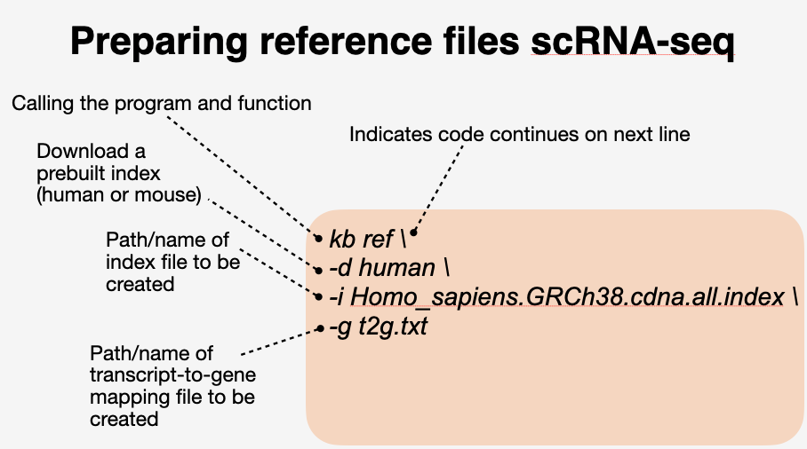
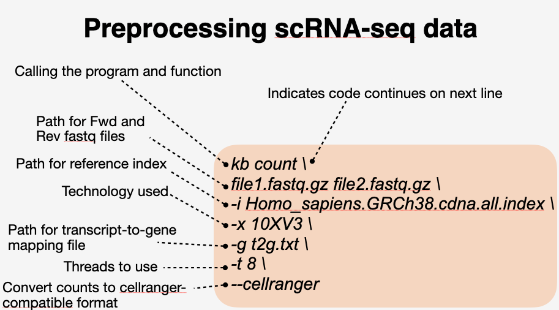

## Preparing reference files for scRNA-seq

```bash
### create conda env for mapping reads
conda create --name kb
conda activate kb
pip install kb-python
```

```bash
### navigate to directory and active kb environment 230907_DIY_Transcriptomics/data/pbmc_1k_raw
kb ref -d human -i Homo_sapiens.GRCh38.cdna.all.index -g t2g.txt
```


## Mapping reads for scRNA-seq data

```bash
kb count pbmc_1k_v3_S1_mergedLanes_R1.fastq.gz pbmc_1k_v3_S1_mergedLanes_R2.fastq.gz -i Homo_sapiens.GRCh38.cdna.all.index -x 10XV3 -g t2g.txt -t 8 --cellranger
```


## Imporing data into R


