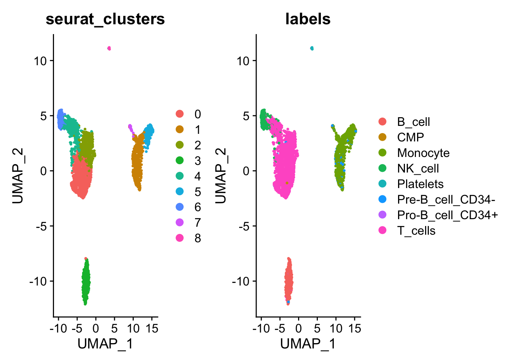
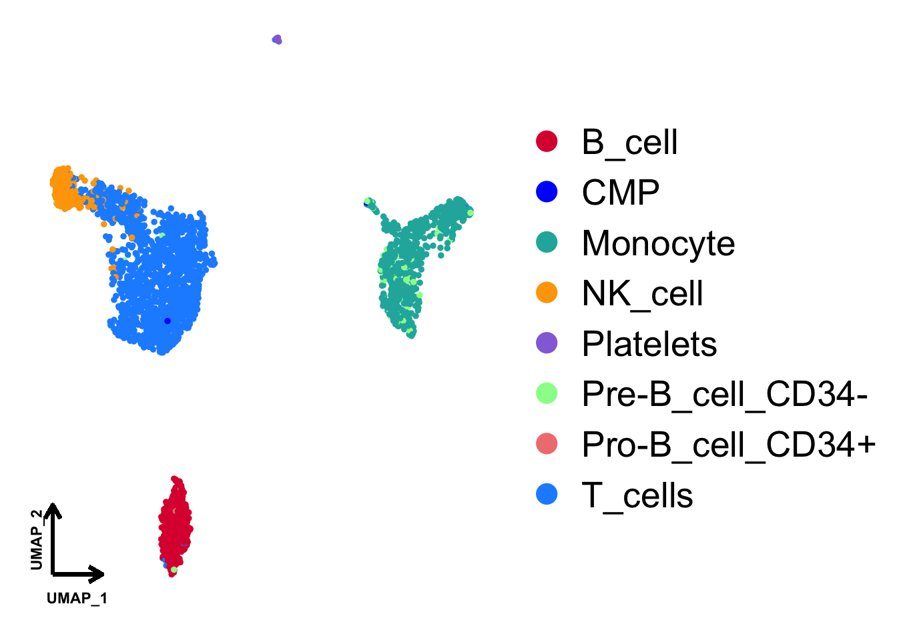
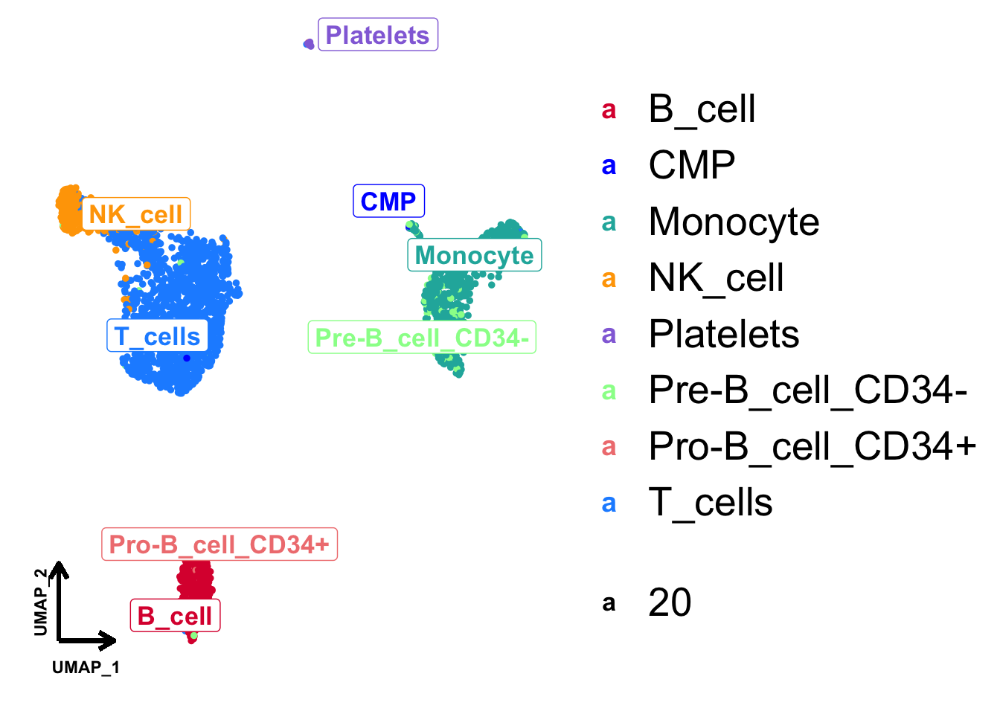

## Packages

::: {.cell layout-align="center"}

```{.r .cell-code}
library(here)
library(tidyverse)
library(Seurat)
library(SingleR)
library(ggrepel)
library(ggthemes)
library(ggnewscale)
library(tidyverse)
library(scCustomize)
library(viridis)
library(RColorBrewer)
library(gridExtra)
library(ComplexHeatmap)
library(dittoSeq)
library(Scillus)
```
:::

## UMAP

### Load Seurat object

::: {.cell layout-align="center"}

```{.r .cell-code}
### Load data
load(here("projects", "2023_scRNA_Seurat", "pbmc_tutorial_singleR.RData"))
load(here("projects", "2023_scRNA_Seurat", "sce.anno.RData"))
load(here("projects", "2023_scRNA_Seurat", "all_markers.RData"))
top5 <- all_markers |> group_by(cluster) |> top_n(5, avg_log2FC)

### Check data
head(pbmc, 2)
##                  orig.ident nCount_RNA nFeature_RNA percent.mt percent.HB
## AAACATACAACCAC-1     pbmc3k       2419          779   3.017776          0
## AAACATTGAGCTAC-1     pbmc3k       4903         1352   3.793596          0
##                  RNA_snn_res.0.5 seurat_clusters  labels
## AAACATACAACCAC-1               0               0 T_cells
## AAACATTGAGCTAC-1               3               3  B_cell
head(sce2, 2)
##                         orig.ident nCount_RNA nFeature_RNA percent.mt
## K16733_AAACATACTCGTTT-1     K16733       2464          965  12.662338
## K16733_AAAGCAGAACGTTG-1     K16733       7145         1919   2.449265
##                         percent.rp percent.HB RNA_snn_res.0.5 seurat_clusters
## K16733_AAACATACTCGTTT-1   13.35227          0              11              11
## K16733_AAAGCAGAACGTTG-1   36.72498          0               3               3
##                         sampel sample group    globalC       anno
## K16733_AAACATACTCGTTT-1    P01    P01    PT        Epi        Epi
## K16733_AAAGCAGAACGTTG-1    P01    P01    PT Fibroblast Fibroblast
head(top5)
## # A tibble: 6 × 7
## # Groups:   cluster [2]
##       p_val avg_log2FC pct.1 pct.2 p_val_adj cluster gene      
##       <dbl>      <dbl> <dbl> <dbl>     <dbl> <fct>   <chr>     
## 1 2.43e- 67       3.05 0.172 0.079 1.26e- 62 0       REG4      
## 2 3.38e- 51       3.19 0.069 0.019 1.76e- 46 0       BPIFB1    
## 3 5.32e- 30       3.71 0.031 0.007 2.76e- 25 0       FABP1     
## 4 6.37e- 21       2.79 0.018 0.003 3.31e- 16 0       SLC9A4    
## 5 1.65e- 20       2.70 0.017 0.003 8.56e- 16 0       AC073218.2
## 6 2.51e-112       3.57 0.132 0.023 1.30e-107 1       SPRR1A
```
:::

### Default seurat UMAP


::: {.cell layout-align="center"}

```{.r .cell-code}
# View the UMAP
DimPlot(pbmc, group.by = c("seurat_clusters", "labels"), reduction = "umap")
```

::: {.cell-output-display}
{fig-align='center' width=100%}
:::
:::


### UMAP with ggplot2


::: {.cell layout-align="center"}

```{.r .cell-code}
# Find the UMAP data
str(pbmc)
## Formal class 'Seurat' [package "SeuratObject"] with 13 slots
##   ..@ assays      :List of 1
##   .. ..$ RNA:Formal class 'Assay' [package "SeuratObject"] with 8 slots
##   .. .. .. ..@ counts       :Formal class 'dgCMatrix' [package "Matrix"] with 6 slots
##   .. .. .. .. .. ..@ i       : int [1:2238732] 29 73 80 148 163 184 186 227 229 230 ...
##   .. .. .. .. .. ..@ p       : int [1:2639] 0 779 2131 3260 4220 4741 5522 6304 7094 7626 ...
##   .. .. .. .. .. ..@ Dim     : int [1:2] 13714 2638
##   .. .. .. .. .. ..@ Dimnames:List of 2
##   .. .. .. .. .. .. ..$ : chr [1:13714] "AL627309.1" "AP006222.2" "RP11-206L10.2" "RP11-206L10.9" ...
##   .. .. .. .. .. .. ..$ : chr [1:2638] "AAACATACAACCAC-1" "AAACATTGAGCTAC-1" "AAACATTGATCAGC-1" "AAACCGTGCTTCCG-1" ...
##   .. .. .. .. .. ..@ x       : num [1:2238732] 1 1 2 1 1 1 1 41 1 1 ...
##   .. .. .. .. .. ..@ factors : list()
##   .. .. .. ..@ data         :Formal class 'dgCMatrix' [package "Matrix"] with 6 slots
##   .. .. .. .. .. ..@ i       : int [1:2238732] 29 73 80 148 163 184 186 227 229 230 ...
##   .. .. .. .. .. ..@ p       : int [1:2639] 0 779 2131 3260 4220 4741 5522 6304 7094 7626 ...
##   .. .. .. .. .. ..@ Dim     : int [1:2] 13714 2638
##   .. .. .. .. .. ..@ Dimnames:List of 2
##   .. .. .. .. .. .. ..$ : chr [1:13714] "AL627309.1" "AP006222.2" "RP11-206L10.2" "RP11-206L10.9" ...
##   .. .. .. .. .. .. ..$ : chr [1:2638] "AAACATACAACCAC-1" "AAACATTGAGCTAC-1" "AAACATTGATCAGC-1" "AAACCGTGCTTCCG-1" ...
##   .. .. .. .. .. ..@ x       : num [1:2238732] 1.64 1.64 2.23 1.64 1.64 ...
##   .. .. .. .. .. ..@ factors : list()
##   .. .. .. ..@ scale.data   : num [1:2000, 1:2638] -0.8556 -0.2773 1.4947 -0.0463 -0.4658 ...
##   .. .. .. .. ..- attr(*, "dimnames")=List of 2
##   .. .. .. .. .. ..$ : chr [1:2000] "ISG15" "CPSF3L" "MRPL20" "ATAD3C" ...
##   .. .. .. .. .. ..$ : chr [1:2638] "AAACATACAACCAC-1" "AAACATTGAGCTAC-1" "AAACATTGATCAGC-1" "AAACCGTGCTTCCG-1" ...
##   .. .. .. ..@ assay.orig   : NULL
##   .. .. .. ..@ var.features : chr [1:2000] "PPBP" "LYZ" "S100A9" "IGLL5" ...
##   .. .. .. ..@ meta.features:'data.frame':	13714 obs. of  5 variables:
##   .. .. .. .. ..$ vst.mean                 : num [1:13714] 0.00341 0.00114 0.0019 0.00114 0.00682 ...
##   .. .. .. .. ..$ vst.variance             : num [1:13714] 0.0034 0.00114 0.00189 0.00114 0.00678 ...
##   .. .. .. .. ..$ vst.variance.expected    : num [1:13714] 0.00365 0.00114 0.00197 0.00114 0.00748 ...
##   .. .. .. .. ..$ vst.variance.standardized: num [1:13714] 0.933 0.992 0.963 0.992 0.906 ...
##   .. .. .. .. ..$ vst.variable             : logi [1:13714] FALSE FALSE FALSE FALSE FALSE FALSE ...
##   .. .. .. ..@ misc         : list()
##   .. .. .. ..@ key          : chr "rna_"
##   ..@ meta.data   :'data.frame':	2638 obs. of  8 variables:
##   .. ..$ orig.ident     : Factor w/ 1 level "pbmc3k": 1 1 1 1 1 1 1 1 1 1 ...
##   .. ..$ nCount_RNA     : num [1:2638] 2419 4903 3147 2639 980 ...
##   .. ..$ nFeature_RNA   : int [1:2638] 779 1352 1129 960 521 781 782 790 532 550 ...
##   .. ..$ percent.mt     : num [1:2638] 3.02 3.79 0.89 1.74 1.22 ...
##   .. ..$ percent.HB     : num [1:2638] 0 0 0 0 0 0 0 0 0 0 ...
##   .. ..$ RNA_snn_res.0.5: Factor w/ 9 levels "0","1","2","3",..: 1 4 3 2 7 3 5 5 5 6 ...
##   .. ..$ seurat_clusters: Factor w/ 9 levels "0","1","2","3",..: 1 4 3 2 7 3 5 5 5 6 ...
##   .. ..$ labels         : chr [1:2638] "T_cells" "B_cell" "T_cells" "Monocyte" ...
##   ..@ active.assay: chr "RNA"
##   ..@ active.ident: Factor w/ 9 levels "0","1","2","3",..: 1 4 3 2 7 3 5 5 5 6 ...
##   .. ..- attr(*, "names")= chr [1:2638] "AAACATACAACCAC-1" "AAACATTGAGCTAC-1" "AAACATTGATCAGC-1" "AAACCGTGCTTCCG-1" ...
##   ..@ graphs      :List of 2
##   .. ..$ RNA_nn :Formal class 'Graph' [package "SeuratObject"] with 7 slots
##   .. .. .. ..@ assay.used: chr "RNA"
##   .. .. .. ..@ i         : int [1:52760] 0 6 102 203 213 229 292 451 547 618 ...
##   .. .. .. ..@ p         : int [1:2639] 0 33 50 64 80 87 103 139 155 162 ...
##   .. .. .. ..@ Dim       : int [1:2] 2638 2638
##   .. .. .. ..@ Dimnames  :List of 2
##   .. .. .. .. ..$ : chr [1:2638] "AAACATACAACCAC-1" "AAACATTGAGCTAC-1" "AAACATTGATCAGC-1" "AAACCGTGCTTCCG-1" ...
##   .. .. .. .. ..$ : chr [1:2638] "AAACATACAACCAC-1" "AAACATTGAGCTAC-1" "AAACATTGATCAGC-1" "AAACCGTGCTTCCG-1" ...
##   .. .. .. ..@ x         : num [1:52760] 1 1 1 1 1 1 1 1 1 1 ...
##   .. .. .. ..@ factors   : list()
##   .. ..$ RNA_snn:Formal class 'Graph' [package "SeuratObject"] with 7 slots
##   .. .. .. ..@ assay.used: chr "RNA"
##   .. .. .. ..@ i         : int [1:194424] 0 6 102 136 187 203 229 292 421 446 ...
##   .. .. .. ..@ p         : int [1:2639] 0 62 120 170 240 287 379 453 533 573 ...
##   .. .. .. ..@ Dim       : int [1:2] 2638 2638
##   .. .. .. ..@ Dimnames  :List of 2
##   .. .. .. .. ..$ : chr [1:2638] "AAACATACAACCAC-1" "AAACATTGAGCTAC-1" "AAACATTGATCAGC-1" "AAACCGTGCTTCCG-1" ...
##   .. .. .. .. ..$ : chr [1:2638] "AAACATACAACCAC-1" "AAACATTGAGCTAC-1" "AAACATTGATCAGC-1" "AAACCGTGCTTCCG-1" ...
##   .. .. .. ..@ x         : num [1:194424] 1 0.1111 0.1765 0.0811 0.0811 ...
##   .. .. .. ..@ factors   : list()
##   ..@ neighbors   : list()
##   ..@ reductions  :List of 3
##   .. ..$ pca :Formal class 'DimReduc' [package "SeuratObject"] with 9 slots
##   .. .. .. ..@ cell.embeddings           : num [1:2638, 1:50] -5.84 -2.56 -1.64 13.29 -2.15 ...
##   .. .. .. .. ..- attr(*, "dimnames")=List of 2
##   .. .. .. .. .. ..$ : chr [1:2638] "AAACATACAACCAC-1" "AAACATTGAGCTAC-1" "AAACATTGATCAGC-1" "AAACCGTGCTTCCG-1" ...
##   .. .. .. .. .. ..$ : chr [1:50] "PC_1" "PC_2" "PC_3" "PC_4" ...
##   .. .. .. ..@ feature.loadings          : num [1:2000, 1:50] 0.01091 0.11663 0.11569 -0.00853 -0.01632 ...
##   .. .. .. .. ..- attr(*, "dimnames")=List of 2
##   .. .. .. .. .. ..$ : chr [1:2000] "PPBP" "LYZ" "S100A9" "IGLL5" ...
##   .. .. .. .. .. ..$ : chr [1:50] "PC_1" "PC_2" "PC_3" "PC_4" ...
##   .. .. .. ..@ feature.loadings.projected: num[0 , 0 ] 
##   .. .. .. ..@ assay.used                : chr "RNA"
##   .. .. .. ..@ global                    : logi FALSE
##   .. .. .. ..@ stdev                     : num [1:50] 7.05 4.5 3.87 3.75 3.15 ...
##   .. .. .. ..@ jackstraw                 :Formal class 'JackStrawData' [package "SeuratObject"] with 4 slots
##   .. .. .. .. .. ..@ empirical.p.values     : num [1:2000, 1:20] 0.0005 0 0 0.0035 0 0 0.01 0 0.0135 0 ...
##   .. .. .. .. .. .. ..- attr(*, "dimnames")=List of 2
##   .. .. .. .. .. .. .. ..$ : chr [1:2000] "PPBP" "LYZ" "S100A9" "IGLL5" ...
##   .. .. .. .. .. .. .. ..$ : chr [1:20] "PC1" "PC2" "PC3" "PC4" ...
##   .. .. .. .. .. ..@ fake.reduction.scores  : num [1:2000, 1:20] -0.003524 0.000285 -0.000627 0.002054 0.000959 ...
##   .. .. .. .. .. ..@ empirical.p.values.full: logi [1, 1] NA
##   .. .. .. .. .. ..@ overall.p.values       : num [1:20, 1:2] 1 2 3 4 5 6 7 8 9 10 ...
##   .. .. .. .. .. .. ..- attr(*, "dimnames")=List of 2
##   .. .. .. .. .. .. .. ..$ : NULL
##   .. .. .. .. .. .. .. ..$ : chr [1:2] "PC" "Score"
##   .. .. .. ..@ misc                      :List of 1
##   .. .. .. .. ..$ total.variance: num 1734
##   .. .. .. ..@ key                       : chr "PC_"
##   .. ..$ umap:Formal class 'DimReduc' [package "SeuratObject"] with 9 slots
##   .. .. .. ..@ cell.embeddings           : num [1:2638, 1:2] -4.58 -2.81 -1.68 12.69 -9.83 ...
##   .. .. .. .. ..- attr(*, "scaled:center")= num [1:2] -0.0395 -1.1523
##   .. .. .. .. ..- attr(*, "dimnames")=List of 2
##   .. .. .. .. .. ..$ : chr [1:2638] "AAACATACAACCAC-1" "AAACATTGAGCTAC-1" "AAACATTGATCAGC-1" "AAACCGTGCTTCCG-1" ...
##   .. .. .. .. .. ..$ : chr [1:2] "UMAP_1" "UMAP_2"
##   .. .. .. ..@ feature.loadings          : num[0 , 0 ] 
##   .. .. .. ..@ feature.loadings.projected: num[0 , 0 ] 
##   .. .. .. ..@ assay.used                : chr "RNA"
##   .. .. .. ..@ global                    : logi TRUE
##   .. .. .. ..@ stdev                     : num(0) 
##   .. .. .. ..@ jackstraw                 :Formal class 'JackStrawData' [package "SeuratObject"] with 4 slots
##   .. .. .. .. .. ..@ empirical.p.values     : num[0 , 0 ] 
##   .. .. .. .. .. ..@ fake.reduction.scores  : num[0 , 0 ] 
##   .. .. .. .. .. ..@ empirical.p.values.full: num[0 , 0 ] 
##   .. .. .. .. .. ..@ overall.p.values       : num[0 , 0 ] 
##   .. .. .. ..@ misc                      : list()
##   .. .. .. ..@ key                       : chr "UMAP_"
##   .. ..$ tsne:Formal class 'DimReduc' [package "SeuratObject"] with 9 slots
##   .. .. .. ..@ cell.embeddings           : num [1:2638, 1:2] -11.1 -36.27 1.96 37.46 -20.88 ...
##   .. .. .. .. ..- attr(*, "dimnames")=List of 2
##   .. .. .. .. .. ..$ : chr [1:2638] "AAACATACAACCAC-1" "AAACATTGAGCTAC-1" "AAACATTGATCAGC-1" "AAACCGTGCTTCCG-1" ...
##   .. .. .. .. .. ..$ : chr [1:2] "tSNE_1" "tSNE_2"
##   .. .. .. ..@ feature.loadings          : num[0 , 0 ] 
##   .. .. .. ..@ feature.loadings.projected: num[0 , 0 ] 
##   .. .. .. ..@ assay.used                : chr "RNA"
##   .. .. .. ..@ global                    : logi TRUE
##   .. .. .. ..@ stdev                     : num(0) 
##   .. .. .. ..@ jackstraw                 :Formal class 'JackStrawData' [package "SeuratObject"] with 4 slots
##   .. .. .. .. .. ..@ empirical.p.values     : num[0 , 0 ] 
##   .. .. .. .. .. ..@ fake.reduction.scores  : num[0 , 0 ] 
##   .. .. .. .. .. ..@ empirical.p.values.full: num[0 , 0 ] 
##   .. .. .. .. .. ..@ overall.p.values       : num[0 , 0 ] 
##   .. .. .. ..@ misc                      : list()
##   .. .. .. ..@ key                       : chr "tSNE_"
##   ..@ images      : list()
##   ..@ project.name: chr "pbmc3k"
##   ..@ misc        : list()
##   ..@ version     :Classes 'package_version', 'numeric_version'  hidden list of 1
##   .. ..$ : int [1:3] 4 0 0
##   ..@ commands    :List of 10
##   .. ..$ NormalizeData.RNA       :Formal class 'SeuratCommand' [package "SeuratObject"] with 5 slots
##   .. .. .. ..@ name       : chr "NormalizeData.RNA"
##   .. .. .. ..@ time.stamp : POSIXct[1:1], format: "2021-07-08 11:49:17"
##   .. .. .. ..@ assay.used : chr "RNA"
##   .. .. .. ..@ call.string: chr [1:2] "NormalizeData(pbmc, normalization.method = \"LogNormalize\", " "    scale.factor = 10000)"
##   .. .. .. ..@ params     :List of 5
##   .. .. .. .. ..$ assay               : chr "RNA"
##   .. .. .. .. ..$ normalization.method: chr "LogNormalize"
##   .. .. .. .. ..$ scale.factor        : num 10000
##   .. .. .. .. ..$ margin              : num 1
##   .. .. .. .. ..$ verbose             : logi TRUE
##   .. ..$ FindVariableFeatures.RNA:Formal class 'SeuratCommand' [package "SeuratObject"] with 5 slots
##   .. .. .. ..@ name       : chr "FindVariableFeatures.RNA"
##   .. .. .. ..@ time.stamp : POSIXct[1:1], format: "2021-07-08 11:49:18"
##   .. .. .. ..@ assay.used : chr "RNA"
##   .. .. .. ..@ call.string: chr "FindVariableFeatures(pbmc, selection.method = \"vst\", nfeatures = 2000)"
##   .. .. .. ..@ params     :List of 12
##   .. .. .. .. ..$ assay              : chr "RNA"
##   .. .. .. .. ..$ selection.method   : chr "vst"
##   .. .. .. .. ..$ loess.span         : num 0.3
##   .. .. .. .. ..$ clip.max           : chr "auto"
##   .. .. .. .. ..$ mean.function      :function (mat, display_progress)  
##   .. .. .. .. ..$ dispersion.function:function (mat, display_progress)  
##   .. .. .. .. ..$ num.bin            : num 20
##   .. .. .. .. ..$ binning.method     : chr "equal_width"
##   .. .. .. .. ..$ nfeatures          : num 2000
##   .. .. .. .. ..$ mean.cutoff        : num [1:2] 0.1 8
##   .. .. .. .. ..$ dispersion.cutoff  : num [1:2] 1 Inf
##   .. .. .. .. ..$ verbose            : logi TRUE
##   .. ..$ ScaleData.RNA           :Formal class 'SeuratCommand' [package "SeuratObject"] with 5 slots
##   .. .. .. ..@ name       : chr "ScaleData.RNA"
##   .. .. .. ..@ time.stamp : POSIXct[1:1], format: "2021-07-08 11:49:47"
##   .. .. .. ..@ assay.used : chr "RNA"
##   .. .. .. ..@ call.string: chr "ScaleData(pbmc, vars.to.regress = \"percent.mt\")"
##   .. .. .. ..@ params     :List of 11
##   .. .. .. .. ..$ features          : chr [1:2000] "PPBP" "LYZ" "S100A9" "IGLL5" ...
##   .. .. .. .. ..$ assay             : chr "RNA"
##   .. .. .. .. ..$ vars.to.regress   : chr "percent.mt"
##   .. .. .. .. ..$ model.use         : chr "linear"
##   .. .. .. .. ..$ use.umi           : logi FALSE
##   .. .. .. .. ..$ do.scale          : logi TRUE
##   .. .. .. .. ..$ do.center         : logi TRUE
##   .. .. .. .. ..$ scale.max         : num 10
##   .. .. .. .. ..$ block.size        : num 1000
##   .. .. .. .. ..$ min.cells.to.block: num 2638
##   .. .. .. .. ..$ verbose           : logi TRUE
##   .. ..$ RunPCA.RNA              :Formal class 'SeuratCommand' [package "SeuratObject"] with 5 slots
##   .. .. .. ..@ name       : chr "RunPCA.RNA"
##   .. .. .. ..@ time.stamp : POSIXct[1:1], format: "2021-07-08 11:49:54"
##   .. .. .. ..@ assay.used : chr "RNA"
##   .. .. .. ..@ call.string: chr "RunPCA(pbmc, features = VariableFeatures(object = pbmc))"
##   .. .. .. ..@ params     :List of 11
##   .. .. .. .. ..$ assay          : chr "RNA"
##   .. .. .. .. ..$ features       : chr [1:2000] "PPBP" "LYZ" "S100A9" "IGLL5" ...
##   .. .. .. .. ..$ npcs           : num 50
##   .. .. .. .. ..$ rev.pca        : logi FALSE
##   .. .. .. .. ..$ weight.by.var  : logi TRUE
##   .. .. .. .. ..$ verbose        : logi TRUE
##   .. .. .. .. ..$ ndims.print    : int [1:5] 1 2 3 4 5
##   .. .. .. .. ..$ nfeatures.print: num 30
##   .. .. .. .. ..$ reduction.name : chr "pca"
##   .. .. .. .. ..$ reduction.key  : chr "PC_"
##   .. .. .. .. ..$ seed.use       : num 42
##   .. ..$ JackStraw.RNA.pca       :Formal class 'SeuratCommand' [package "SeuratObject"] with 5 slots
##   .. .. .. ..@ name       : chr "JackStraw.RNA.pca"
##   .. .. .. ..@ time.stamp : POSIXct[1:1], format: "2021-07-08 11:54:13"
##   .. .. .. ..@ assay.used : chr "RNA"
##   .. .. .. ..@ call.string: chr "JackStraw(pbmc, num.replicate = 100)"
##   .. .. .. ..@ params     :List of 7
##   .. .. .. .. ..$ reduction    : chr "pca"
##   .. .. .. .. ..$ assay        : chr "RNA"
##   .. .. .. .. ..$ dims         : num 20
##   .. .. .. .. ..$ num.replicate: num 100
##   .. .. .. .. ..$ prop.freq    : num 0.01
##   .. .. .. .. ..$ verbose      : logi TRUE
##   .. .. .. .. ..$ maxit        : num 1000
##   .. ..$ ScoreJackStraw          :Formal class 'SeuratCommand' [package "SeuratObject"] with 5 slots
##   .. .. .. ..@ name       : chr "ScoreJackStraw"
##   .. .. .. ..@ time.stamp : POSIXct[1:1], format: "2021-07-08 11:54:13"
##   .. .. .. ..@ assay.used : chr "RNA"
##   .. .. .. ..@ call.string: chr "ScoreJackStraw(pbmc, dims = 1:20)"
##   .. .. .. ..@ params     :List of 4
##   .. .. .. .. ..$ reduction   : chr "pca"
##   .. .. .. .. ..$ dims        : int [1:20] 1 2 3 4 5 6 7 8 9 10 ...
##   .. .. .. .. ..$ score.thresh: num 1e-05
##   .. .. .. .. ..$ do.plot     : logi FALSE
##   .. ..$ FindNeighbors.RNA.pca   :Formal class 'SeuratCommand' [package "SeuratObject"] with 5 slots
##   .. .. .. ..@ name       : chr "FindNeighbors.RNA.pca"
##   .. .. .. ..@ time.stamp : POSIXct[1:1], format: "2021-07-08 11:54:15"
##   .. .. .. ..@ assay.used : chr "RNA"
##   .. .. .. ..@ call.string: chr "FindNeighbors(pbmc, dims = 1:10)"
##   .. .. .. ..@ params     :List of 17
##   .. .. .. .. ..$ reduction      : chr "pca"
##   .. .. .. .. ..$ dims           : int [1:10] 1 2 3 4 5 6 7 8 9 10
##   .. .. .. .. ..$ assay          : chr "RNA"
##   .. .. .. .. ..$ k.param        : num 20
##   .. .. .. .. ..$ return.neighbor: logi FALSE
##   .. .. .. .. ..$ compute.SNN    : logi TRUE
##   .. .. .. .. ..$ prune.SNN      : num 0.0667
##   .. .. .. .. ..$ nn.method      : chr "annoy"
##   .. .. .. .. ..$ n.trees        : num 50
##   .. .. .. .. ..$ annoy.metric   : chr "euclidean"
##   .. .. .. .. ..$ nn.eps         : num 0
##   .. .. .. .. ..$ verbose        : logi TRUE
##   .. .. .. .. ..$ force.recalc   : logi FALSE
##   .. .. .. .. ..$ do.plot        : logi FALSE
##   .. .. .. .. ..$ graph.name     : chr [1:2] "RNA_nn" "RNA_snn"
##   .. .. .. .. ..$ l2.norm        : logi FALSE
##   .. .. .. .. ..$ cache.index    : logi FALSE
##   .. ..$ FindClusters            :Formal class 'SeuratCommand' [package "SeuratObject"] with 5 slots
##   .. .. .. ..@ name       : chr "FindClusters"
##   .. .. .. ..@ time.stamp : POSIXct[1:1], format: "2021-07-08 11:54:15"
##   .. .. .. ..@ assay.used : chr "RNA"
##   .. .. .. ..@ call.string: chr "FindClusters(pbmc, resolution = 0.5)"
##   .. .. .. ..@ params     :List of 10
##   .. .. .. .. ..$ graph.name      : chr "RNA_snn"
##   .. .. .. .. ..$ modularity.fxn  : num 1
##   .. .. .. .. ..$ resolution      : num 0.5
##   .. .. .. .. ..$ method          : chr "matrix"
##   .. .. .. .. ..$ algorithm       : num 1
##   .. .. .. .. ..$ n.start         : num 10
##   .. .. .. .. ..$ n.iter          : num 10
##   .. .. .. .. ..$ random.seed     : num 0
##   .. .. .. .. ..$ group.singletons: logi TRUE
##   .. .. .. .. ..$ verbose         : logi TRUE
##   .. ..$ RunUMAP.RNA.pca         :Formal class 'SeuratCommand' [package "SeuratObject"] with 5 slots
##   .. .. .. ..@ name       : chr "RunUMAP.RNA.pca"
##   .. .. .. ..@ time.stamp : POSIXct[1:1], format: "2021-07-08 11:54:28"
##   .. .. .. ..@ assay.used : chr "RNA"
##   .. .. .. ..@ call.string: chr "RunUMAP(pbmc, dims = 1:10)"
##   .. .. .. ..@ params     :List of 22
##   .. .. .. .. ..$ dims                : int [1:10] 1 2 3 4 5 6 7 8 9 10
##   .. .. .. .. ..$ reduction           : chr "pca"
##   .. .. .. .. ..$ assay               : chr "RNA"
##   .. .. .. .. ..$ slot                : chr "data"
##   .. .. .. .. ..$ umap.method         : chr "uwot"
##   .. .. .. .. ..$ return.model        : logi FALSE
##   .. .. .. .. ..$ n.neighbors         : int 30
##   .. .. .. .. ..$ n.components        : int 2
##   .. .. .. .. ..$ metric              : chr "cosine"
##   .. .. .. .. ..$ learning.rate       : num 1
##   .. .. .. .. ..$ min.dist            : num 0.3
##   .. .. .. .. ..$ spread              : num 1
##   .. .. .. .. ..$ set.op.mix.ratio    : num 1
##   .. .. .. .. ..$ local.connectivity  : int 1
##   .. .. .. .. ..$ repulsion.strength  : num 1
##   .. .. .. .. ..$ negative.sample.rate: int 5
##   .. .. .. .. ..$ uwot.sgd            : logi FALSE
##   .. .. .. .. ..$ seed.use            : int 42
##   .. .. .. .. ..$ angular.rp.forest   : logi FALSE
##   .. .. .. .. ..$ verbose             : logi TRUE
##   .. .. .. .. ..$ reduction.name      : chr "umap"
##   .. .. .. .. ..$ reduction.key       : chr "UMAP_"
##   .. ..$ RunTSNE                 :Formal class 'SeuratCommand' [package "SeuratObject"] with 5 slots
##   .. .. .. ..@ name       : chr "RunTSNE"
##   .. .. .. ..@ time.stamp : POSIXct[1:1], format: "2021-07-08 11:54:36"
##   .. .. .. ..@ assay.used : chr "RNA"
##   .. .. .. ..@ call.string: chr "RunTSNE(pbmc, dims = 1:10)"
##   .. .. .. ..@ params     :List of 8
##   .. .. .. .. ..$ reduction     : chr "pca"
##   .. .. .. .. ..$ cells         : chr [1:2638] "AAACATACAACCAC-1" "AAACATTGAGCTAC-1" "AAACATTGATCAGC-1" "AAACCGTGCTTCCG-1" ...
##   .. .. .. .. ..$ dims          : int [1:10] 1 2 3 4 5 6 7 8 9 10
##   .. .. .. .. ..$ seed.use      : num 1
##   .. .. .. .. ..$ tsne.method   : chr "Rtsne"
##   .. .. .. .. ..$ dim.embed     : num 2
##   .. .. .. .. ..$ reduction.name: chr "tsne"
##   .. .. .. .. ..$ reduction.key : chr "tSNE_"
##   ..@ tools       :List of 2
##   .. ..$ BuildClusterTree           :List of 4
##   .. .. ..$ edge       : int [1:16, 1:2] 10 10 11 12 12 11 13 14 14 16 ...
##   .. .. ..$ edge.length: num [1:16] 463 158 174 131 131 ...
##   .. .. ..$ tip.label  : chr [1:9] "0" "1" "2" "3" ...
##   .. .. ..$ Nnode      : int 8
##   .. .. ..- attr(*, "class")= chr "phylo"
##   .. .. ..- attr(*, "order")= chr "cladewise"
##   .. ..$ CalculateBarcodeInflections:List of 4
##   .. .. ..$ barcode_distribution:'data.frame':	2638 obs. of  4 variables:
##   .. .. .. ..$ orig.ident: Factor w/ 1 level "pbmc3k": 1 1 1 1 1 1 1 1 1 1 ...
##   .. .. .. ..$ nCount_RNA: num [1:2638] 8875 8415 8011 7928 7167 ...
##   .. .. .. ..$ rank      : num [1:2638] 1 2 3 4 5 6 7 8 9 10 ...
##   .. .. .. ..$ rawdiff   : num [1:2638] 0 -0.02311 -0.02136 -0.00452 -0.04382 ...
##   .. .. ..$ inflection_points   :'data.frame':	1 obs. of  3 variables:
##   .. .. .. ..$ orig.ident: Factor w/ 1 level "pbmc3k": 1
##   .. .. .. ..$ nCount_RNA: num 7167
##   .. .. .. ..$ rank      : num 5
##   .. .. ..$ threshold_values    :'data.frame':	2 obs. of  2 variables:
##   .. .. .. ..$ threshold: chr [1:2] "threshold.low" "threshold.high"
##   .. .. .. ..$ rank     : num [1:2] 1 2638
##   .. .. ..$ cells_pass          : chr [1:2635] "GGGCCAACCTTGGA-1" "CAGGTTGAGGATCT-1" "ACGAGGGACAGGAG-1" "AAGCCATGAACTGC-1" ...
# Retrieve UMAP data
# Retrieve the coordinates of each cell, and cluster, celltype information
umap <- pbmc@reductions$umap@cell.embeddings |> 
  as.data.frame() |> 
  cbind(cell_type = pbmc@meta.data$labels)

head(umap)
##                     UMAP_1     UMAP_2 cell_type
## AAACATACAACCAC-1 -4.577857   1.650203   T_cells
## AAACATTGAGCTAC-1 -2.813911 -11.897462    B_cell
## AAACATTGATCAGC-1 -1.684490   3.302480   T_cells
## AAACCGTGCTTCCG-1 12.694498   2.098798  Monocyte
## AAACCGTGTATGCG-1 -9.829201   3.982013   NK_cell
## AAACGCACTGGTAC-1 -2.908319   1.249230   T_cells
```
:::

::: {.cell layout-align="center"}

```{.r .cell-code}
# Define the colors
allcolour <- c(
    "#DC143C","#0000FF","#20B2AA","#FFA500","#9370DB","#98FB98","#F08080",
    "#1E90FF","#7CFC00","#FFFF00", "#808000","#FF00FF","#FA8072","#7B68EE",
    "#9400D3","#800080","#A0522D","#D2B48C","#D2691E","#87CEEB","#40E0D0",
    "#5F9EA0","#FF1493","#0000CD","#008B8B","#FFE4B5","#8A2BE2","#228B22",
    "#E9967A","#4682B4","#32CD32","#F0E68C","#FFFFE0","#EE82EE","#FF6347",
    "#6A5ACD","#9932CC","#8B008B","#8B4513","#DEB887"
)
# ggplot2
p <- ggplot(umap, aes(x = UMAP_1, y = UMAP_2, color = cell_type)) +
    geom_point(size = 1, alpha = 1) +
    ### MAP cluster with color
    scale_color_manual(values = allcolour) +
    ### Axis annotation
    geom_segment(
        aes(
            x = min(umap$UMAP_1) , y = min(umap$UMAP_2) ,
            xend = min(umap$UMAP_1) +3, yend = min(umap$UMAP_2)
        ), colour = "black", linewidth = 1,arrow = arrow(length = unit(0.3,"cm"))
    ) + 
    geom_segment(
        aes(
            x = min(umap$UMAP_1)  , y = min(umap$UMAP_2)  ,
            xend = min(umap$UMAP_1) , yend = min(umap$UMAP_2) + 3),
            colour = "black", linewidth = 1,arrow = arrow(length = unit(0.3,"cm"))
    ) +
    annotate(
        "text", x = min(umap$UMAP_1) +1.5, y = min(umap$UMAP_2) -1, 
        label = "UMAP_1", color="black",size = 3, fontface="bold"
    ) + 
    annotate(
        "text", x = min(umap$UMAP_1) -1, y = min(umap$UMAP_2) + 1.5, 
        label = "UMAP_2", color="black",size = 3, fontface="bold" ,angle=90
    ) + 
    theme(
        panel.grid.major = element_blank(),
        panel.grid.minor = element_blank(),
        panel.border = element_blank(),
        axis.title = element_blank(),
        axis.text = element_blank(),
        axis.ticks = element_blank(),
        panel.background = element_rect(fill = "white"),
        plot.background = element_rect(fill = "white"),
        legend.title = element_blank(), 
        legend.key=element_rect(fill= "white"),
        legend.text = element_text(size = 20),
        legend.key.size=unit(1, "cm")
    ) +
    ### legend label size
    guides(color = guide_legend(override.aes = list(size=5)))
### View it
p
```

::: {.cell-output-display}
{fig-align='center' width=100%}
:::
:::


### Annotate cell type on UMAP


::: {.cell layout-align="center"}

```{.r .cell-code}
# Calcualte the median coordinates of each cluster
cell_type_med <- umap |>
  group_by(cell_type) |>
  summarise(UMAP_1 = median(UMAP_1),
    UMAP_2 = median(UMAP_2)
  )
# Annotation
p + geom_label_repel(
    aes(label = cell_type, size = 20), fontface = "bold", data = cell_type_med,
    point.padding = unit(0.5, "lines")
)
```

::: {.cell-output-display}
{fig-align='center' width=100%}
:::
:::

## FeaturePlot

### Default Seurat FeaturePlot

::: {.cell layout-align="center"}

```{.r .cell-code}
DimPlot(pbmc, label = TRUE)|FeaturePlot(pbmc, features = "CD79A")
```

::: {.cell-output-display}
{fig-align='center' width=100%}
:::

```{.r .cell-code}
FeaturePlot(pbmc, features = c("CD79A", "CD8A"), blend=TRUE)
```

::: {.cell-output-display}
{fig-align='center' width=100%}
:::

```{.r .cell-code}
FeaturePlot(pbmc, features = c("CD79A","CD79B"), blend=TRUE)
```

::: {.cell-output-display}
{fig-align='center' width=100%}
:::

```{.r .cell-code}
FeaturePlot(pbmc, features = c("CD79A","CD79B", "CD68", "CD163"))
```

::: {.cell-output-display}
{fig-align='center' width=100%}
:::
:::


### Feature with ggplot2


::: {.cell layout-align="center"}

```{.r .cell-code}
mydata  <- FetchData(
    pbmc,
    vars = c("rna_CD79A", "rna_CD8A", "rna_CCR7", "UMAP_1", "UMAP_2")
)
head(mydata)
##                  rna_CD79A rna_CD8A rna_CCR7    UMAP_1     UMAP_2
## AAACATACAACCAC-1  0.000000 1.635873 1.635873 -4.577857   1.650203
## AAACATTGAGCTAC-1  1.962726 0.000000 0.000000 -2.813911 -11.897462
## AAACATTGATCAGC-1  0.000000 0.000000 0.000000 -1.684490   3.302480
## AAACCGTGCTTCCG-1  0.000000 0.000000 0.000000 12.694498   2.098798
## AAACCGTGTATGCG-1  0.000000 0.000000 0.000000 -9.829201   3.982013
## AAACGCACTGGTAC-1  0.000000 0.000000 0.000000 -2.908319   1.249230

### Single gene
mydata |>
    ggplot(aes(x = UMAP_1, y = UMAP_2)) +
    geom_point(
        data = mydata, aes(x = UMAP_1, y = UMAP_2,
        color = rna_CD79A), size = 1
    ) +
    ### Increase the transprancy of gray dots
    scale_color_gradient(
        "rna_CD79A", low = alpha("grey", 0.1), 
        high = alpha("red", 1)
    ) +
    ### Density
    stat_density2d(aes(colour=rna_CD79A))
```

::: {.cell-output-display}
{fig-align='center' width=100%}
:::
:::

::: {.cell layout-align="center"}

```{.r .cell-code}
### Multiple genes in feature plot
# ggplot(mydata, aes(x = UMAP_1, y = UMAP_2)) +
#     geom_point(
#         data = mydata, aes(x = UMAP_1, y = UMAP_2, color = rna_CD79A), 
#         size = 1
#     ) +
#     scale_color_gradient(
#         "CD79A", low = alpha("grey", 0.1), high = alpha("purple", 1)
#     ) +
#     new_scale("color") +
#     geom_point(
#         data = mydata, aes(x = UMAP_1, y = UMAP_2, color = rna_CD8A), 
#         size = 1
#     ) +
#     scale_color_gradient(
#         "CD8A", low = alpha("grey", 0.1), high = alpha("red", 1)
#     ) +
#     new_scale("color") +
#     geom_point(
#         data = mydata, aes(x = UMAP_1, y = UMAP_2,color = rna_CCR7), 
#         size = 1
#     ) +
#     scale_color_gradient(
#         "CCR7", low = alpha("grey", 0.1), high = alpha("green", 1)
#     ) +
#     theme_bw()
```
:::


## Dotplot


### Deafult Dotplot within Seurat

::: {.cell layout-align="center"}

```{.r .cell-code}
# Find marker genes
# all_markers <- FindAllMarkers(object = sce2)
# save(all_markers,file = here("learn", "2023_scRNA", "all_markers.RData"))

DotPlot(sce2,features = unique(top5$gene) ,assay='RNA')
```

::: {.cell-output-display}
{fig-align='center' width=100%}
:::
:::

::: {.cell layout-align="center"}

```{.r .cell-code}
# Optimize colors, size, and direction
p1 <- DotPlot(sce2, features = unique(top5$gene), assay = "RNA") + 
  coord_flip() + 
  labs(x = NULL,y = NULL) + 
  guides(size = guide_legend("Percent Expression"))+
  scale_color_gradientn(colours = c("#330066", "#336699", "#66CC66", "#FFCC33")) +
  theme(
    panel.grid = element_blank(), 
    axis.text.x = element_text(angle = 45, hjust = 0.5,vjust = 0.5)
  )
## Scale for colour is already present.
## Adding another scale for colour, which will replace the existing scale.
p1
```

::: {.cell-output-display}
{fig-align='center' width=100%}
:::
:::


### Dotplot with Complexheatmap

We can refer to details from [here](https://divingintogeneticsandgenomics.com/post/clustered-dotplot-for-single-cell-rnaseq/) for detailed parameters customization.


::: {.cell layout-align="center"}

```{.r .cell-code}
# Retrieve data
df <- p1$data
head(df)
##               avg.exp   pct.exp features.plot id avg.exp.scaled
## REG4       7.70481043 17.174382          REG4  0       2.500000
## BPIFB1     0.30669602  6.860158        BPIFB1  0       2.500000
## FABP1      0.29179596  3.118254         FABP1  0       2.500000
## SLC9A4     0.01901309  1.751019        SLC9A4  0       2.500000
## AC073218.2 0.03103152  1.655073    AC073218.2  0       1.137072
## SPRR1A     0.07460096  3.837851        SPRR1A  0       0.208155

# The matrix for the scaled expression 
exp_mat <-df |> 
  select(-pct.exp, -avg.exp) |>  
  pivot_wider(names_from = id, values_from = avg.exp.scaled) |> 
  as.data.frame()
row.names(exp_mat) <- exp_mat$features.plot
exp_mat <- exp_mat[, -1] |> as.matrix()
head(exp_mat, 2)
##          0          1          2          3          4        5          6
## REG4   2.5  1.0681259 -0.6492553 -0.6766277  0.4956595 1.826576 -0.4005466
## BPIFB1 2.5 -0.1015123 -0.4099583 -0.5370206 -0.3309614 1.039651 -0.6032213
##                 7          8          9         10        11         12
## REG4   -0.3648312 -0.6411552  0.3682808 -0.4876358 0.3408992 -0.6358072
## BPIFB1  0.4017002 -0.5414065 -0.2597756 -0.5685453 1.6007798 -0.6318396
##                13         14        15         16         17         18
## REG4   -0.7044399 -0.7832735 0.5617191 -0.7888883 -0.5395693 -0.7888883
## BPIFB1 -0.6318396 -0.6318396 1.1110916 -0.6318396 -0.6318396 -0.6318396

## The matrix for the percentage of cells express a gene
percent_mat <- df |> 
  select(-avg.exp, -avg.exp.scaled) |>  
  pivot_wider(names_from = id, values_from = pct.exp) |> 
  as.data.frame()
 
row.names(percent_mat) <- percent_mat$features.plot  
percent_mat <- percent_mat[, -1] |> as.matrix()
head(percent_mat, 2)
##                0         1        2         3        4         5         6
## REG4   17.174382 11.642157 5.015480 3.2281731 7.209302 16.111851 7.9301075
## BPIFB1  6.860158  2.389706 1.114551 0.7336757 2.015504  3.062583 0.2688172
##                7         8         9        10        11       12       13 14
## REG4   11.367673 2.5782689 12.406948 7.1090047 12.244898 5.797101 2.380952  1
## BPIFB1  6.571936 0.3683241  1.736973 0.4739336  8.843537 0.000000 0.000000  0
##              15 16       17 18
## REG4   9.278351  0 8.571429  0
## BPIFB1 7.216495  0 0.000000  0
```
:::

::: {.cell layout-align="center"}

```{.r .cell-code}
# Complexheatmap
## any value that is greater than 2 will be mapped to yellow
col_fun <-  circlize::colorRamp2(c(-1, 0, 2), viridis(20)[c(1,10, 20)])
cell_fun <- function(j, i, x, y, w, h, fill) {
    grid.rect(x = x, y = y, width = w, height = h,
        gp = gpar(col = NA, fill = NA))
    grid.circle(x = x, y = y, r = percent_mat[i, j] / 100 * min(unit.c(w, h)),
        gp = gpar(fill = col_fun(exp_mat[i, j]), col = NA))
}

# also do a kmeans clustering for the genes with k = 4
Heatmap(
    exp_mat,
    heatmap_legend_param = list(title = "Average Expression"),
    column_title = "clustered dotplot",
    col = col_fun,
    rect_gp = gpar(type = "none"),
    cell_fun = cell_fun,
    row_names_gp = gpar(fontsize = 3),
    # row_km = 4,
    border = "black"
)
```
:::

::: {.cell layout-align="center"}

```{.r .cell-code}
# Annotate celltype
colnames(exp_mat)
cluster_anno <- c("Epi", "Myeloid", "Fibroblast", "T", "Endo", "un")

column_ha <- HeatmapAnnotation(
    cluster_anno = cluster_anno,
    col = list(cluster_anno = setNames(brewer.pal(6, "Paired"), unique(cluster_anno))
    ),
    na_col = "grey"
)

Heatmap(
    exp_mat,
    heatmap_legend_param = list(title = "Average Expression"),
    column_title = "clustered dotplot",
    col = col_fun,
    rect_gp = gpar(type = "none"),
    cell_fun = cell_fun,
    row_names_gp = gpar(fontsize = 5),
    # row_km = 4,
    border = "black",
    top_annotation = column_ha
)

```
:::

::: {.cell layout-align="center"}

```{.r .cell-code}
# Add legend
layer_fun <- function(j, i, x, y, w, h, fill) {
    grid.rect(
        x = x, y = y, width = w, height = h, gp = gpar(col = NA, fill = NA)
    )
    grid.circle(
        x = x, y = y, r = pindex(percent_mat, i, j) / 100 * unit(2, "mm"),
        gp = gpar(fill = col_fun(pindex(exp_mat, i, j)), col = NA)
    )
}

lgd_list = list(
    Legend(
        labels = c(0, 0.25, 0.5, 0.75, 1), title = "Percent Expressed",
        graphics = list(
            function(x, y, w, h) grid.circle(x = x, y = y, r = 0 * unit(2, "mm"),
                gp = gpar(fill = "black")),
            function(x, y, w, h) grid.circle(x = x, y = y, r = 0.25 * unit(2, "mm"),
                gp = gpar(fill = "black")),
            function(x, y, w, h) grid.circle(x = x, y = y, r = 0.5 * unit(2, "mm"),
                gp = gpar(fill = "black")),
            function(x, y, w, h) grid.circle(x = x, y = y, r = 0.75 * unit(2, "mm"),
                gp = gpar(fill = "black")),
            function(x, y, w, h) grid.circle(x = x, y = y, r = 1 * unit(2, "mm"),
                gp = gpar(fill = "black"))
        )
    )
)

hp <- Heatmap(
    exp_mat,
    heatmap_legend_param = list(title = "expression"),
    column_title = "clustered dotplot",
    col = col_fun,
    rect_gp = gpar(type = "none"),
    layer_fun = layer_fun,
    row_names_gp = gpar(fontsize = 5),
    # row_km = 4,
    border = "black",
    top_annotation = column_ha
)

draw(hp, annotation_legend_list = lgd_list)
```
:::


### Dotplot with scCustomize


