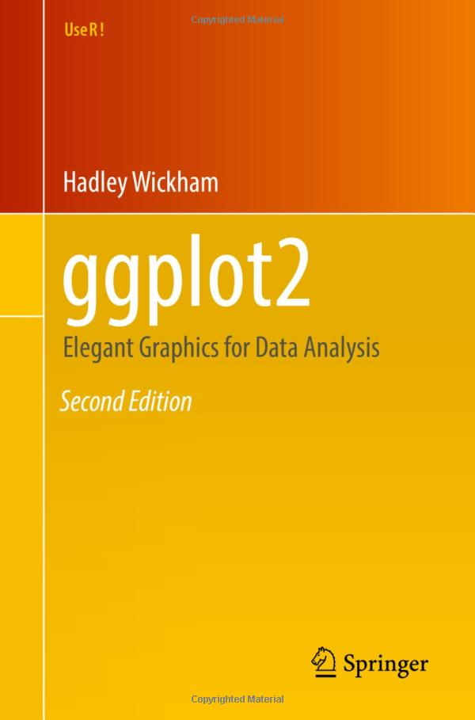
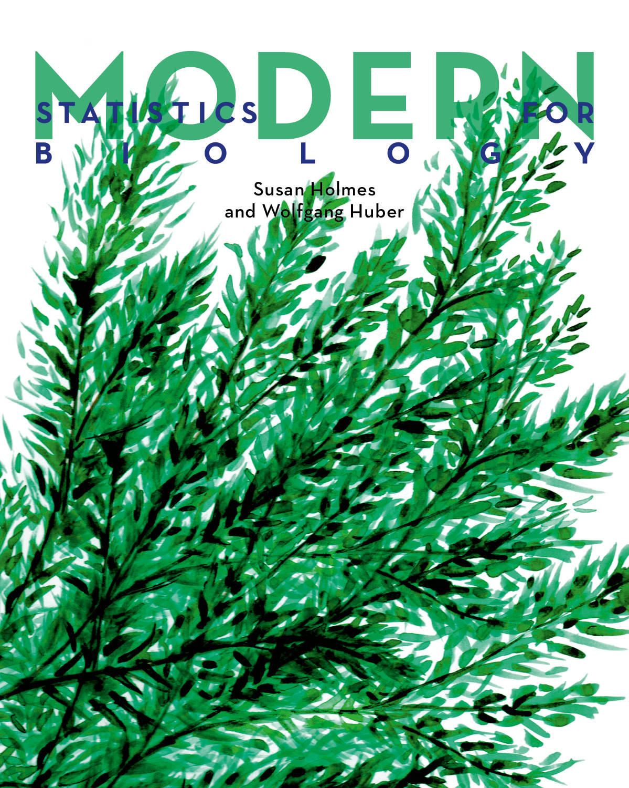

- [An Introduction to Statistical Learning](https://www.statlearning.com/)
- [Functional Programming](https://dcl-prog.stanford.edu/)
- [The Epidemiologist R Handbook](https://epirhandbook.com/en/index.html)
- [Data Analysis and Prediction Algorithms with R](http://rafalab.dfci.harvard.edu/dsbook/)
- [Data Analysis in Genome Biology](https://girke.bioinformatics.ucr.edu/GEN242/)
- [PH525x series - Biomedical Data Science](http://genomicsclass.github.io/book/)

[{height=3in}](https://r4ds.hadley.nz/)

[{height=3in}](https://r-graphics.org/)

[{height=3in}](https://ggplot2-book.org/)

[{height=3in}](https://web.stanford.edu/class/bios221/book/)

