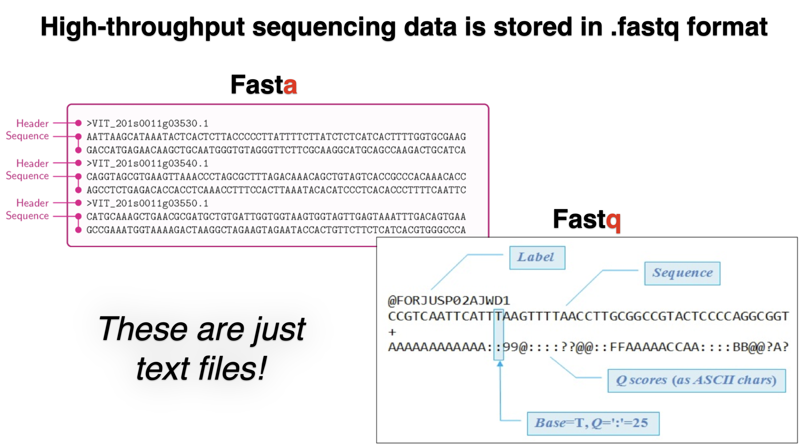

## High-throughput Sequencing

### File formats produced by sequencing

## scRNA-seq

- [Single-cell RNA-seq: raw sequencing data to counts](https://hbctraining.github.io/In-depth-NGS-Data-Analysis-Course/sessionIV/lessons/SC_pre-QC.html)

## Resources

- [File formats produced by sequencing](https://learn.gencore.bio.nyu.edu/ngs-file-formats/)
- [RNA-seqlopedia](https://rnaseq.uoregon.edu/) - Created by the Univ. of Orgeon, this is a great resource for understanding the entire RNAseq workflow.
- [SequencEnG - An interactive learning resource for next-generation sequencing (NGS) techniques](http://education.knoweng.org/sequenceng/)
- [Next-Generation Sequencing Analysis](https://learn.gencore.bio.nyu.edu/) - provide hands on experience with analyzing next generation sequencing. Standard pipelines are presented that provide the user with and step-by-step guide to using state of the art bioinformatics tools
- [Single Cell Gene Expression](https://www.10xgenomics.com/support/single-cell-gene-expression)
- [The Essence of scRNA-Seq Clustering: Why and How to Do it Right](https://blog.bioturing.com/2022/02/15/the-essence-of-scrna-seq-clustering/)