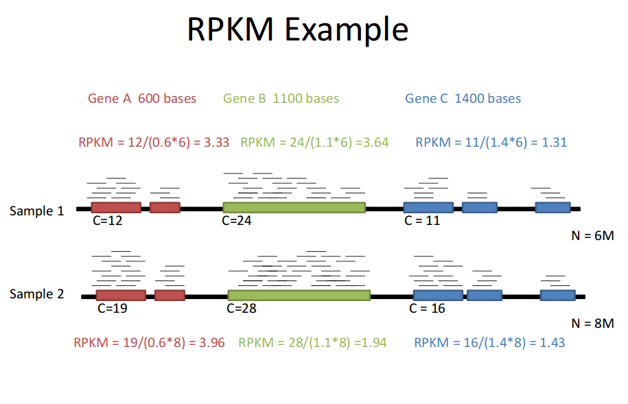

## scRNA-seq

### Experimental scRNA-seq workflow

::: {.callout-note title="Typical workflows including:"}

1. Single cell dissociation
    - tissue is digested

2. Single cell isolation
    - errors can occur that lead to empty droplets, doublets, multiplets, non-viables cells

3. Library construction
    - well or droplet contains the chemicals to break down the cell membrances
    - intra cellular mRNA is captured, reverse-transcribed to cDNA molecules and amplified
    - Uniqiue molecular identifed (UMI) allow us to distinguish between amplified copies of the same mRNA molecule and reads from separate mRNA molecules transcribed from the same gene
    - Amplification before sequencing is to increase its probility of being measured

4. Sequencing
    - cDNA libraries are labelled with cellular barcodes
    - libraries are pooled together
:::

### File formats produced by sequencing

### Reads quality control

Quality control is performed to ensure that the data quality is sufficient for downstream analysis. The QC can be performed in cell level,  transcript level and count data directly.

To check the integrity of cel, `cell QC` is commonly performed based on three covariates:

1. Count depth: the number of counts per barcode
2. The number of genes per barcode
3. The fraction of counts from mitochondrial genes per barcode

- Make sure all cellular bacode data correspond to viable cells

- all reads assigned to the same barcode may not correspond to reads from the cells as a barcode may mistakenly tag multiple cells (doublet) or may not tag any cells (empty droplet)

The distribution of  these QC covariates are examined for outlier peaks that filtered out by thresholding. Condieration any of these three QC covariates in isolation can lead to misinterpretation of cellular signals. These thresholds shoule be set as permissive as possible to  avoid filtering out viable cell populations unintentionally.

- Cells with high a comparatively high fraction of mitochandrial counts maybe involved  in respiratory process

- Cells with low counts and/or genes may correspond to quiecent cells population

- Cells with high counts maybe larger in size

::: {.callout-tip}
- Perform QC by finding outlier peaks in the number of genes, the count depth and the fraction of mitochondrial reads. Consider these covariates jointly instead of separtely
- Be as permissive of QC thresholding as possible, and revisit QC if downstream clustering cannot be interpreted
- If the distribution of QC covariates differ between samples, QC thresholds should be determined separately for each sample to account for sample quality differences.
:::

### Mapping reads to cellular barcodes and origin mRNA molecules 

Tools that same as those used in bulk RNA-seq are available for this procedure, including:

- Burrows-Wheeler Aligner (BWA)

- STAR

- Kallisto

Only reads that map to exonic loci with high mapping quality are considered for generation of the gene expression matrix.

### Normalization

Each count in a count matrix represents the successful capture, reverse transciption, and sequencing of a molecule of cellular mRNA. **Count depths** for identical cellss can differ due to the variability inherent in each of these steps. 
These variables are usually difficult to estimate  and thus typically modeled as fixed effects.

Normalization is done by scaling count data to obtain correct relative gene expression abundances between cells.

- Reads per kilobase (RPK) is defined by multiplying the read counts of an isoform (i) by 1000 and dividing by isoform length

- Reads per kilobase per million (RPKM) is defined to compare experiments or different samples (cells) so that additional normalization by the total fragment count is integrated in the denominator term, which is expressed in millions.

- TPM takes other isoforms into account, which contrasts with the RPKM metric. This metric quantifies the abundance of isoforms (i) using the RPK fraction across isoforms.

::: {.callout-note}
- Normalized data should be log(x=1)-transformed for use with downstream analysis methods that assume data are normally distributed
:::

### Estimate confounding factors

### Data correction and integration

### Feature selection and dimensionality reduction

### Cell and gene-level downstream analysis

## Reference

- [Single-cell RNA-seq: raw sequencing data to counts](https://hbctraining.github.io/In-depth-NGS-Data-Analysis-Course/sessionIV/lessons/SC_pre-QC.html)
- [File formats produced by sequencing](https://learn.gencore.bio.nyu.edu/ngs-file-formats/)
- [RNA-seqlopedia](https://rnaseq.uoregon.edu/) - Created by the Univ. of Orgeon, this is a great resource for understanding the entire RNAseq workflow.
- [SequencEnG - An interactive learning resource for next-generation sequencing (NGS) techniques](http://education.knoweng.org/sequenceng/)
- [Next-Generation Sequencing Analysis](https://learn.gencore.bio.nyu.edu/) - provide hands on experience with analyzing next generation sequencing. Standard pipelines are presented that provide the user with and step-by-step guide to using state of the art bioinformatics tools
- [Single Cell Gene Expression](https://www.10xgenomics.com/support/single-cell-gene-expression)
- [The Essence of scRNA-Seq Clustering: Why and How to Do it Right](https://blog.bioturing.com/2022/02/15/the-essence-of-scrna-seq-clustering/)
- [How to Use t-SNE Effectively](https://distill.pub/2016/misread-tsne/)
- [Ten quick tips for effective dimensionality reduction](https://journals.plos.org/ploscompbiol/article?id=10.1371/journal.pcbi.1006907)
- [Hypergeometric test and Fisher’s exact test ](http://mengnote.labspot.com/2012/12/calculate-correct-hypergeometric-p.html)
