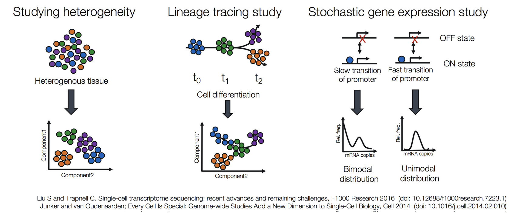
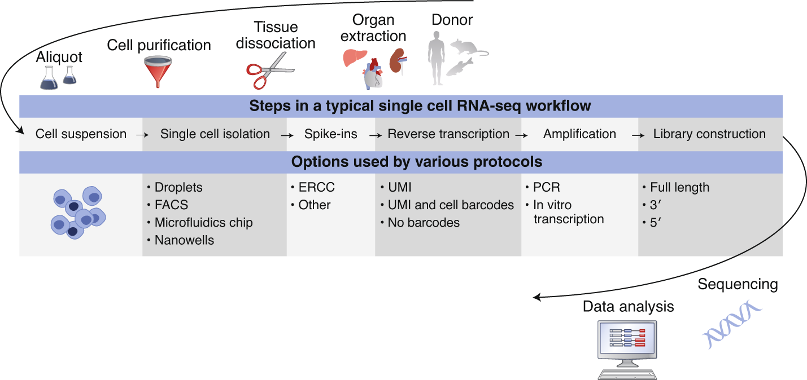
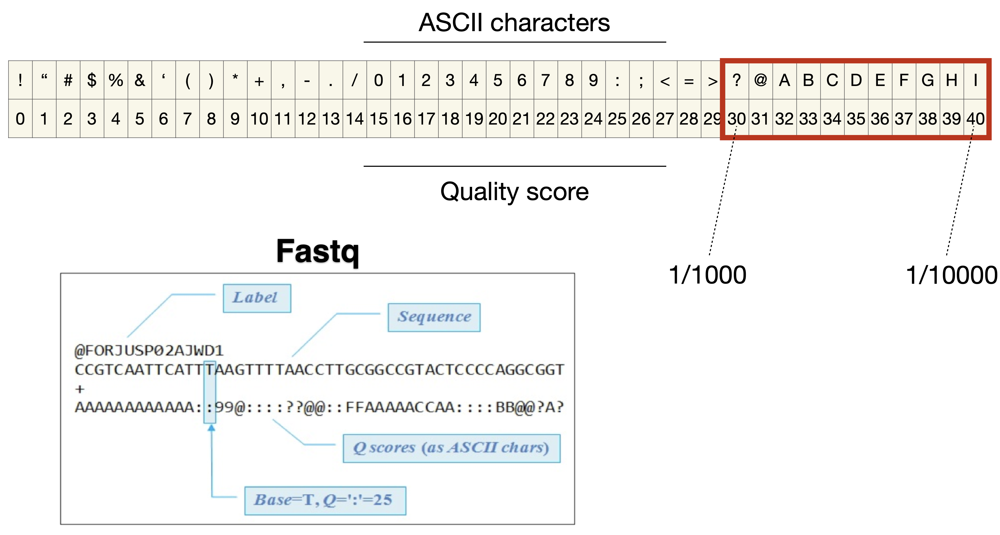
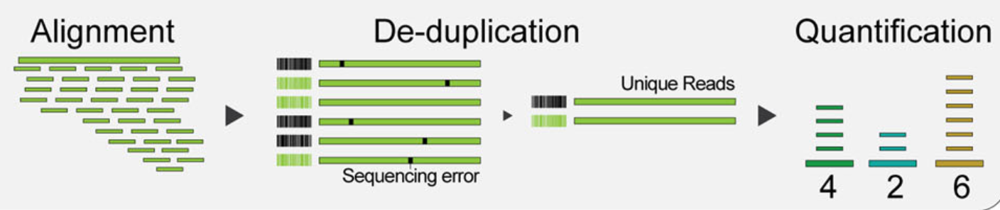
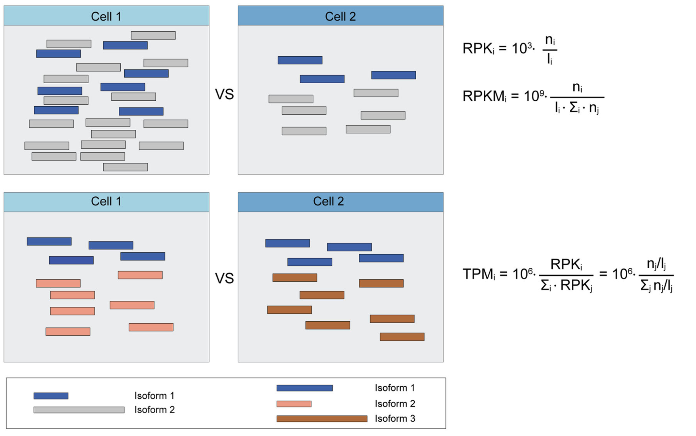
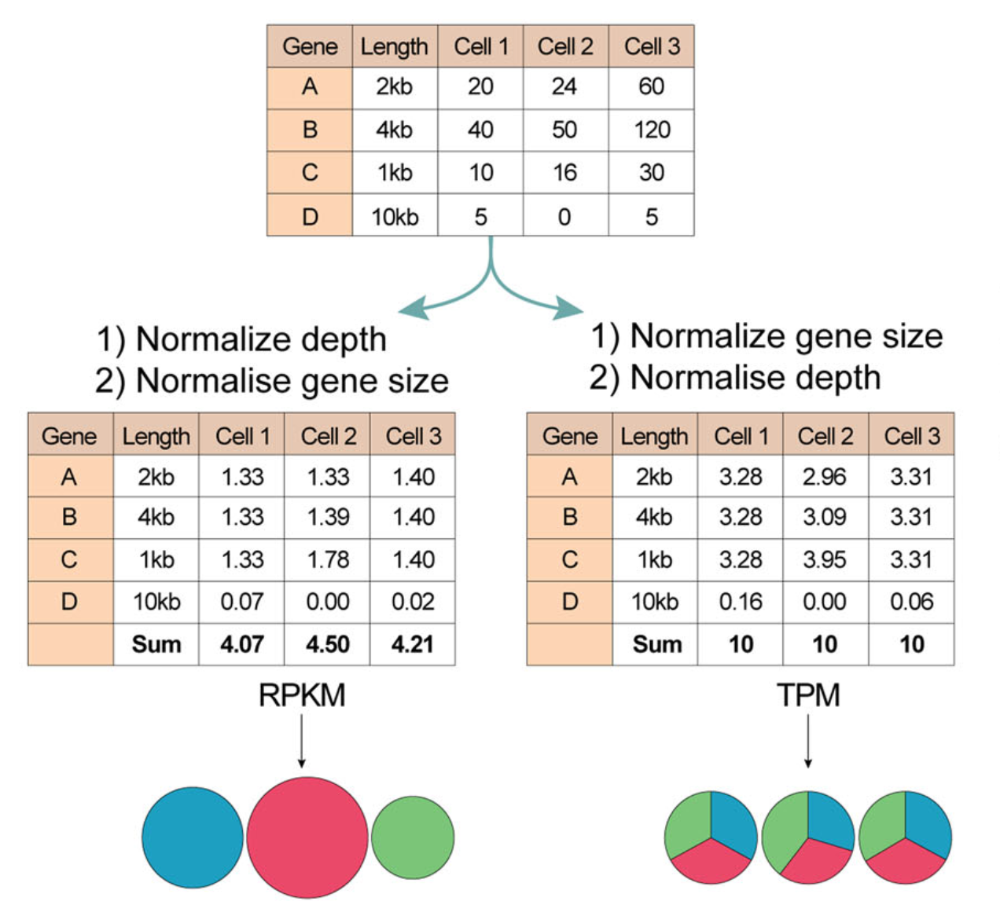
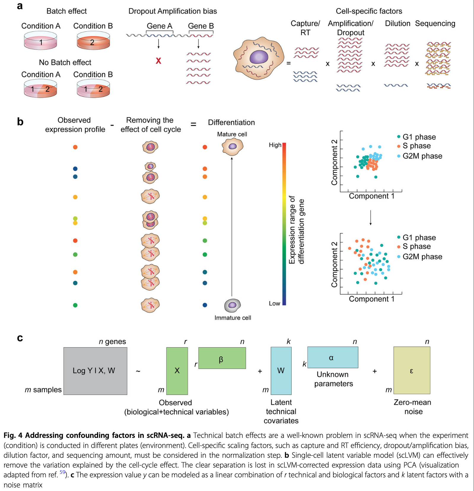

## scRNA-seq

### Experimental scRNA-seq workflow

Typical workflows including:

1. Single cell dissociation
    - tissue is digested

2. Single cell isolation
    - errors can occur that lead to empty droplets, doublets, multiplets, non-viables cells

3. Library construction
    - well or droplet contains the chemicals to break down the cell membrances
    - intra cellular mRNA is captured, reverse-transcribed to cDNA molecules and amplified
    - Uniqiue molecular identifed (UMI) allow us to distinguish between amplified copies of the same mRNA molecule and reads from separate mRNA molecules transcribed from the same gene
    - Amplification before sequencing is to increase its probility of being measured

4. Sequencing
    - cDNA libraries are labelled with cellular barcodes
    - libraries are pooled together

### File formats produced by sequencing

### Quality control of raw reads 

Quality control is performed to ensure that the data quality is sufficient for downstream analysis. The QC can be performed in cell level,  transcript level and count data directly.

To check the integrity of cel, `cell QC` is commonly performed based on three covariates:

1. Count depth: the number of counts per barcode
2. The number of genes per barcode
3. The fraction of counts from mitochondrial genes per barcode

- Make sure all cellular bacode data correspond to viable cells

- all reads assigned to the same barcode may not correspond to reads from the cells as a barcode may mistakenly tag multiple cells (doublet) or may not tag any cells (empty droplet)

The distribution of  these QC covariates are examined for outlier peaks that filtered out by thresholding. Condieration any of these three QC covariates in isolation can lead to misinterpretation of cellular signals. These thresholds shoule be set as permissive as possible to  avoid filtering out viable cell populations unintentionally.

- Cells with high a comparatively high fraction of mitochandrial counts maybe involved  in respiratory process

- Cells with low counts and/or genes may correspond to quiecent cells population

- Cells with high counts maybe larger in size

::: {.callout-tip}
- Perform QC by finding outlier peaks in the number of genes, the count depth and the fraction of mitochondrial reads. Consider these covariates jointly instead of separtely
- Be as permissive of QC thresholding as possible, and revisit QC if downstream clustering cannot be interpreted
- If the distribution of QC covariates differ between samples, QC thresholds should be determined separately for each sample to account for sample quality differences.
:::

### Mapping reads to cellular barcodes and origin mRNA molecules 

Tools that same as those used in bulk RNA-seq are available for this procedure, including:

- Burrows-Wheeler Aligner (BWA)
- STAR
- Kallisto
- Sailfish
- Salmon

Only reads that map to exonic loci with high mapping quality are considered for generation of the gene expression matrix.

### Normalization for quantification of expression

Each count in a count matrix represents the successful capture, reverse transciption, and sequencing of a molecule of cellular mRNA. **Count depths** for identical cellss can differ due to the variability inherent in each of these steps. 
These variables are usually difficult to estimate  and thus typically modeled as fixed effects.

Normalization is done by scaling count data to obtain correct relative gene expression abundances between cells.

These three metrics attempt to normalize for sequencing depth and gene length. Here’s how you do it for RPKM:

1. Count up the total reads in a sample and divide that number by 1,000,000 – this is our “per million” scaling factor.
2. Divide the read counts by the “per million” scaling factor. This normalizes for sequencing depth, giving you reads per million (RPM)
3. Divide the RPM values by the length of the gene, in kilobases. This gives you RPKM.

FPKM is very similar to RPKM. RPKM was made for single-end RNA-seq, where every read corresponded to a single fragment that was sequenced. FPKM was made for paired-end RNA-seq. With paired-end RNA-seq, two reads can correspond to a single fragment, or, if one read in the pair did not map, one read can correspond to a single fragment. The only difference between RPKM and FPKM is that FPKM takes into account that two reads can map to one fragment (and so it doesn’t count this fragment twice).

TPM is very similar to RPKM and FPKM. The only difference is the order of operations. Here’s how you calculate TPM:

1. Divide the read counts by the length of each gene in kilobases. This gives you reads per kilobase (RPK).
2. Count up all the RPK values in a sample and divide this number by 1,000,000. This is your “per million” scaling factor.
3. Divide the RPK values by the “per million” scaling factor. This gives you TPM.

When calculating TPM, the only difference is that you normalize for gene length first, and then normalize for sequencing depth second. However, the effects of this difference are quite profound.

When you use TPM, the sum of all TPMs in each sample are the same. This makes it easier to compare the proportion of reads that mapped to a gene in each sample. In contrast, with RPKM and FPKM, the sum of the normalized reads in each sample may be different, and this makes it harder to compare samples directly.

Here’s an example. If the TPM for gene A in Sample 1 is 3.33 and the TPM in sample B is 3.33, then I know that the exact same proportion of total reads mapped to gene A in both samples. This is because the sum of the TPMs in both samples always add up to the same number (so the denominator required to calculate the proportions is the same, regardless of what sample you are looking at.)

With RPKM or FPKM, the sum of normalized reads in each sample can be different. Thus, if the RPKM for gene A in Sample 1 is 3.33 and the RPKM in Sample 2 is 3.33, I would not know if the same proportion of reads in Sample 1 mapped to gene A as in Sample 2. This is because the denominator required to calculate the proportion could be different for the two samples.

Using RPKM/FPKM normalization, the total number of RPKM/FPKM normalized counts for each sample will be different. Therefore, you cannot compare the normalized counts for each gene equally between samples.

| Normalization method                                         | Description                                                  | Accounted factors                    | Recommendations for use                                      |
| ------------------------------------------------------------ | ------------------------------------------------------------ | ------------------------------------ | ------------------------------------------------------------ |
| **CPM** (counts per million)                                 | counts scaled by total number of reads                       | sequencing depth                     | gene count comparisons between replicates of the same samplegroup; **NOT for within sample comparisons or DE analysis** |
| **TPM** (transcripts per kilobase million)                   | counts per length of transcript (kb) per million reads mapped | sequencing depth and gene length     | gene count comparisons within a sample or between samples of the same sample group; **NOT for DE analysis** |
| **RPKM/FPKM** (reads/fragments per kilobase of exon per million reads/fragments mapped) | similar to TPM                                               | sequencing depth and gene length     | gene count comparisons between genes within a sample; **NOT for between sample comparisons or DE analysis** |
| DESeq2’s **median of ratios** [[1](https://genomebiology.biomedcentral.com/articles/10.1186/gb-2010-11-10-r106)] | counts divided by sample-specific size factors determined by median ratio of gene counts relative to geometric mean per gene | sequencing depth and RNA composition | gene count comparisons between samples and for **DE analysis**; **NOT for within sample comparisons** |
| EdgeR’s **trimmed mean of M values (TMM)** [[2](https://genomebiology.biomedcentral.com/articles/10.1186/gb-2010-11-3-r25)] | uses a weighted trimmed mean of the log expression ratios between samples | sequencing depth, RNA composition    | gene count comparisons between samples and for **DE analysis**; **NOT for within sample comparisons** |

: Several common normalization methods exist to account for these differences:

Source - [StatQuest](https://www.youtube.com/watch?v=TTUrtCY2k-w&embeds_referring_euri=https%3A%2F%2Fwww.rna-seqblog.com%2F&source_ve_path=MjM4NTE&feature=emb_title), [RPKM, FPKM and TPM, clearly explained](https://www.rna-seqblog.com/rpkm-fpkm-and-tpm-clearly-explained/), [Count normalization with DESeq2](https://hbctraining.github.io/DGE_workshop_salmon/lessons/02_DGE_count_normalization.html)

::: {.callout-note}
- While TPM and RPKM/FPKM normalization methods both account for sequencing depth and gene length, RPKM/FPKM are not recommended. **The reason is that the normalized count values output by the RPKM/FPKM method are not comparable between samples.**
- Normalized data should be log(x=1)-transformed for use with downstream analysis methods that assume data are normally distributed
:::

### Estimate confounding factors

The observed read counts are affected by a combination of different factors, including biological variables and technical noise.

Batch effects, systematic differences that are unrelated to any biological variation and result from sample preparation conditions, are often prominent.

### Data correction and integration

### Feature selection and dimensionality reduction

### Cell and gene-level downstream analysis

## Reference

- [Single-cell RNA-seq: raw sequencing data to counts](https://hbctraining.github.io/In-depth-NGS-Data-Analysis-Course/sessionIV/lessons/SC_pre-QC.html)
- [File formats produced by sequencing](https://learn.gencore.bio.nyu.edu/ngs-file-formats/)
- [RNA-seqlopedia](https://rnaseq.uoregon.edu/) - Created by the Univ. of Orgeon, this is a great resource for understanding the entire RNAseq workflow.
- [SequencEnG - An interactive learning resource for next-generation sequencing (NGS) techniques](http://education.knoweng.org/sequenceng/)
- [Next-Generation Sequencing Analysis](https://learn.gencore.bio.nyu.edu/) - provide hands on experience with analyzing next generation sequencing. Standard pipelines are presented that provide the user with and step-by-step guide to using state of the art bioinformatics tools
- [Single Cell Gene Expression](https://www.10xgenomics.com/support/single-cell-gene-expression)
- [The Essence of scRNA-Seq Clustering: Why and How to Do it Right](https://blog.bioturing.com/2022/02/15/the-essence-of-scrna-seq-clustering/)
- [How to Use t-SNE Effectively](https://distill.pub/2016/misread-tsne/)
- [Ten quick tips for effective dimensionality reduction](https://journals.plos.org/ploscompbiol/article?id=10.1371/journal.pcbi.1006907)
- [Hypergeometric test and Fisher’s exact test ](http://mengnote.labspot.com/2012/12/calculate-correct-hypergeometric-p.html)
- [Bioinformatics Training at the Harvard Chan Bioinformatics Core](https://hbctraining.github.io/main/)
- [ANALYSIS OF SINGLE CELL RNA-SEQ DATA](https://broadinstitute.github.io/2019_scWorkshop/)