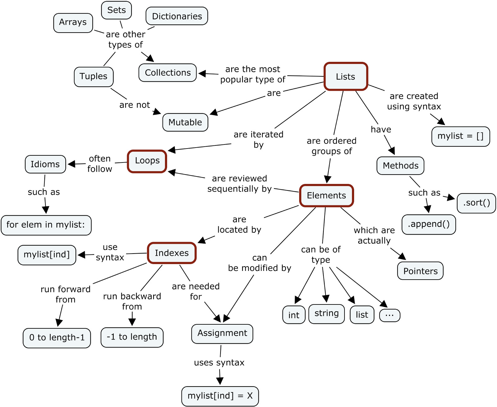

## Data structures



## Basic functions

```python
type() # what type of a variable
len() # length of 
range()
list()
tuple()
dict()
strings # a sequence of letter
immutable: Number (数字), String(字符), Tuple (元组)
mutable: List（列表）, Dictionary（字典）, Set(集合)
```

```python
# Conidtional execution
if / elif / else

# Comparison operators
## Numerical comparison operators include:
<       # less than
>       # greater than
<=      # less than or equal to
>=      # greater than or equal to
==      # equal to
!=      # not equal to
## String comparison operators include:
==      # equal to
!=      # not equal to
## Logical Operators
and, or, not

# Iteration/Lopps
for          # used when the number of possible iterations are known in advance
while        # used when the number of possible iterations can not be defined in advance
break        # it stops the iteration immediately and moves on to the statement that follows the looping
continue     # it skips the rest of the steps but moves on to the next iteration
try / except # Exceptions are errors that are found during execution of the Python program
```

## Reference

- https://www.py4e.com/
- https://omgenomics.com/
- https://www.coursera.org/learn/bioinformatics
- http://do1.dr-chuck.com/pythonlearn/EN_us/pythonlearn.pdf
- https://www.py4e.com/html3
- http://do1.dr-chuck.com/pythonlearn/EN_us/pythonlearn.epub
- [Primer on Python for R Users](https://cran.r-project.org/web/packages/reticulate/vignettes/python_primer.html)
