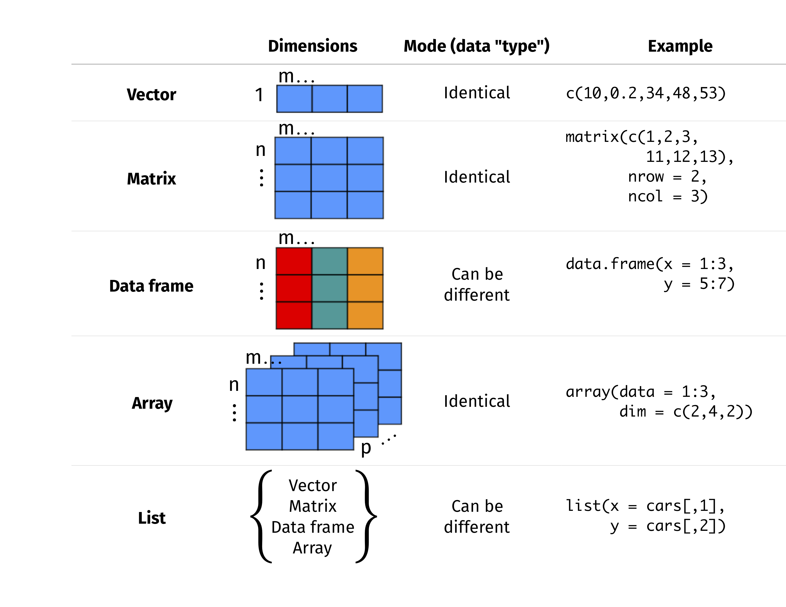

```{r setup, include=FALSE}
knitr::opts_chunk$set(
    # evaluate = FALSE, # fig.width = 6, # fig.height = 3.8, # fig.retina = 3,
    fig.align = "center", out.width = "100%", warning = FALSE, collapse = TRUE
)
```
## Basic concepts

### Data structure



### General functions

```r
dir()                            # Show the directory
getwd()                          # Check working directory
setwd()                          # Change working directory
data()                           # Load built-in dataset
view()                           # View the entire dataset
tail()                           # Just show the last 6 rows
class()                          # Check the class of an R object
str()                            # Display internal structure of an R object
length()                         # Give length of a vector
dim()                            # View the number of rows and columns of a matrix or a data frame
names()                          # List names of variables in a data frame
set.seed()                       # Generate random number seed to make sure the results do not change.
ls()                             # list the variables in the workspace
rm()                             # remove the variable from workspace
rm(list = ls())                  # remove all the variables from the workspace
list.files()                     # List the filename under specific directory
.libPaths()                      # R installation site
help(package="")                 # Check the functions of R library
system.file(package=“dagdata”)   # Extract the location of package
colnames(installed.packages())   # list the installed packages
```

## Best practise for R coding

- Variables = my_variable
- Functions = RunThisStuffs()
- Constants = CONSTANTS
- Use 4 spaces (and not tab) for indentations
- Always writing documentation above function definition
- A function should not be longer than one screen
- Avoid using for loop, learn lapply and vector operations
- Never ever use hard-coded variables in functions
- `### ======` to divide function blocks
- `### ------` to divide parts in a function
- Name and style code consistently
- `rm(list =ls())` and `gc()` to tidy up its memory
- Don't save a session history
- Keep track of `sessionInfo()` in project folder
- Use version control

## Reference

- [An Introduction to Statistical Learning](https://www.statlearning.com/)
- [R for Data Science (2e)](https://r4ds.hadley.nz/)
- [R Graphics Cookbook, 2nd edition](https://r-graphics.org/)
- [Advanced R](https://adv-r.hadley.nz/)
- [ggplot2: Elegant Graphics for Data Analysis](https://ggplot2-book.org/)
- [Functional Programming](https://dcl-prog.stanford.edu/)
- [The Epidemiologist R Handbook](https://epirhandbook.com/en/)
- [Modern Statistics for Modern Biology](https://web.stanford.edu/class/bios221/book/)
- [Data Analysis and Prediction Algorithms with R](http://rafalab.dfci.harvard.edu/dsbook/)
- [Bioinformatics Training & Education Program](https://bioinformatics.ccr.cancer.gov/btep/)
- [Saving R Graphics across OSs](https://www.jumpingrivers.com/blog/r-graphics-cairo-png-pdf-saving/)
- [Tutorial on Advanced Stats and Machine Learning with R](http://r-statistics.co/)
- [Publication ready plots using ggpubr](https://jeweljohnsonj.github.io/jeweljohnson.github.io/project7.html)
- [datanovia](https://www.datanovia.com/en/)
- [Data Analysis in Genome Biology](https://girke.bioinformatics.ucr.edu/GEN242/)
- [Data Viz with Python and R](https://datavizpyr.com/category/r/)
- [PH525x series - Biomedical Data Science](http://genomicsclass.github.io/book/)
